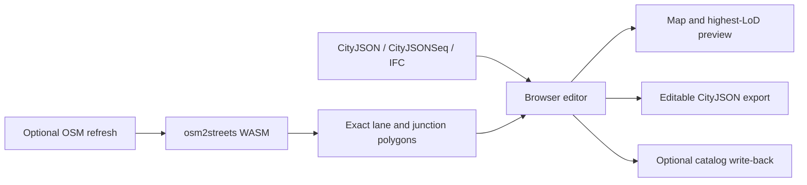

# City Editor project reference

This file is the single technical handoff for City Editor. It consolidates the former prototype status, road-geometry notes, Hamburg pipeline guides, osm2streets plans, and next-session task list.

## What the project guarantees

- The application runs from the repository root with `npm ci` and `npm run dev`.
- The committed Hamburg city-center demo starts by merging its LoD2 context, 68 surveyed textured LoD3 buildings with 1,043 detailed installations, and 1,608 precomputed osm2streets Road objects from CityJSON. It works without a local backend, Overpass, Rust, or startup OSM XML processing.
- CityJSON is the editable source of truth for both buildings and `Transportation` `Road` objects.
- Imported osm2streets polygons remain byte-for-byte unchanged during attribute-only road edits.
- Close building views stream Hamburg's official textured 3D Tiles; editable CityJSON remains the source of truth and distant context falls back to grounded LoD2, outlines, or blocks.
- Road and building edit modes cull unrelated distant geometry and expensive street-point overlays.
- All primary controls use pointer events and touch-sized targets. Road drawing and editing always expose **Finish**, **Cancel**, **Save**, and **Discard**.



## Repository layout

```text
webcityeditor/
├── src/                   React editor, hooks, map layers, and geometry logic
├── tests/                 Component, hook, CLI, and geometry tests
├── scripts/               Hamburg, CityJSON, osm2streets, and OpenDRIVE tools
├── public/data/           Small committed browser-safe Hamburg demo
├── test-fixtures/         Small deterministic regression inputs
├── assets/readme/         Screenshots used by README.md
├── vendor/osm2streets/    Git submodule containing the maintained fork
├── vendor/osm2streets-js/ Built browser WASM package
├── Data/                  Optional large local catalogs; ignored by Git
├── README.md              User guide
└── PROJECT.md             This technical reference and roadmap
```

The old `prototype/` and `spike/` layouts are obsolete. Source and tooling must not be placed back under them.

## Editing model

### Buildings and LoD

The loader keeps every geometry supplied by CityJSON. At overview zoom the map draws LoD0 footprint context; cheap blocks blend in from zoom 14 to 15.25. From zoom 15.25 to 18 it progressively replaces nearby blocks with source LoD2 geometry. Each root building group is normalized by its own minimum source elevation, rather than one viewport-wide minimum, so every building touches the flat editor map while installations remain at the correct relative height. Official textured 3D Tiles are a separate, non-overlapping close stage beginning at zoom 18.25. The map listens during the zoom gesture, not only at `zoomend`, so trackpad and pinch changes are continuous. The selected-building viewer retains the editable CityJSON geometry.

The wide Hamburg context is LoD2. The editable close-up data preserves that geometry and adds 68 matching surveyed LoD3 counterparts from official Area 1 tile `6433`; 68 JPG atlases, UV coordinates, and 1,043 BuildingInstallation objects ship as an offline/editing fallback. The close map no longer triangulates that conversion for its main visual. It streams `https://daten-hamburg.de/gdi3d/datasource-data/LoD3_tex20cm/tileset.json`, the CORS-enabled PBR hierarchy used by Hamburg's geoportal, at a screen-space error of four pixels. Each b3dm batch feature is shifted by its own `Grundhöhe NN` metadata (or its minimum vertex when missing), which attaches it to the flat map without flattening roof detail. Two additional placeable assets are converted from tile `6431`: source objects `DEHHALKAJ0000oGL` and `DEHHALKAJ0000oWO`. At zoom 16.5 and closer, the map instances 2,110 city-center trees converted from Hamburg's official summer 3D street-tree tiles, retaining exact positions, ALS heights, crown diameters, species, planting years, and streets. Edit focus hides that context to preserve interaction performance.

Imported buildings are intentionally read-only for topology-changing tools until **Make editable** is chosen. Attribute edits remain lightweight. Parametric conversion enables footprint, roof, openings, overhang, subdivision, and transform workflows, but it replaces the imported geometry and is therefore explicit.

The legacy `_createdBy: "city-editor-prototype"` value remains a deliberate on-disk compatibility marker for already exported parametric objects. It is not a path or repository-layout dependency.

### Roads: exact surfaces versus editable ribbons

Roads are stored as CityJSON `Transportation` objects. Each lane, shoulder, sidewalk, cycleway, parking strip, or median is a semantic `TrafficArea` or `AuxiliaryTrafficArea` polygon.

There are two geometry modes:

| Mode | Used for | Save behavior |
|---|---|---|
| `exact` | Imported osm2streets lane and junction polygons | Type, direction, material, access, and speed update attributes while boundaries and the global vertex array remain unchanged |
| `generated` | User-drawn or intentionally reshaped roads | The curved centreline and ordered bands regenerate matching preview and CityJSON ribbons |

The `_roadLayout` attribute stores editable sections, bands, curve settings, elevation, and confirmed endpoint connections. `_sourceCenterlineWgs84` preserves osm2streets' directed centerline, so reordering or resizing one band rebuilds around the same road axis instead of deriving a diagonal from polygon corners. Direction arrows are map polygons tangent to that line, independent of CityJSON ring winding. `_roadGeometryMode` records whether the current boundaries are `exact` or `generated`. Existing exact data without the marker is still treated as exact for compatibility.

Changing only semantic attributes shows **Exact source polygons protected**. Moving handles, changing any width, reordering or adding bands, splitting a section, or changing curve settings switches the pending save to a clearly labelled geometry rebuild.

### Curves and connections

Road sections use a sampled smooth curve, not straight chords between every control point. The same sampled path drives the map preview and saved band polygons, preventing preview/export drift.

Endpoint editing is deliberate:

- yellow handles move existing bends;
- white midpoint handles insert a bend;
- teal endpoint targets come from other draft sections, editable CityJSON roads, and OSM road endpoints;
- dropping an endpoint on a teal target stores a confirmed connection;
- connections between two editable CityJSON roads are written reciprocally.
- moving a confirmed endpoint away prompts before Save, then clears the stale reciprocal metadata
  from the connected road in the same guarded edit when the user accepts the disconnection;
- deleting a CityJSON road clears reciprocal endpoint metadata from every surviving editable road.

Connection metadata confirms graph topology. It does not yet synthesize a complete lane-level intersection, turn restrictions, or regenerated road markings; that is listed in the remaining roadmap rather than presented as finished.

## UX and performance decisions

- **Roads** starts as a compact chooser with one existing-road action: tap a CityJSON road, then choose **Edit road**. The sheet expands only after a road is being edited.
- On desktop, the active road's complete cross-section editor sits over the map along the bottom: matching visual bands plus large type, material, width, direction, order, remove, and add controls. The redundant lane editor in the right sheet is hidden. Touch layouts keep the same complete controls in the bottom sheet.
- Road curvature is changed by dragging or adding visible map anchors. The UI exposes only the meaningful **Smooth** and **Straight** choice, not an abstract curve-strength percentage.
- Map/satellite mode, satellite opacity, and road-overlay opacity are directly inside the road sheet. The generic **Map layers** control starts collapsed and closes when another map tool opens.
- Phone layouts retain only Data, Roads, New Building, and More in the primary toolbar. Planning, list, export, validation, and secondary tools use the touch-sized More menu.
- Planning can be enabled at overview zoom. Requests remain bounded to a safe city-center window, while the scrollable legend stays at the lower left and Map layers stays at the upper left.
- Drawing uses capture-phase Pointer Events and pointer capture. Do not add `event.buttons === 0` as a drag-ending condition; trackpads and overlay sequences can report it mid-drag.
- Edit focus computes a padded bounding box around the active road or building, then filters buildings, roads, zones, OSM centre-lines, osm2streets polygons, and street objects outside it.
- Tagged OSM street points stay hidden below close zoom unless edit focus needs them.
- Clearance and overlap checks are deferred while dragging, and expensive geometry is memoized rather than rebuilt on every pointer event.
- Generic building metadata is collapsed under **Source metadata**; common fields and actions stay visible first.

## Data and format workflows

### Built-in Hamburg demo

The committed browser-safe files are:

- `public/data/hamburg/hamburg-city-center-buildings.city.jsonl`
- `public/data/hamburg/hamburg-city-center-roads.city.json`
- `public/data/hamburg/hamburg-city-center-roads.osm`
- `public/data/transportation/osm2streets-hamburg-short-intersection.city.json`

The `.city.json` road file is the default and export source of truth. The `.osm` file is retained only for an optional refresh/comparison. Regenerate the center samples with:

```powershell
npm run data:hamburg-center
npm run data:hamburg-center:osm
npm run data:hamburg-center:roads
```

### Optional whole-city buildings

```powershell
npm run data:hamburg-lod2
npm run dev:hamburg-buildings
```

The strict CityJSONSeq catalog streams tiles for the visible viewport and supports local changed-tile write-back. Large source and generated files stay under ignored `Data/`.

### Official Hamburg LoD3 data

The close map streams the official live tileset at `https://daten-hamburg.de/gdi3d/datasource-data/LoD3_tex20cm/tileset.json`; its JSON and b3dm children return `Access-Control-Allow-Origin: *`. CityJSON remains authoritative for edits and export. The compact tile `6433` conversion is retained as editable/offline source data. Reproduce it by downloading the tile's records from the Area 1 archive, converting with `citygml-tools`, then building the subset with:

```bash
npm run data:hamburg-lod3-download -- 6433
# Extract the resulting partial ZIP with a Deflate64-capable ZIP tool.
tools/citygml-tools-2.4.0/citygml-tools to-cityjson -e 25832 -c -o .tmp/hamburg-lod3-converted/6433 .tmp/hamburg-lod3-source/6433/6433/6433.gml
npm run data:hamburg-lod3-showcase
npm run data:hamburg-trees
```

`data:hamburg-trees` follows the official summer-tree 3D Tiles hierarchy only for the committed demo bbox, reads the highest-resolution I3DM positions and attributes, converts ECEF positions to WGS84, and writes the compact 2,110-tree browser asset. No 372 MB archive or runtime cross-origin tile requests are required.

The two placement assets were selected from tile `6431` and normalized around local placement origins. With that converted tile and its extracted `images` directory in the documented temporary paths, reproduce them with:

```powershell
npm run data:hamburg-lod3-assets
```

The normalizer is `scripts/build-hamburg-lod3-assets.mjs`. The output is licensed under Datenlizenz Deutschland – Namensnennung – Version 2.0; attribution is **Freie und Hansestadt Hamburg, Landesbetrieb Geoinformation und Vermessung**. The source dataset is <https://suche.transparenz.hamburg.de/dataset/3d-gebaeudemodell-lod3-0-hh-hamburg5>.

### Optional whole-city roads

On Windows, inspect, prepare, or serve the complete reproducible catalog with:

```powershell
.\PREPARE_HAMBURG_ROADS.cmd -DryRun
.\PREPARE_HAMBURG_ROADS.cmd
.\PREPARE_HAMBURG_ROADS.cmd -Serve
```

Equivalent npm commands are `npm run data:hamburg-roads:prepare` and `npm run dev:hamburg-roads`. Generated CityJSONSeq road tiles stay in `Data/hamburg-roads-osm2streets/cityjsonseq/` and must not be committed. The retained complete catalog is roughly 2.3 GiB and reproducible from the local OSM input.

### osm2streets fork and WASM

`vendor/osm2streets` is the retained Git submodule. The browser consumes `vendor/osm2streets-js`, which is built from the fork and committed so the default demo does not require Rust.

The fork hardens degenerate geometry, zero-width and shared-use edge cases, separated sidewalks, short intersections, and deterministic lane-polygon output. Normal edits do not rerun osm2streets: it generates or refreshes exact base polygons, after which CityJSON is authoritative.

Rebuild and compare the engine only when changing the fork:

```powershell
powershell -ExecutionPolicy Bypass -File scripts/build-osm2streets-wasm.ps1
npm run osm2streets:compare
npm test
npm run build
```

### Conversion and interoperability

- `npm run osm2streets:cityjson` converts osm2streets lane polygons to CityJSON Transportation surfaces while retaining provenance and exact boundaries.
- `npm run cityjson:to-citygml` exports the supported CityJSON subset to CityGML.
- IFC import keeps a low-detail footprint plus the detailed mesh and its semantic surfaces.
- `npm run opendrive:rtron -- --dry-run` exposes the experimental r:trån/OpenDRIVE command path. It remains a pipeline scaffold until a real licensed fixture and end-to-end geometry acceptance are added.

## Development and verification

Start each repository session with read-only orientation and preserve unrelated work:

```powershell
git status --short --branch
git fetch --prune origin
```

Fast-forward from `origin/main` only when it preserves the current worktree. Never reset or discard unrelated changes.

Run ordinary verification from the repository root:

```powershell
npm run test -- tests/lib/transportation.test.ts
npm test
npm run build
git diff --check
```

For catalog setup changes, also run:

```powershell
.\PREPARE_HAMBURG_ROADS.cmd -DryRun
node --check scripts/dev.mjs
node --check scripts/prepare-hamburg-road-catalog.mjs
npm run dev:hamburg-roads -- --dry-run
```

Focused regression coverage exists for smooth road preview/export parity, touch handle editing, endpoint snapping, reciprocal CityJSON connections, exact-polygon attribute saves, highest-LoD mesh selection, catalog preparation, and the Hamburg committed fixtures.

## Remaining roadmap

The following work is intentionally not claimed as complete:

1. Generate true intersection surfaces from confirmed connected roads, including lane-to-lane connectors, turns, crossings, and regenerated markings. Exact lane polygons already match osm2streets styling; dynamic junction synthesis is not claimed as complete.
2. Add a real, redistributable OpenDRIVE fixture and verify r:trån import against CityJSON Transportation semantics.
3. Add topology-aware coordinate propagation when a connected road is later moved. The editor now
   detects a moved-away confirmed endpoint, asks before saving, and clears stale reciprocal metadata
   from the peer road; automatic movement of the peer geometry is still pending.
4. Profile the complete whole-city road catalog on representative touch hardware and add spatial indexing if edit-focus filtering is not sufficient.
5. Add a dedicated renderer for Hamburg's CORS-enabled Cesium quantized-mesh DGM terrain and drape the active MapLibre basemap onto it. Per-building grounding fixes floating models now; full terrain is required to preserve surveyed elevation differences and terrain breaklines visually.
6. Add screenshot-based GPU regression coverage for official 3D Tiles and grounded mixed LoD2/LoD3 data on lower-end mobile devices. Structural grounding and tile-data regressions already have unit coverage.

These are continuation tasks, not blockers for the committed demo or the exact attribute-editing workflow.
