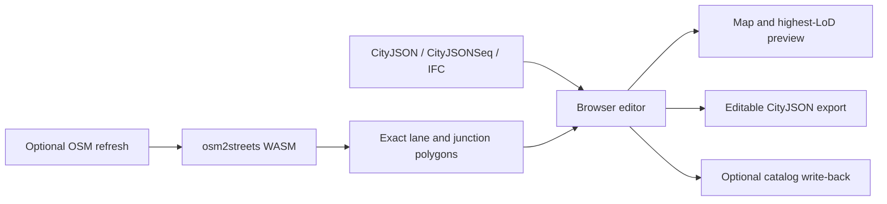

# City Editor project reference

This file is the single technical handoff for City Editor. It consolidates the former prototype status, road-geometry notes, Hamburg pipeline guides, osm2streets plans, and next-session task list.

## What the project guarantees

- The application runs from the repository root with `npm ci` and `npm run dev`.
- The committed Hamburg city-center demo starts by merging its LoD2 context, 24 surveyed textured LoD3 buildings with 395 detailed installations, and 1,608 precomputed osm2streets Road objects from CityJSON. It works without a local backend, Overpass, Rust, or startup OSM XML processing.
- CityJSON is the editable source of truth for both buildings and `Transportation` `Road` objects.
- Imported osm2streets polygons remain byte-for-byte unchanged during attribute-only road edits.
- Close building views use the highest geometry LoD available per object, including textured LoD3 surfaces; distant context falls back to outlines or blocks.
- Road and building edit modes cull unrelated distant geometry and expensive street-point overlays.
- All primary controls use pointer events and touch-sized targets. Road drawing and editing always expose **Finish**, **Cancel**, **Save**, and **Discard**.



## Repository layout

```text
webcityeditor/
├── src/                   React editor, hooks, map layers, and geometry logic
├── tests/                 Component, hook, CLI, and geometry tests
├── scripts/               Hamburg, CityJSON, osm2streets, and OpenDRIVE tools
├── public/data/           Small committed browser-safe Hamburg demo
├── test-fixtures/         Small deterministic regression inputs
├── assets/readme/         Screenshots used by README.md
├── vendor/osm2streets/    Git submodule containing the maintained fork
├── vendor/osm2streets-js/ Built browser WASM package
├── Data/                  Optional large local catalogs; ignored by Git
├── README.md              User guide
└── PROJECT.md             This technical reference and roadmap
```

The old `prototype/` and `spike/` layouts are obsolete. Source and tooling must not be placed back under them.

## Editing model

### Buildings and LoD

The loader keeps every geometry supplied by CityJSON. At overview zoom the map draws cheap footprint context; blocks blend in from zoom 13.25 to 15.25. From zoom 14.75 to 18.25 it uses a smooth 3.5-level transition into an indexed mesh of up to 420 nearby buildings plus their child installations. The map listens during the zoom gesture, not only at `zoomend`, so trackpad and pinch changes are continuous. It selects the numerically highest `geometry.lod` for each object, including LoD3 when present and LoD2/2.2 as the fallback. Its output limit is 160,000 vertices. The selected-building viewer also retains the full object geometry.

The wide Hamburg context is LoD2. The default close-up area replaces 24 matching LoD2 buildings with their surveyed LoD3 counterparts from official Area 1 tile `6433`; 24 JPG atlases, UV coordinates, and 395 BuildingInstallation objects ship with them. The toolbar therefore reports `LoD3 · no openings in source`: textures visibly contain facade detail, but the source does not encode separate semantic Window or Door surfaces. Two additional placeable assets are converted from tile `6431`: source objects `DEHHALKAJ0000oGL` and `DEHHALKAJ0000oWO`. The close map renderer includes child installations and creates a separate texture mesh for each atlas.

Imported buildings are intentionally read-only for topology-changing tools until **Make editable** is chosen. Attribute edits remain lightweight. Parametric conversion enables footprint, roof, openings, overhang, subdivision, and transform workflows, but it replaces the imported geometry and is therefore explicit.

The legacy `_createdBy: "city-editor-prototype"` value remains a deliberate on-disk compatibility marker for already exported parametric objects. It is not a path or repository-layout dependency.

### Roads: exact surfaces versus editable ribbons

Roads are stored as CityJSON `Transportation` objects. Each lane, shoulder, sidewalk, cycleway, parking strip, or median is a semantic `TrafficArea` or `AuxiliaryTrafficArea` polygon.

There are two geometry modes:

| Mode | Used for | Save behavior |
|---|---|---|
| `exact` | Imported osm2streets lane and junction polygons | Type, direction, material, access, and speed update attributes while boundaries and the global vertex array remain unchanged |
| `generated` | User-drawn or intentionally reshaped roads | The curved centreline and ordered bands regenerate matching preview and CityJSON ribbons |

The `_roadLayout` attribute stores editable sections, bands, curve settings, elevation, and confirmed endpoint connections. `_roadGeometryMode` records whether the current boundaries are `exact` or `generated`. Existing exact data without the marker is still treated as exact for compatibility.

Changing only semantic attributes shows **Exact source polygons protected**. Moving handles, changing any width, reordering or adding bands, splitting a section, or changing curve settings switches the pending save to a clearly labelled geometry rebuild.

### Curves and connections

Road sections use a sampled smooth curve, not straight chords between every control point. The same sampled path drives the map preview and saved band polygons, preventing preview/export drift.

Endpoint editing is deliberate:

- yellow handles move existing bends;
- white midpoint handles insert a bend;
- teal endpoint targets come from other draft sections, editable CityJSON roads, and OSM road endpoints;
- dropping an endpoint on a teal target stores a confirmed connection;
- connections between two editable CityJSON roads are written reciprocally.

Connection metadata confirms graph topology. It does not yet synthesize a complete lane-level intersection, turn restrictions, or regenerated road markings; that is listed in the remaining roadmap rather than presented as finished.
Dragging a confirmed endpoint away and saving now removes the stale reciprocal connection from the other editable CityJSON road, so both roads reopen with the same disconnected topology.

## UX and performance decisions

- **Roads** starts as a compact chooser with one existing-road action: tap a CityJSON road, then choose **Edit road**. The sheet expands only after a road is being edited.
- On desktop, the active road's complete cross-section editor sits over the map along the bottom: matching visual bands plus large type, material, width, direction, order, remove, and add controls. The redundant lane editor in the right sheet is hidden. Touch layouts keep the same complete controls in the bottom sheet.
- Road curvature is changed by dragging or adding visible map anchors. The UI exposes only the meaningful **Smooth** and **Straight** choice, not an abstract curve-strength percentage.
- Map/satellite mode, satellite opacity, and road-overlay opacity are directly inside the road sheet. The generic **Map layers** control starts collapsed and closes when another map tool opens.
- Phone layouts retain only Data, Roads, New Building, and More in the primary toolbar. Planning, list, export, validation, and secondary tools use the touch-sized More menu.
- Drawing uses capture-phase Pointer Events and pointer capture. Do not add `event.buttons === 0` as a drag-ending condition; trackpads and overlay sequences can report it mid-drag.
- Edit focus computes a padded bounding box around the active road or building, then filters buildings, roads, zones, OSM centre-lines, osm2streets polygons, and street objects outside it.
- Tagged OSM street points stay hidden below close zoom unless edit focus needs them.
- Clearance and overlap checks are deferred while dragging, and expensive geometry is memoized rather than rebuilt on every pointer event.
- Generic building metadata is collapsed under **Source metadata**; common fields and actions stay visible first.

## Data and format workflows

### Built-in Hamburg demo

The committed browser-safe files are:

- `public/data/hamburg/hamburg-city-center-buildings.city.jsonl`
- `public/data/hamburg/hamburg-city-center-roads.city.json`
- `public/data/hamburg/hamburg-city-center-roads.osm`
- `public/data/transportation/osm2streets-hamburg-short-intersection.city.json`

The `.city.json` road file is the default and export source of truth. The `.osm` file is retained only for an optional refresh/comparison. Regenerate the center samples with:

```powershell
npm run data:hamburg-center
npm run data:hamburg-center:osm
npm run data:hamburg-center:roads
```

### Optional whole-city buildings

```powershell
npm run data:hamburg-lod2
npm run dev:hamburg-buildings
```

The strict CityJSONSeq catalog streams tiles for the visible viewport and supports local changed-tile write-back. Large source and generated files stay under ignored `Data/`.

### Official Hamburg LoD3 data

The default showcase is selected from official tile `6433`, remains at its surveyed coordinates, and replaces matching LoD2 IDs during startup. Download the tile's records from the 1.5 GB Area 1 archive without fetching the whole archive, convert it with `citygml-tools`, then build the compact committed subset with:

```bash
npm run data:hamburg-lod3-download -- 6433
# Extract the resulting partial ZIP with a Deflate64-capable ZIP tool.
tools/citygml-tools-2.4.0/citygml-tools to-cityjson -e 25832 -c -o .tmp/hamburg-lod3-converted/6433 .tmp/hamburg-lod3-source/6433/6433/6433.gml
npm run data:hamburg-lod3-showcase
```

The two placement assets were selected from tile `6431` and normalized around local placement origins. With that converted tile and its extracted `images` directory in the documented temporary paths, reproduce them with:

```powershell
npm run data:hamburg-lod3-assets
```

The normalizer is `scripts/build-hamburg-lod3-assets.mjs`. The output is licensed under Datenlizenz Deutschland – Namensnennung – Version 2.0; attribution is **Freie und Hansestadt Hamburg, Landesbetrieb Geoinformation und Vermessung**. The source dataset is <https://suche.transparenz.hamburg.de/dataset/3d-gebaeudemodell-lod3-0-hh-hamburg5>.

### Optional whole-city roads

On Windows, inspect, prepare, or serve the complete reproducible catalog with:

```powershell
.\PREPARE_HAMBURG_ROADS.cmd -DryRun
.\PREPARE_HAMBURG_ROADS.cmd
.\PREPARE_HAMBURG_ROADS.cmd -Serve
```

Equivalent npm commands are `npm run data:hamburg-roads:prepare` and `npm run dev:hamburg-roads`. Generated CityJSONSeq road tiles stay in `Data/hamburg-roads-osm2streets/cityjsonseq/` and must not be committed. The retained complete catalog is roughly 2.3 GiB and reproducible from the local OSM input.

### osm2streets fork and WASM

`vendor/osm2streets` is the retained Git submodule. The browser consumes `vendor/osm2streets-js`, which is built from the fork and committed so the default demo does not require Rust.

The fork hardens degenerate geometry, zero-width and shared-use edge cases, separated sidewalks, short intersections, and deterministic lane-polygon output. Normal edits do not rerun osm2streets: it generates or refreshes exact base polygons, after which CityJSON is authoritative.

Rebuild and compare the engine only when changing the fork:

```powershell
powershell -ExecutionPolicy Bypass -File scripts/build-osm2streets-wasm.ps1
npm run osm2streets:compare
npm test
npm run build
```

### Conversion and interoperability

- `npm run osm2streets:cityjson` converts osm2streets lane polygons to CityJSON Transportation surfaces while retaining provenance and exact boundaries.
- `npm run cityjson:to-citygml` exports the supported CityJSON subset to CityGML.
- IFC import keeps a low-detail footprint plus the detailed mesh and its semantic surfaces.
- `npm run opendrive:rtron -- --dry-run` exposes the experimental r:trån/OpenDRIVE command path. It remains a pipeline scaffold until a real licensed fixture and end-to-end geometry acceptance are added.

## Development and verification

Start each repository session with read-only orientation and preserve unrelated work:

```powershell
git status --short --branch
git fetch --prune origin
```

Fast-forward from `origin/main` only when it preserves the current worktree. Never reset or discard unrelated changes.

Run ordinary verification from the repository root:

```powershell
npm run test -- tests/lib/transportation.test.ts
npm test
npm run build
git diff --check
```

For catalog setup changes, also run:

```powershell
.\PREPARE_HAMBURG_ROADS.cmd -DryRun
node --check scripts/dev.mjs
node --check scripts/prepare-hamburg-road-catalog.mjs
npm run dev:hamburg-roads -- --dry-run
```

Focused regression coverage exists for smooth road preview/export parity, touch handle editing, endpoint snapping, reciprocal CityJSON connections, exact-polygon attribute saves, highest-LoD mesh selection, catalog preparation, and the Hamburg committed fixtures.

## Remaining roadmap

The following work is intentionally not claimed as complete:

1. Generate true intersection surfaces from confirmed connected roads, including lane-to-lane connectors, turns, crossings, and regenerated markings. Exact lane polygons already match osm2streets styling; dynamic junction synthesis is not claimed as complete.
2. Add a real, redistributable OpenDRIVE fixture and verify r:trån import against CityJSON Transportation semantics.
3. Add topology-aware propagation and conflict resolution when a connected road is moved while remaining joined or is deleted. Explicit endpoint disconnection already clears the reciprocal metadata on save.
4. Profile the complete whole-city road catalog on representative touch hardware and add spatial indexing if edit-focus filtering is not sufficient.
5. Add screenshot-based GPU regression coverage for multiple texture atlases and mixed LoD2/LoD3 data on lower-end mobile devices. The converted textured samples and structural UV regression coverage now ship.

These are continuation tasks, not blockers for the committed demo or the exact attribute-editing workflow.
