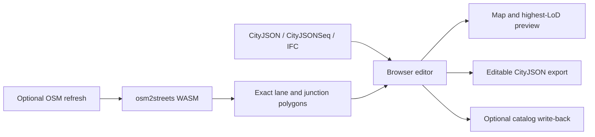

# City Editor project reference

This file is the single technical handoff for City Editor. It consolidates the former prototype status, road-geometry notes, Hamburg pipeline guides, osm2streets plans, and next-session task list.

## What the project guarantees

- The application runs from the repository root with `npm ci` and `npm run dev`.
- The committed Hamburg city-center demo starts by merging its LoD2 context, 68 surveyed LoD3 buildings with 1,043 detailed installations, and 1,608 precomputed osm2streets Road objects from CityJSON. It works without a local backend, Overpass, Rust, or startup OSM XML processing.
- CityJSON is the editable source of truth for both buildings and `Transportation` `Road` objects.
- Imported osm2streets polygons remain byte-for-byte unchanged during attribute-only road edits.
- Close map views stream Hamburg Geoportal's official untextured LoD3 3D Tiles from zoom 17. The service shares `DEHH...` IDs with the editable LoD2 context and supports browser CORS. The selected-building viewer uses those IDs to isolate one matching remote mesh when local LoD3 is absent. Building photo textures are intentionally not rendered; semantic surface colours keep LoD3 geometry predictable.
- Road and building edit modes cull unrelated distant geometry and expensive street-point overlays.
- All primary controls use pointer events and touch-sized targets. Road drawing and editing always expose **Finish**, **Cancel**, **Save**, and **Discard**.



## Repository layout

```text
webcityeditor/
├── src/                   React editor, hooks, map layers, and geometry logic
├── tests/                 Component, hook, CLI, and geometry tests
├── scripts/               Hamburg, CityJSON, osm2streets, and OpenDRIVE tools
├── public/data/           Small committed browser-safe Hamburg demo
├── test-fixtures/         Small deterministic regression inputs
├── assets/readme/         Screenshots used by README.md
├── vendor/osm2streets/    Git submodule containing the maintained fork
├── vendor/osm2streets-js/ Built browser WASM package
├── Data/                  Optional large local catalogs; ignored by Git
├── README.md              User guide
└── PROJECT.md             This technical reference and roadmap
```

The old `prototype/` and `spike/` layouts are obsolete. Source and tooling must not be placed back under them.

## Editing model

### Buildings and LoD

The loader keeps every geometry supplied by CityJSON. At overview zoom the map draws LoD0 footprint context; cheap blocks blend in from zoom 14 to 15.25. From zoom 15.25 it progressively replaces nearby blocks with source LoD2 geometry. At zoom 17, official Hamburg objects switch to the Geoportal's untextured LoD3 3D Tiles. Locally created, dirty, or edited objects have explicit priority on the editable CityJSON layer and retain a block fallback below detailed zoom. Detailed local geometry uses semantic roof, wall, window, and door colours; source photo atlases are not rendered. The map listens during the zoom gesture, not only at `zoomend`, so trackpad and pinch changes are continuous.

The wide editable Hamburg context is LoD2. The untextured close map reads the whole-city official `LoD3_untexturiert` hierarchy directly. The repository also includes 68 matching surveyed LoD3 counterparts from Area 1 tile `6433`, with 20,294 surfaces and 1,043 BuildingInstallation objects. Source JPG atlases and UVs remain in the fixture for provenance but are not part of the renderer. Four placeable, single-root assets retain their complete BuildingInstallation descendants. Custom generated buildings publish explicit LoD2 and LoD3 tiers, and a LoD3-only asset remains eligible for the middle-zoom detail fallback. At zoom 16.5 and closer, the map instances 2,110 city-center trees converted from Hamburg's official summer 3D street-tree tiles. Edit focus hides remote detail and tree context to preserve interaction performance.

Every map representation uses one vertical datum. The renderer reads Hamburg's CORS-enabled `Gelaende` quantized-mesh DGM hybrid service, triangulates its Cesium geographic/TMS tiles, and drapes TopPlus or satellite imagery over that surface. Each selected LoD is independently normalized from its semantic `GroundSurface` to the terrain elevation at its building root, avoiding source-tier Z offsets during LoD changes. Footprints, block extrusions, detail meshes, placement previews, generated buildings, and official trees use the same absolute terrain elevations.

Imported buildings are intentionally read-only for topology-changing tools until **Make editable** is chosen. Attribute edits remain lightweight. Parametric conversion enables footprint, roof, openings, overhang, subdivision, and transform workflows, but it replaces the imported geometry and is therefore explicit.

The legacy `_createdBy: "city-editor-prototype"` value remains a deliberate on-disk compatibility marker for already exported parametric objects. It is not a path or repository-layout dependency.

### Roads: exact surfaces versus editable ribbons

Roads are stored as CityJSON `Transportation` objects. Each lane, shoulder, sidewalk, cycleway, parking strip, or median is a semantic `TrafficArea` or `AuxiliaryTrafficArea` polygon.

There are two geometry modes:

| Mode | Used for | Save behavior |
|---|---|---|
| `exact` | Imported osm2streets lane and junction polygons | Type, direction, material, access, and speed update attributes while boundaries and the global vertex array remain unchanged |
| `generated` | User-drawn or intentionally reshaped roads | The curved centreline and ordered bands regenerate matching preview and CityJSON ribbons |

The `_roadLayout` attribute stores editable sections, bands, curve settings, elevation, and confirmed endpoint connections. `_sourceCenterlineWgs84` preserves osm2streets' directed centerline, so reordering or resizing one band rebuilds around the same road axis instead of deriving a diagonal from polygon corners. Direction arrows are map polygons tangent to that line, independent of CityJSON ring winding. `_roadGeometryMode` records whether the current boundaries are `exact` or `generated`. Existing exact data without the marker is still treated as exact for compatibility.

Changing only semantic attributes shows **Exact source polygons protected**. Moving handles, changing any width, reordering or adding bands, splitting a section, or changing curve settings switches the pending save to a clearly labelled geometry rebuild.

### Curves and connections

Road sections use a sampled smooth curve, not straight chords between every control point. The same sampled path drives the map preview and saved band polygons, preventing preview/export drift.

Endpoint editing is deliberate:

- yellow handles move existing bends;
- white midpoint handles insert a bend;
- every incoming connectable lane has a numbered purple handle at its arrival endpoint;
- every nearby direction- and mode-compatible outgoing lane from other draft sections, editable CityJSON roads, and OSM roads is shown as an exact lane-centre teal target, with candidate curves from the active handle;
- dropping one purple lane handle on one teal lane target stores only that direction-aware movement and exposes its source/target band, mode, direction, and endpoint in the bottom editor; one source lane can retain multiple target movements;
- connections between two editable CityJSON roads are written reciprocally;
- imported osm2streets junction membership seeds editable incoming-to-outgoing lane-movement proposals. Provenance and proposed/confirmed/rejected status are retained, confirmed/rejected decisions are stored reciprocally in `_roadMovements`, and rejected curves stay suppressed after reload;
- moving a confirmed endpoint away prompts before Save, then clears the stale reciprocal metadata
  from the connected road in the same guarded edit when the user accepts the disconnection;
- deleting a CityJSON road clears reciprocal endpoint metadata from every surviving editable road.

Connection metadata and imported movement decisions confirm graph topology. They do not yet synthesize new intersection surfaces or regenerated road markings; that is listed in the remaining roadmap rather than presented as finished.

## UX and performance decisions

- **Roads** starts as a compact chooser with one existing-road action: tap a CityJSON road, then choose **Edit road**. The sheet expands only after a road is being edited.
- On desktop, the active road's complete cross-section editor sits over the map along the bottom: matching visual bands plus large type, material, width, direction, order, remove, and add controls. The redundant lane editor in the right sheet is hidden. Touch layouts keep the same complete controls in the bottom sheet.
- Saved road surfaces sit 12 cm above sampled terrain and use the normal scene depth buffer, so buildings and trees occlude them. Opening **Roads** temporarily draws road surfaces above scene depth for reliable selection and editing.
- Removing a band selects the nearest surviving band and remaps or drops its lane movements and endpoint mappings; the final band cannot be removed, so both road menus always retain a valid selection.
- Road curvature is changed by dragging or adding visible map anchors. The UI exposes only the meaningful **Smooth** and **Straight** choice, not an abstract curve-strength percentage.
- Map/satellite mode, satellite opacity, and road-overlay opacity are directly inside the road sheet. The generic **Map layers** control starts collapsed and closes when another map tool opens.
- Phone layouts retain only Data, Roads, New Building, and More in the primary toolbar. Planning, list, export, validation, and secondary tools use the touch-sized More menu.
- Planning can be enabled at overview zoom. Requests remain bounded to a safe city-center window, while the scrollable legend stays at the lower left and Map layers stays at the upper left.
- Drawing uses capture-phase Pointer Events and pointer capture. Do not add `event.buttons === 0` as a drag-ending condition; trackpads and overlay sequences can report it mid-drag.
- Edit focus computes a padded bounding box around the active road or building, then filters buildings, roads, zones, OSM centre-lines, osm2streets polygons, and street objects outside it.
- Tagged OSM street points stay hidden below close zoom unless edit focus needs them.
- Clearance and overlap checks are deferred while dragging, and expensive geometry is memoized rather than rebuilt on every pointer event.
- Generic building metadata is collapsed under **Source metadata**; common fields and actions stay visible first.

## Data and format workflows

### Built-in Hamburg demo

The committed browser-safe files are:

- `public/data/hamburg/hamburg-city-center-buildings.city.jsonl`
- `public/data/hamburg/hamburg-city-center-roads.city.json`
- `public/data/hamburg/hamburg-city-center-roads.osm`
- `public/data/transportation/osm2streets-hamburg-short-intersection.city.json`

The `.city.json` road file is the default and export source of truth. The `.osm` file is retained only for an optional refresh/comparison. Regenerate the center samples with:

```powershell
npm run data:hamburg-center
npm run data:hamburg-center:osm
npm run data:hamburg-center:roads
```

### Optional whole-city buildings

```powershell
npm run data:hamburg-lod2
npm run dev:hamburg-buildings
```

The strict CityJSONSeq catalog streams tiles for the visible viewport and supports local changed-tile write-back. Large source and generated files stay under ignored `Data/`.

### Official Hamburg LoD3 data

The untextured close map streams `https://daten-hamburg.de/gdi3d/datasource-data/LoD3_untexturiert/tileset.json`. The service returns permissive CORS headers and B3DM batch IDs matching the `DEHH...` identifiers in Hamburg's LoD2 CityJSON. The selected-building inspector uses the same hierarchy and ID metadata, converts glTF Y-up coordinates to its Z-up scene, and recentres only the isolated building. The committed editable conversion of official tile `6433` retains its source UVs and JPG atlases for provenance, while the application renders semantic materials only. Reproduce it with:

```bash
npm run data:hamburg-lod3-download -- 6433
# Extract the resulting partial ZIP with a Deflate64-capable ZIP tool.
tools/citygml-tools-2.4.0/citygml-tools to-cityjson -e 25832 -c -o .tmp/hamburg-lod3-converted/6433 .tmp/hamburg-lod3-source/6433/6433/6433.gml
npm run data:hamburg-lod3-showcase
npm run data:hamburg-trees
```

`data:hamburg-trees` follows the official summer-tree 3D Tiles hierarchy only for the committed demo bbox, reads the highest-resolution I3DM positions and attributes, converts ECEF positions to WGS84, and writes the compact 2,110-tree browser asset. No 372 MB archive or runtime cross-origin tile requests are required.

The four placement assets are selected from the committed tile `6433` conversion and normalized around local placement origins while retaining each root's installation hierarchy. Reproduce them with:

```powershell
npm run data:hamburg-lod3-assets
```

The normalizer is `scripts/build-hamburg-lod3-assets.mjs`. The output is licensed under Datenlizenz Deutschland – Namensnennung – Version 2.0; attribution is **Freie und Hansestadt Hamburg, Landesbetrieb Geoinformation und Vermessung**. The source dataset is <https://suche.transparenz.hamburg.de/dataset/3d-gebaeudemodell-lod3-0-hh-hamburg17>.

### Official Hamburg terrain

The map reads `https://daten-hamburg.de/gdi3d/datasource-data/Gelaende`, whose `layer.json` advertises geographic/TMS `quantized-mesh-1.0` tiles through level 16. `@loaders.gl/terrain` decodes the source triangles in the browser, and terrain sampling uses barycentric interpolation with a nearest-vertex fallback only inside a covering tile. Terrain UVs are normalized from the source's south-up convention to north-up browser imagery, and synthetic textured skirts stay disabled so map labels cannot flip or smear down tile boundaries. Only the selected basemap owns terrain textures; each zoom level preloads those images before drawing the mesh, leaving the matching MapLibre raster visible during loading or after a failed image. MapLibre also hides the inactive raster completely and uses a neutral background below satellite imagery, so slow or missing satellite tiles cannot reveal TopPlus labels. The official service, TopPlus WMS, and satellite export endpoints all allow direct browser image/tile requests, so no proxy is required.

### Optional whole-city roads

On Windows, inspect, prepare, or serve the complete reproducible catalog with:

```powershell
.\PREPARE_HAMBURG_ROADS.cmd -DryRun
.\PREPARE_HAMBURG_ROADS.cmd
.\PREPARE_HAMBURG_ROADS.cmd -Serve
```

Equivalent npm commands are `npm run data:hamburg-roads:prepare` and `npm run dev:hamburg-roads`. Generated CityJSONSeq road tiles stay in `Data/hamburg-roads-osm2streets/cityjsonseq/` and must not be committed. The retained complete catalog is roughly 2.3 GiB and reproducible from the local OSM input.

### osm2streets fork and WASM

`vendor/osm2streets` is the retained Git submodule. The browser consumes `vendor/osm2streets-js`, which is built from the fork and committed so the default demo does not require Rust.

The fork hardens degenerate geometry, zero-width and shared-use edge cases, separated sidewalks, short intersections, and deterministic lane-polygon output. Normal edits do not rerun osm2streets: it generates or refreshes exact base polygons, after which CityJSON is authoritative.

Rebuild and compare the engine only when changing the fork:

```powershell
powershell -ExecutionPolicy Bypass -File scripts/build-osm2streets-wasm.ps1
npm run osm2streets:compare
npm test
npm run build
```

### Conversion and interoperability

- `npm run osm2streets:cityjson` converts osm2streets lane polygons to CityJSON Transportation surfaces while retaining provenance and exact boundaries.
- `npm run cityjson:to-citygml` exports the supported CityJSON subset to CityGML.
- IFC import keeps a low-detail footprint plus the detailed mesh and its semantic surfaces.
- `npm run opendrive:rtron -- --dry-run` exposes the experimental r:trån/OpenDRIVE command path. It remains a pipeline scaffold until a real licensed fixture and end-to-end geometry acceptance are added.

## Development and verification

Start each repository session with read-only orientation and preserve unrelated work:

```powershell
git status --short --branch
git fetch --prune origin
```

Fast-forward from `origin/main` only when it preserves the current worktree. Never reset or discard unrelated changes.

Run ordinary verification from the repository root:

```powershell
npm run test -- tests/lib/transportation.test.ts
npm test
npm run build
git diff --check
```

For catalog setup changes, also run:

```powershell
.\PREPARE_HAMBURG_ROADS.cmd -DryRun
node --check scripts/dev.mjs
node --check scripts/prepare-hamburg-road-catalog.mjs
npm run dev:hamburg-roads -- --dry-run
```

Focused regression coverage exists for smooth road preview/export parity, touch handle editing, lane-removal topology cleanup, all-compatible endpoint discovery, direction/mode-safe lane pairs, reciprocal movement decisions, exact-polygon attribute saves, terrain-relative road depth, stable map anchors, semantic LoD parity, per-tier terrain clamping, LoD3-only fallback, editable-building precedence, catalog preparation, and the Hamburg committed fixtures.

## Implemented: unified road connectivity and building LoD rendering

This coordinated implementation replaced the overlapping road-selection states and duplicate close-building renderers. The subsections below are retained as the acceptance record for the unified behavior and its regression coverage.

### 1. Separate road-edit state from lane-selection highlighting

Entering road edit mode clears the whole-road selection, and the synchronized side/bottom editors now leave only the active draft band highlighted.

- Clear the pre-edit road selection/highlight as soon as a `RoadDraft` becomes active.
- Keep only the active cross-section band highlight when the user selects a lane or other band in either road menu.
- Keep the side panel, bottom editor, and map selection synchronized without restoring the whole-road selection.
- Discarding or saving the draft may select the resulting road again, but that post-edit selection must be deliberate and visually distinct from a band selection.
- Add a regression test for the transition from selected road to active draft and another for changing the selected band from the bottom editor.

### 2. Make every possible lane connection visible and understandable

Every incoming lane now shows its own numbered purple handle at its arrival endpoint, with exact outgoing-lane teal targets and candidate curves before a drag begins.

- Render a distinct purple connection handle for every connectable incoming lane. Keep these separate from yellow shape anchors and white bend-insertion handles, including when handles overlap in screen space.
- When edit mode starts, or when a purple handle is pressed, show all compatible nearby outgoing lanes as teal targets. Do not limit target visibility to the single nearest target before the drag begins.
- Draw lightweight, half-transparent candidate curves from the active purple handle to the available teal targets. Emphasize the currently hovered or nearest valid target without hiding the alternatives.
- After a connection is confirmed, draw the persisted lane-to-lane curves and expose the source band, target band, direction, and endpoint in the bottom editor.
- Define deterministic filtering for distance, road identity, direction compatibility, and bands that are actually connectable. Sidewalk, bicycle, car, bus, and shared-use connections must not be silently paired across incompatible modes.
- Ensure both handles and all candidate targets remain visible at high pitch, bearing, and zoom and are not clipped or hidden behind the road surface or quick editor.

### 3. Derive intersection connectivity from the existing OSM/osm2streets data

Imported OSM/osm2streets topology now seeds editable movements instead of requiring every connection to be drawn manually.

- Inspect the original OSM connectivity, directed centerlines, osm2streets lane polygons, junction polygons, and any retained provenance before designing a new schema.
- At each imported intersection, group road endpoints that belong to the same junction and generate explicit candidate lane movements from incoming compatible bands to outgoing compatible bands.
- Preserve provenance and distinguish `imported/proposed`, `user-confirmed`, and `user-rejected` movements. OSM-derived guesses must remain editable and must not masquerade as confirmed turn restrictions when the source does not provide them.
- Render the proposed movements as subdued curved lines at the intersection. Confirmed movements should use the stronger persisted connection styling; rejected proposals should remain suppressed across reload/export.
- Use known direction, access, mode, turn-lane, one-way, and restriction metadata when present. Fall back to deterministic geometry and lane-order matching only when source semantics are absent.
- Persist confirmed/rejected movement decisions in CityJSON road metadata and maintain reciprocal references without modifying exact imported lane polygons during attribute-only edits.
- Add fixture-based tests around the committed short Hamburg intersection for through, left/right turn, bicycle, sidewalk/crossing, one-way, and incompatible-mode cases.

### 4. Eliminate building movement during camera changes

Building meshes now retain a document-wide projected origin and canonical per-root anchor. Each selected source tier derives its own source ground and normalizes to the same sampled Hamburg terrain elevation, so camera and LoD changes do not introduce a different world-space ground.

- Trace source coordinates from CityJSON EPSG:25832 through WGS84 conversion, local normalization, per-building ground offset, and deck.gl/MapLibre model matrices.
- Record stable world-space anchor coordinates for representative LoD2, LoD3, imported, and newly created buildings before and after bearing/pitch-only camera changes.
- Verify that camera changes never recompute or round source positions, change the projection origin, apply grounding twice, or switch between meshes with different horizontal anchors.
- Compare corresponding LoD2 and LoD3 building bounds and centroids. If source LoDs use different origins, compute and retain one canonical per-building anchor rather than normalizing each representation independently.
- Avoid simultaneous cross-fading of misaligned duplicate building layers. A LoD transition may change geometry resolution, but it must retain the same logical object identity, transform, selection state, and world-space anchor.
- Check GPU precision at Hamburg projected-coordinate magnitudes. Use a stable local origin/high-precision coordinate path if direct large coordinates cause camera-dependent jitter.
- Add an automated projection/transform regression plus screenshot-based checks at multiple bearings and pitches. The same building corners should reproject consistently within a small pixel tolerance after a camera round trip.

### 5. Keep real detailed LoD3 with semantic materials

The close view includes the source LoD3 root geometry and every selected BuildingInstallation descendant. Photo-texture rendering and its controls were removed after unreliable atlas output; diagnostics are calculated from objects and surfaces actually queued for semantic drawing.

- Verify representative Hamburg objects against the original LoD3 source and count their selected LoD3 solids, surfaces, openings, and installation descendants in the rendered mesh.
- Keep the detailed LoD3 geometry while rendering semantic roof, wall, window, and door materials.
- Prefer one logical building rendering pipeline in which LoD0/LoD2/LoD3 are resolution choices for the same object set. If separate GPU layer types remain necessary, centralize object identity, transforms, culling, selection, grounding, and transition ownership so the result behaves as one layer.
- Make the UI report the representation actually drawn: geometry LoD, source, object count, and whether detailed descendants were included. Do not infer successful LoD3 rendering from a requested `maxLod` alone.
- Add visual fixtures that clearly distinguish LoD2 from LoD3 through dormers, openings, roof detail, and installations, and fail if the close view silently falls back.

### 6. Keep editable/new buildings visible through every LoD

Newly created, selected, dirty, and parametrically edited buildings have explicit priority in the close-detail semantic object set, plus an always-visible block fallback below detail zoom.

- Maintain a single logical set of visible buildings. Higher-resolution source objects use matching imported IDs; unmatched, new, dirty, selected, or parametrically edited buildings always remain rendered.
- Give editable objects explicit precedence in culling and mesh budgets, with no separately streamed source duplicate to hide them.
- New buildings that have generated LoD3 must remain visible at the closest zoom with semantic LoD3 materials.
- Selection, hover, edit handles, validation, and save previews must target the same logical object across LoD transitions.
- Add tests covering a new building and an edited imported building while crossing the LoD2/LoD3 threshold at maximum zoom.

### Verification criteria

This task is complete only when all of the following hold in the Hamburg demo:

1. Opening a road draft removes the whole-road highlight; selecting a menu band highlights only that band on the map.
2. Numbered per-lane purple handles are visible, all valid nearby outgoing-lane targets are discoverable, and candidate/confirmed curves explain the available lane movements.
3. Imported intersections display editable OSM/osm2streets-derived lane-movement proposals with provenance and deterministic persistence.
4. Buildings do not slide, jump, or swap horizontal anchors during bearing, pitch, zoom, or LoD transitions.
5. Close zoom visibly renders genuine detailed LoD3 geometry with semantic materials.
6. New and edited buildings remain visible and selectable at maximum zoom.
7. Focused unit/fixture tests, the full test suite, production build, and browser/GPU visual regression pass without new console warnings.

## Remaining roadmap

The following work is intentionally not claimed as complete:

1. Generate true intersection surfaces from confirmed connected roads, including lane-to-lane connectors, turns, crossings, and regenerated markings. Exact lane polygons already match osm2streets styling; dynamic junction synthesis is not claimed as complete.
2. Add a real, redistributable OpenDRIVE fixture and verify r:trån import against CityJSON Transportation semantics.
3. Complete topology-aware coordinate propagation for every road source. The editor now detects a
   moved-away confirmed endpoint and can, after explicit confirmation, move a generated peer road's
   endpoint while preserving reciprocal metadata and fit-checking both geometries. Exact imported
   polygons and ambiguous multi-peer joins retain the guarded disconnect path until a deliberate
   regeneration/conflict-resolution workflow is added.
4. Profile the complete whole-city road catalog on representative touch hardware and add spatial indexing if edit-focus filtering is not sufficient.
5. Automate screenshot-based GPU regression coverage for grounded mixed LoD2/LoD3 data and road depth on lower-end mobile devices. Structural anchor, semantic-material, terrain, and committed-fixture regressions already have unit coverage.

These are continuation tasks, not blockers for the committed demo or the exact attribute-editing workflow.
