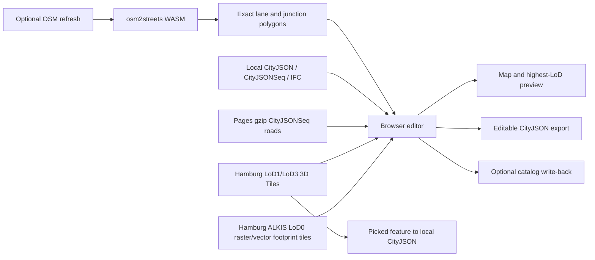

# City Editor project reference

This file is the single technical handoff for City Editor. It consolidates the former prototype status, road-geometry notes, Hamburg pipeline guides, osm2streets plans, and next-session task list.

## What the project guarantees

- The application runs from the repository root with `npm ci` and `npm run dev`.
- The default demo starts with usage-coloured citywide ALKIS LoD0 footprints, fades in native LoD1 from zoom 13.25, and switches directly to photo-textured native LoD3 at zoom 18. There is no ordinary LoD2 display tier. A persistent building-usage legend explains the flat-footprint palette; official 3D tiers retain semantic deep-red roofs and cream walls. Tapping a streamed batch feature creates a passive local CityJSON edit proxy; the streamed object is hidden only after a local mutation is saved.
- The complete 550,691-feature osm2streets catalog—344,265 roads plus 206,426 linked intersections—is packaged as 930 static 1 km gzip CityJSONSeq tiles and streamed from GitHub Pages by viewport. Its 122.6 MB gzip payload replaces 1.67 GB of raw CityJSONSeq and includes exact cross-tile seam dependencies. It works without a local backend, Overpass, Rust, or startup OSM XML processing.
- CityJSON is the editable source of truth for roads, locally loaded buildings, and buildings handed off from the remote stream.
- Imported osm2streets polygons remain byte-for-byte unchanged during attribute-only road edits.
- Close building views replace the official LoD1 stream with Hamburg's official LoD3 stream. Editable local CityJSON remains the source of truth for selected/changed objects.
- Road and building edit modes cull unrelated distant geometry and expensive street-point overlays.
- All primary controls use pointer events and touch-sized targets. Road drawing and editing always expose **Finish**, **Cancel**, **Save**, and **Discard**.


```mermaid
flowchart LR
  F["Hamburg ALKIS LoD0 raster/vector footprint tiles"] --> B["Browser editor"]
  H["Hamburg LoD1/LoD3 3D Tiles"] --> B
  H --> C["Picked feature to local CityJSON"]
  R["Pages gzip CityJSONSeq roads"] --> B
  A["Local CityJSON / CityJSONSeq / IFC"] --> B
  O["Optional OSM refresh"] --> S["osm2streets WASM"]
  S --> P["Exact lane and junction polygons"]
  P --> B
  B --> V["Map and highest-LoD preview"]
  B --> E["Editable CityJSON export"]
  B --> W["Optional catalog write-back"]
```

## Repository layout

```text
webcityeditor/
├── src/                   React editor, hooks, map layers, and geometry logic
├── tests/                 Component, hook, CLI, and geometry tests
├── scripts/               Hamburg, CityJSON, osm2streets, and OpenDRIVE tools
├── public/data/           Small committed browser-safe Hamburg demo
├── test-fixtures/         Small deterministic regression inputs
├── assets/readme/         Screenshots used by README.md
├── vendor/osm2streets/    Git submodule containing the maintained fork
├── vendor/osm2streets-js/ Built browser WASM package
├── Data/                  Optional large local catalogs; ignored by Git
├── README.md              User guide
└── PROJECT.md             This technical reference and roadmap
```

The old `prototype/` and `spike/` layouts are obsolete. Source and tooling must not be placed back under them.

## Editing model

### Buildings and LoD

The citywide LoD0 overview is generated from the official ALKIS 2D GML snapshot. Zooms 8–11 use small pre-rendered usage-coloured PNG tiles so a city overview never asks the browser to parse hundreds of thousands of sub-pixel polygons. From zoom 12, static MVT tiles preserve flat vector footprints and the same usage categories. They remain mounted under the incoming 3D tier through its 15.4–16.2 handoff, and remain fully visible at any zoom while that tier is still loading. The official ALKIS WMS remains a neutral low-zoom/loading fallback. At zoom 13.25 the map streams Hamburg's native LoD1 blocks and reaches full opacity at zoom 14.25 without whole-tile CityJSON conversion. LoD1 remains the ordinary middle-distance 3D tier until zoom 18; no LoD2 visual stream is requested. At zoom 18 the editor requests official photo-textured LoD3 by default, keeping LoD1 visible until the first LoD3 tile is ready. Opening Roads caps the remote city at LoD1; local LoD3-only edits remain visible without photos, and closing Roads restores the saved texture preference. The photo-texture switch can select the smaller untextured LoD3 variant instead. Semantic 3D materials are unlit linear-space colours so roofs display as deep terracotta rather than orange or lighting-dependent brown. Zoom updates are quantized to twentieths of a level during the gesture and settle to the exact final value.

Official 3D building payloads are `.b3dm`/glTF, not CityJSON. On a building click, the editor resolves the picked batch in screen space, applies the tile/node ECEF transforms, converts only that feature to EPSG:25832, reconstructs its semantic mesh, and merges it as a passive edit proxy. The remote feature continues through the ordinary LoD1/LoD3/photo pipeline until an actual local mutation promotes the proxy to a geometry override. The source feature and batch IDs are retained; a selected passive LoD1 proxy upgrades automatically when matching LoD3 arrives. The 1,353-building center file and 68 surveyed textured LoD3 counterparts remain local editing/assets data rather than a second center-only display layer. At zoom 16.5 and closer, the map streams the highest-resolution instances intersecting the viewport from Hamburg's official citywide summer-tree 3D Tiles hierarchy, then renders them with the editor's procedural tree meshes.

Imported buildings are intentionally read-only for topology-changing tools until **Make editable** is chosen. Attribute edits remain lightweight. Parametric conversion enables footprint, roof, openings, overhang, subdivision, and transform workflows, but it replaces the imported geometry and is therefore explicit.

The legacy `_createdBy: "city-editor-prototype"` value remains a deliberate on-disk compatibility marker for already exported parametric objects. It is not a path or repository-layout dependency.

### Roads: exact surfaces versus editable ribbons

Roads are stored as CityJSON `Transportation` objects. Each lane, shoulder, sidewalk, cycleway, parking strip, or median is a semantic `TrafficArea` or `AuxiliaryTrafficArea` polygon.

There are two geometry modes:

| Mode | Used for | Save behavior |
|---|---|---|
| `exact` | Imported osm2streets lane and junction polygons | Type, direction, material, access, and speed update attributes while boundaries and the global vertex array remain unchanged |
| `generated` | User-drawn or intentionally reshaped roads | The curved centreline and ordered bands regenerate matching preview and CityJSON ribbons |

The `_roadLayout` attribute stores editable sections, bands, curve settings, elevation, and confirmed endpoint connections. `_sourceCenterlineWgs84` preserves osm2streets' directed centerline, so reordering or resizing one band rebuilds around the same road axis instead of deriving a diagonal from polygon corners. Direction markings are map paths tangent to that line, independent of CityJSON ring winding. Imported osm2streets `allowed_turns` values are normalised onto their driving bands and draw straight, hooked left/right, merge, or U-turn markings; combined permissions share the same lane stem. `_roadGeometryMode` records whether the current boundaries are `exact` or `generated`. Existing exact data without the marker is still treated as exact for compatibility.

Changing only semantic attributes shows **Exact source polygons protected**. Moving handles, changing any width, reordering or adding bands, splitting a section, or changing curve settings switches the pending save to a clearly labelled geometry rebuild.

### Curves and connections

Road sections use a sampled smooth curve, not straight chords between every control point. The same sampled path drives the map preview and saved band polygons, preventing preview/export drift.

Endpoint editing is deliberate:

- yellow handles move existing bends;
- white midpoint handles insert a bend;
- teal endpoint targets come from other draft sections, editable CityJSON roads, and OSM road endpoints;
- dropping an endpoint on a teal target stores a confirmed connection;
- connections between two editable CityJSON roads are written reciprocally.
- confirmed editable-road joins derive direction- and mode-compatible lane continuations from
  their CityJSON layouts. Opposite endpoint kinds preserve target band order, while equal endpoint
  kinds reverse it, so straight three-lane continuations do not cross. Physically aligned pairs
  render as temporary road-coloured surfaces; real turns remain subdued guides. These display
  surfaces do not modify exact osm2streets polygons or export junction geometry.
- moving a confirmed endpoint away prompts before Save, then clears the stale reciprocal metadata
  from the connected road in the same guarded edit when the user accepts the disconnection;
- deleting a CityJSON road clears reciprocal endpoint metadata from every surviving editable road.

Connection metadata confirms graph topology. Imported osm2streets intersections preserve their
directed source-road-to-target-road movement list and each road's endpoint at that intersection.
Only those authoritative road pairs are considered. Within an allowed pair, explicit
`allowed_turns` select the compatible source lanes before left-to-right rank pairing chooses target
lanes, so a right-turn lane cannot fan out into a left branch. Missing metadata remains unknown and
does not invent a restriction. The editor does not permanently regenerate exact imported junction
geometry.

## UX and performance decisions

- **Roads** starts as a compact chooser with one existing-road action: tap a CityJSON road, then choose **Edit road**. The sheet expands only after a road is being edited.
- On desktop, the active road's complete cross-section editor sits over the map along the bottom: matching visual bands plus large type, material, width, direction, order, remove, and add controls. The redundant lane editor in the right sheet is hidden. Touch layouts keep the same complete controls in the bottom sheet.
- Road curvature is changed by dragging or adding visible map anchors. The UI exposes only the meaningful **Smooth** and **Straight** choice, not an abstract curve-strength percentage.
- Map/satellite mode, satellite opacity, and road-overlay opacity are directly inside the road sheet. The generic **Map layers** control starts collapsed and closes when another map tool opens.
- Road-network connection highlights exist only while the Roads workspace is open. Closing it or selecting unrelated map content clears every saved-road, OSM, lane, and junction highlight. Connections use a bright cyan/ice stroke over a dark navy halo so they remain distinct over dark, grey, blue, and red road surfaces as well as pale basemap areas.
- Phone layouts retain only Data, Roads, New Building, and More in the primary toolbar. Planning, list, export, validation, and secondary tools use the touch-sized More menu.
- Planning can be enabled at overview zoom. A single official FNP OGC API request supplies 2,842 interactive polygons across Hamburg and is cached in session; bounded XPlan detail queries run only when the viewport is within the safe 4.5 km range and refresh after the camera leaves the padded query coverage. The scrollable legend stays at the lower left and Map layers stays at the upper left.
- Drawing uses capture-phase Pointer Events and pointer capture. Do not add `event.buttons === 0` as a drag-ending condition; trackpads and overlay sequences can report it mid-drag.
- Edit focus computes a padded bounding box around the active road or building, then filters buildings, roads, zones, OSM centre-lines, osm2streets polygons, and street objects outside it.
- Tagged OSM street points stay hidden below close zoom unless edit focus needs them.
- Clearance and overlap checks are deferred while dragging, and expensive geometry is memoized rather than rebuilt on every pointer event.
- Generic building metadata is collapsed under **Source metadata**; common fields and actions stay visible first.

## Data and format workflows

### Built-in Hamburg demo

The committed browser-safe files are:

- `public/data/hamburg/hamburg-city-center-buildings.city.jsonl`
- `public/data/hamburg/hamburg-city-center-roads.city.json`
- `public/data/hamburg/hamburg-city-center-roads.osm`
- `public/data/hamburg/buildings/catalog.json`
- `public/data/hamburg/buildings/raster/**/*.png`
- `public/data/hamburg/buildings/tiles/**/*.pbf`
- `public/data/hamburg/roads/catalog.json`
- `public/data/hamburg/roads/tiles/*.city.jsonl.gz`
- `public/data/transportation/osm2streets-hamburg-short-intersection.city.json`

The center `.city.json` road file is retained as a compact fallback. The default uses the static catalog; visible road tiles become the editable/exportable source of truth in memory. The `.osm` file is retained only for optional refresh/comparison. Regenerate the center samples with:

```powershell
npm run data:hamburg-center
npm run data:hamburg-center:osm
npm run data:hamburg-center:roads
```

### Citywide LoD0 footprints

The reproducible builder downloads Hamburg's official INSPIRE ALKIS 2D GML,
streams roughly 453,000 valid building polygons into a temporary SQLite index,
and writes usage-coloured overview PNG plus compact raw MVT tiles:

```powershell
python -m pip install -r scripts/requirements-hamburg-building-tiles.txt
npm run data:hamburg-building-footprints
```

Only the static browser tiles and their catalog are committed; the 1.43 GB
uncompressed GML and temporary spatial index are not. The current catalog has
453,216 footprints in 123 overview PNG and 5,116 MVT files, totalling 39,948,821
tile bytes (38.1 MiB).

### Optional whole-city buildings

```powershell
npm run data:hamburg-lod2
npm run dev:hamburg-buildings
```

The strict CityJSONSeq catalog streams tiles for the visible viewport and supports local changed-tile write-back. Large source and generated files stay under ignored `Data/`.

### Official Hamburg LoD3 data

The close map streams the official live tileset at `https://daten-hamburg.de/gdi3d/datasource-data/LoD3_tex20cm/tileset.json`; its JSON and b3dm children return `Access-Control-Allow-Origin: *`. CityJSON remains authoritative for edits and export. The compact tile `6433` conversion is retained as editable/offline source data. Reproduce it by downloading the tile's records from the Area 1 archive, converting with `citygml-tools`, then building the subset with:

```bash
npm run data:hamburg-lod3-download -- 6433
# Extract the resulting partial ZIP with a Deflate64-capable ZIP tool.
tools/citygml-tools-2.4.0/citygml-tools to-cityjson -e 25832 -c -o .tmp/hamburg-lod3-converted/6433 .tmp/hamburg-lod3-source/6433/6433/6433.gml
npm run data:hamburg-lod3-showcase
npm run data:hamburg-trees
```

`data:hamburg-trees` retains the compact 2,110-tree city-centre fixture used by tests. The live map follows the official citywide summer-tree 3D Tiles hierarchy by viewport, reads only intersecting highest-resolution I3DM/CMPT instances, converts ECEF positions to WGS84, and keeps a bounded decoded-tile cache. This avoids both the old city-centre limit and loading the full tree inventory into memory.

The four placement assets are selected from the committed tile `6433` conversion and normalized around local placement origins while retaining each root's installation hierarchy. Reproduce them with:

```powershell
npm run data:hamburg-lod3-assets
```

The normalizer is `scripts/build-hamburg-lod3-assets.mjs`. The output is licensed under Datenlizenz Deutschland – Namensnennung – Version 2.0; attribution is **Freie und Hansestadt Hamburg, Landesbetrieb Geoinformation und Vermessung**. The source dataset is <https://suche.transparenz.hamburg.de/dataset/3d-gebaeudemodell-lod3-0-hh-hamburg17>.

### Whole-city Pages road stream

On Windows, inspect, prepare, or serve the complete reproducible catalog with:

```powershell
.\PREPARE_HAMBURG_ROADS.cmd -DryRun
.\PREPARE_HAMBURG_ROADS.cmd
.\PREPARE_HAMBURG_ROADS.cmd -Serve
```

Equivalent npm commands are `npm run data:hamburg-roads:prepare` and `npm run dev:hamburg-roads`. The raw strict CityJSONSeq source stays under ignored `Data/`. Package a complete, failure-free source catalog for Pages with:

```powershell
npm run data:hamburg-roads:pages
```

The packager assigns each feature by extent centroid to a 1 km cell, preserves the millimetre grid, and writes relative gzip tile URLs. The current result is 930 files, 550,691 features (344,265 roads and 206,426 intersections), 1,666,587,937 bytes uncompressed, and 122,423,214 compressed tile bytes (about 116.75 MiB), plus the catalog. GitHub Pages is read-only, so edited road tiles are retained through **Save local** or **Export CityJSON**, not `Save seq`.

Runtime memory stays bounded while moving through the city. Every viewport keeps
its visible road cells, all exact seam-dependency cells, and at most two
optional neighbouring cells. If a tile request is already running, the newest
viewport is queued and replayed immediately afterward so a rapid zoom cannot
leave a large intermediate tile set resident. Clean off-screen source features
are evicted before the next merge, immutable Pages features discard write-back
templates after import, and vertex compaction uses an in-place typed-array
remap. The footprint MVT cache is binary and byte-limited, and native LoD1/LoD3
streams use bounded request concurrency and GPU cache targets; textured LoD3
uses the coarser refinement target because its decoded 20 cm atlases are the
largest renderer-memory cost. Once a textured tile completes its first draw,
the uploaded GPU texture remains active while the duplicate CPU-side decoded
ImageBitmap is explicitly released; unload repeats the release defensively.

### osm2streets fork and WASM

`vendor/osm2streets` is the retained Git submodule. The browser consumes `vendor/osm2streets-js`, which is built from the fork and committed so the default demo does not require Rust.

The fork hardens degenerate geometry, zero-width and shared-use edge cases, separated sidewalks, short intersections, and deterministic lane-polygon output. Normal edits do not rerun osm2streets: it generates or refreshes exact base polygons, after which CityJSON is authoritative.

Rebuild and compare the engine only when changing the fork:

```powershell
powershell -ExecutionPolicy Bypass -File scripts/build-osm2streets-wasm.ps1
npm run osm2streets:compare
npm test
npm run build
```

### Conversion and interoperability

- `npm run osm2streets:cityjson` converts osm2streets lane polygons to CityJSON Transportation surfaces while retaining provenance and exact boundaries.
- `npm run cityjson:to-citygml` exports the supported CityJSON subset to CityGML.
- IFC import keeps a low-detail footprint plus the detailed mesh and its semantic surfaces.
- `npm run opendrive:rtron -- --dry-run` exposes the experimental r:trån/OpenDRIVE command path. It remains a pipeline scaffold until a real licensed fixture and end-to-end geometry acceptance are added.

## Development and verification

Start each repository session with read-only orientation and preserve unrelated work:

```powershell
git status --short --branch
git fetch --prune origin
```

Fast-forward from `origin/main` only when it preserves the current worktree. Never reset or discard unrelated changes.

Run ordinary verification from the repository root:

```powershell
npm run test -- tests/lib/transportation.test.ts
npm test
npm run build
git diff --check
```

For catalog setup changes, also run:

```powershell
.\PREPARE_HAMBURG_ROADS.cmd -DryRun
node --check scripts/dev.mjs
node --check scripts/prepare-hamburg-road-catalog.mjs
npm run dev:hamburg-roads -- --dry-run
```

Focused regression coverage exists for smooth road preview/export parity, touch handle editing, endpoint snapping, reciprocal CityJSON connections, exact-polygon attribute saves, highest-LoD mesh selection, catalog preparation, and the Hamburg committed fixtures.

## Next guided patch: lane-order-aware intersection continuations

Implement this patch from the current `main` state. Keep the existing endpoint snapping,
reciprocal CityJSON road metadata, exact imported polygons, and current map-performance behavior.
Do not bring back a terrain mesh or change TopPlus/satellite rendering as part of this work.

The problem is lane ordering, not missing road geometry. Bands are stored left-to-right relative
to each road section's directed centreline. Pairing two connected sections by raw array index can
therefore draw crossing movements: a physical straight continuation from lanes 1, 2, 3 is sometimes
shown as 1→3, 2→2, 3→1. The crossed guides also leave the junction looking like an unresolved grey
area.

Required behavior:

1. Derive lane-level movements from CityJSON road layouts, band semantics, directed centrelines,
   endpoint connections, and imported intersection membership. Use original OSM/osm2streets output
   only as a fallback when the committed CityJSON lacks information; CityJSON remains authoritative.
2. Pair only direction- and mode-compatible bands. Normalize the target order using the connected
   endpoint kinds: preserve target order for opposite endpoints (`start`↔`end`) and reverse it for
   equal endpoints (`start`↔`start` or `end`↔`end`). Thus a three-lane `end`→`start` connection is
   1→1, 2→2, 3→3, while `end`→`end` is 1→3, 2→2, 3→1.
3. Classify physically aligned movements as `through`. Render those as temporary, metre-width,
   road-coloured continuation bands over the junction so the road reads as continuous. Keep actual
   left, right, U-turn, bicycle, sidewalk/crossing, and ambiguous movements as subdued editable
   guide curves. These display bands must not rewrite exact osm2streets polygons or pretend that
   exportable intersection geometry has been synthesized.
4. Add focused tests for both three-lane endpoint orientations, compatible-mode/direction filtering,
   `through` classification, and the committed short Hamburg intersection
   fixture. In the browser, verify that straight lanes no longer cross, the grey gap is visually
   filled, real turns remain understandable, TopPlus stays sharp, and interaction performance does
   not drop after the map settles.

Implemented first slice (2026-07-26): confirmed reciprocal editable-road joins now satisfy the
endpoint-order normalization and mode/direction filtering in item 2. Their geometrically aligned
`through` pairs use temporary width-aware continuation surfaces, while non-through pairs remain
subdued guides. The Hamburg browser acceptance pass remains pending.

Removed review-state experiment (2026-07-31): lane continuations are derived directly from
authoritative CityJSON/osm2streets topology and `allowed_turns`. The proposed/confirmed/rejected
review controls, status metadata, reciprocal status synchronization, and status-based guide hiding
were removed as unnecessary. Confirmed road endpoint connections remain part of `_roadLayout`;
exact imported polygons remain protected.

## Remaining roadmap

The following work is intentionally not claimed as complete:

1. Generate true intersection surfaces from confirmed connected roads, including lane-to-lane connectors, turns, crossings, and regenerated markings. Exact lane polygons already match osm2streets styling; dynamic junction synthesis is not claimed as complete.
2. Add a real, redistributable OpenDRIVE fixture and verify r:trån import against CityJSON Transportation semantics.
3. Complete topology-aware coordinate propagation for every road source. The editor now detects a
   moved-away confirmed endpoint and can, after explicit confirmation, move a generated peer road's
   endpoint while preserving reciprocal metadata and fit-checking both geometries. Exact imported
   polygons and ambiguous multi-peer joins retain the guarded disconnect path until a deliberate
   regeneration/conflict-resolution workflow is added.
4. Profile the complete whole-city road catalog on representative touch hardware and add spatial indexing if edit-focus filtering is not sufficient.
5. Add a dedicated renderer for Hamburg's CORS-enabled Cesium quantized-mesh DGM terrain and drape the active MapLibre basemap onto it. Per-building grounding fixes floating models now; full terrain is required to preserve surveyed elevation differences and terrain breaklines visually.
6. Add screenshot-based GPU regression coverage for official 3D Tiles and grounded mixed LoD1/LoD3 data on lower-end mobile devices. Structural grounding and tile-data regressions already have unit coverage.

These are continuation tasks, not blockers for the committed demo or the exact attribute-editing workflow.
