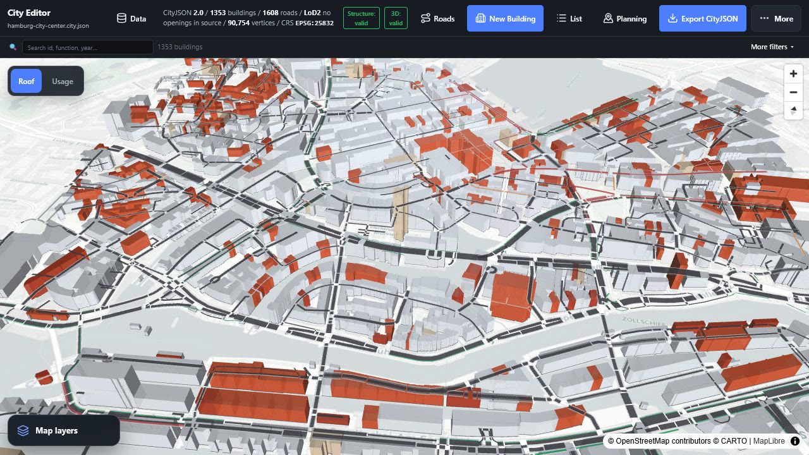
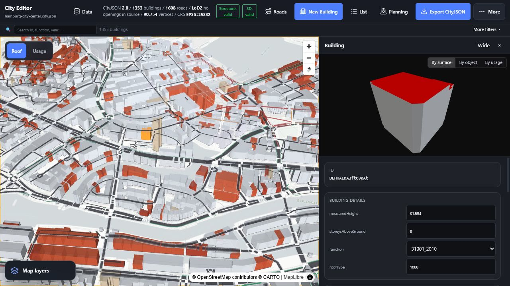
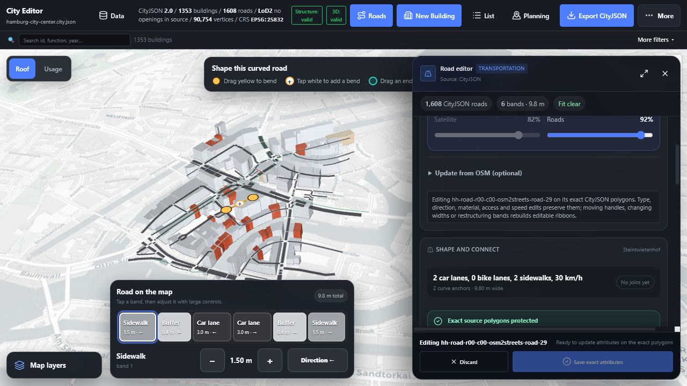

# City Editor

City Editor is a touch-friendly map for editing buildings and osm2streets-quality roads in one CityJSON file. The Hamburg demo opens automatically with 1,353 buildings and 1,608 editable CityJSON roads—no server or OSM conversion is needed at startup.



## Start the editor

Install [Node.js](https://nodejs.org/) 20 or newer, then run:

```powershell
npm ci
npm run dev
```

Open the local address printed in the terminal. No backend, Rust installation, or data download is needed for the built-in demo.

## Edit a building

1. Tap a building on the map to see its attributes.
2. Change its height, storeys, function, or roof type in **Building details**.
3. Choose **Start editing position** to move it while keeping its ground aligned with nearby terrain.
4. Choose **Make editable** only when you intentionally want to replace imported geometry with a reshaped parametric building.
5. Export CityJSON when you are ready to save or compare the result.

The close-up viewer uses the highest LoD actually stored for that building. The built-in Hamburg source is LoD2, so the UI says **LoD2 · no openings in source** instead of pretending windows or LoD3 geometry exist. A file that really contains LoD3 or semantic Window/Door surfaces is rendered at that higher source detail. Hamburg’s much larger official [LoD3.0 CityGML source](https://suche.transparenz.hamburg.de/dataset/3d-gebaeudemodell-lod3-0-hh-hamburg5) has detailed roofs and facade textures, but must first be converted to CityJSON.



## Edit a road

1. Choose **Roads**, then tap a road on the map.
2. Choose the single **Edit road** action. The exact osm2streets polygons are already stored in CityJSON.
3. Tap a coloured band in the map-integrated cross-section. Use the large `−`, `+`, and direction controls, or scroll the road sheet for every attribute.
4. Drag yellow handles to bend the road, tap white `+` handles to add a curve point, and drag an end onto a teal dot to confirm a connection.
5. Switch between **Map** and **Satellite** inside the road sheet. Both satellite and road opacity have their own sliders.
6. Choose **Save** or **Discard**.

The saved CityJSON road layer uses the same lane colours and polygon boundaries as the osm2streets view, without the extra white outlines that previously changed its appearance. Attribute-only changes preserve the exact source vertices. Moving a handle, changing width/order, splitting, or changing curve settings deliberately rebuilds only that road and is clearly labelled before save.



## Save, compare, and continue later

Edits stay local until you export. **Export CityJSON** downloads one complete snapshot containing both buildings and roads. Reopen it later to compare or continue editing.

To create a building, choose **New Building**, tap at least three corners, choose **Use outline**, review the preview, then choose **Create Building**. This flow works with touch and does not require a double-click.

On a phone, the toolbar keeps only **Data**, **Roads**, **New Building**, and **More** visible. Building list, planning, export, validation, and developer actions remain available in the large **More** menu.

Architecture, data formats, osm2streets decisions, contributor commands, and the honest remaining roadmap are in [PROJECT.md](PROJECT.md).
