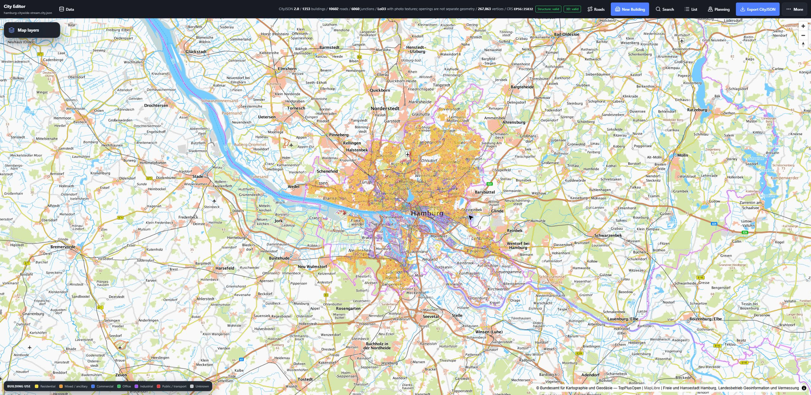
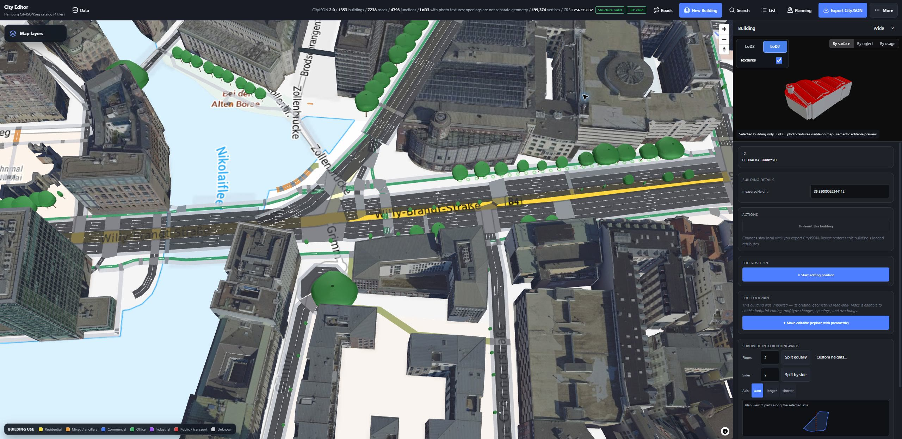
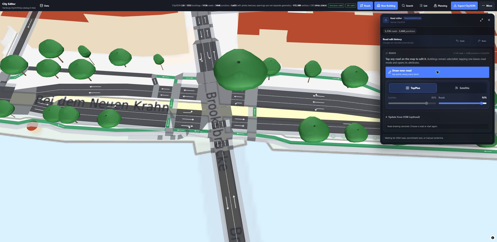

# City Editor

City Editor is a touch-friendly map editor for Hamburg buildings, roads, and planning data. The default map shows Hamburg's official ALKIS footprints coloured by use, adds lightweight LoD1 blocks, and then switches directly to textured LoD3 as you zoom. It streams our complete CityJSON road catalog from GitHub Pages and turns a tapped streamed building into a local editable CityJSON copy on demand.

**[Open City Editor](https://cakirmert.github.io/webcityeditor/)**

The demo starts automatically with Hamburg-wide flat LoD0 footprints derived from the official ALKIS 2D GML. Coloured raster tiles keep the regional overview light; vector footprints take over at zoom 12 and remain underneath the incoming 3D tier until its handoff completes, avoiding an empty loading range. Native LoD1 fades in at zoom 13.25, reaches full opacity at 14.25, and remains the ordinary 3D tier until native LoD3 takes over at zoom 18 with **Photo textures** enabled by default. There is no ordinary LoD2 display tier. LoD0 footprints are always coloured by building use, with a legend on the map and inside **Map layers**; LoD1 and untextured LoD3 keep semantic deep-red roofs and cream walls. Only road tiles for the visible viewport and their exact seam dependencies enter memory; the complete catalog contains 344,265 roads and 206,426 linked junctions. Roads and buildings copied for editing remain ordinary local CityJSON.



## First minute

1. Drag the map to move and use the wheel, pinch gesture, or `+` and `−` buttons to zoom.
2. Zoom to LoD1 or LoD3, then tap a building to copy that one streamed feature into local CityJSON and inspect it, or choose **Roads** and tap a loaded road.
3. Use **Map layers** for TopPlus, satellite comparison, opacity, and the building-usage legend.
4. Unsaved changes are shown in the top bar. Choose **Export CityJSON** when you want a portable snapshot.

## Change the map view

Open **Map layers** in the upper-left of the map.

- **TopPlus** is the default official cartographic basemap.
- **Satellite** is useful for checking building footprints and road alignment.
- **Satellite image** and **Road surfaces** have separate opacity sliders.
- **Building usage** explains the colours applied to flat LoD0 footprints from Hamburg’s official ALKIS `currentUse` values. The same compact legend remains at the bottom of the map while this menu is closed. Official 3D buildings keep semantic deep-red roofs and cream walls.
- **Photo textures** is on by default and becomes available only in the close LoD3 view. With it off, LoD3 roofs, walls, windows, and doors retain distinct semantic colours.
- The status at the bottom explains which building detail level is currently visible.

> **Screenshot to add — `assets/readme/map-layers.jpg`**
> Open Map layers over a close Hamburg view. Show TopPlus and Satellite, the Building usage legend, the LoD3 Photo textures switch, both opacity controls, and enough map on the right to make their effect obvious. Suggested caption: “Map layers keeps comparison, the footprint-usage legend, and optional LoD3 texture controls together.”

## Inspect and edit a building

1. At LoD1 or LoD3, tap a building. That one `.b3dm` batch feature becomes a passive local CityJSON edit proxy while the normal remote LoD remains visible. Saving a geometry or attribute edit promotes the local copy and hides only its remote duplicate. A selected LoD1 proxy automatically upgrades when its LoD3 tile arrives. The citywide footprint overview is intentionally not pickable.
2. Use **By surface**, **By object**, or **By usage** above the preview to understand the model.
3. Change attributes such as measured height, storeys, function, or roof type.
4. Choose **Start editing position** to move the building on the map.
5. Choose **Edit footprint corners** when the source geometry supports footprint editing.
6. Use **Revert this building** to restore its loaded attributes before export.



The local copied mesh can be moved and its attributes can be edited immediately. **Make editable (replace with parametric)** deliberately replaces it with a shape that can change roof geometry, windows, doors, overhangs, and subdivisions. Ordinary attribute or position edits do not need that second conversion.

The selected-building viewer loads only the selected CityJSON object. Use its **LoD2 / LoD3** control to compare source tiers. A **Textures** switch is shown only when that selected building actually contains a photo atlas; textures start off. Their photographed windows and doors are not automatically editable openings. Buildings are attached to the flat editor map using each building’s surveyed ground height.

## Add a new building

1. Choose **New Building** in the top bar.
2. Pick one of the four included single-building LoD3 assets for quick placement, or choose **Draw a custom building**.
3. For an asset, tap the map where its centre should be placed.
4. For a custom building, tap at least three footprint corners and choose **Use outline**.
5. Set height, roof, classic/balanced/modern window rhythm, doors, and editable parts while watching the preview.
6. Keep **One building** for the simple default. Choose independent floors or side-by-side wings only when those parts must be edited separately.
7. Choose **Create Building**. The new building becomes part of the working CityJSON.

> **Screenshot to add — `assets/readme/new-building.jpg`**
> Show the New Building chooser with the four sample assets and Draw a custom building visible. Keep part of the map visible behind it. Suggested caption: “Start from a reusable single-building LoD3 asset or draw a custom footprint.”

> **Optional second screenshot — `assets/readme/custom-building.jpg`**
> Capture a completed custom outline with the creation preview open. Show the roof choices, openings, and the clearly labelled editable-parts choice. Suggested caption: “The preview explains the result before anything is added to CityJSON.”

## Edit an existing road

1. Choose **Roads** in the top bar.
   The remote city uses lightweight semantic LoD1 while this workspace is open, which keeps road interaction responsive; closing Roads restores the saved LoD3/photo setting.
2. Tap a coloured road surface on the map, then choose **Edit road**.
3. Tap a lane, cycle lane, sidewalk, buffer, parking strip, or green strip in **Road on the map**.
4. Change its type, surface, width, direction, or order with the large controls. Lane dividers and direction markings update from the road bands. Imported junction movements first restrict which directed road pairs can connect; each lane's `allowed_turns` then selects the compatible destination and produces straight, hooked left/right, merge, U-turn, and combined lane arrows.
5. Drag a yellow anchor to move a bend. Tap or drag a white `+` to add a bend. Drag a road end onto a teal target to confirm a road connection.
6. Choose **Smooth** or **Straight**. Split the road only where its lane layout changes along its length.
7. Use **Undo** or `Ctrl+Z` to step back. Use **Redo**, `Ctrl+Shift+Z`, or `Ctrl+Y` to repeat an undone change. Changes are recorded automatically, and rapid anchor dragging is kept as one useful history step.
8. Choose **Save exact attributes** or **Save road changes**. **Discard** leaves the saved CityJSON unchanged.



Attribute-only changes preserve imported osm2streets polygons and vertices. Moving handles, changing widths or band order, adding or removing a band, splitting a section, or changing the curve mode rebuilds only that road as editable ribbons.

## Draw a new road

1. Open **Roads** and choose **Draw new road**.
2. Tap the road centreline on the map. Add a point at the start, every important bend, and the end.
3. Choose the large **Finish road** button. Two or more points are required.
4. Edit the generated road bands exactly like an existing road.
5. Compare the shape with **Satellite** and adjust both opacity sliders when needed.
6. Use the yellow end handles and teal targets to connect it to existing roads.
7. Choose **Save new road** to insert it into the working CityJSON.

> **Screenshot to add — `assets/readme/new-road.jpg`**
> Capture drawing mode after three or four centreline points have been placed. Include the large Finish road and Cancel buttons, the instruction banner, and the visible line on the map. Suggested caption: “Tap the centreline at every bend, then finish with the large touch-friendly action.”

## Use the planning overlay

1. Choose **Planning** in the top bar. Hamburg's official FNP areas load once for the whole city, including at overview zoom.
2. Wait for the planning legend. Detailed XPlan polygons are added for close views and refresh automatically after you move outside the loaded detail window.
3. Tap an area to inspect its planning category.
4. Open **Map layers** if you need a different basemap or opacity while comparing the plan.
5. Choose **Planning** again, or use the legend’s hide action, to turn the overlay off.

> **Screenshot to add — `assets/readme/planning.jpg`**
> Use a medium zoom where several coloured planning areas are visible. Keep the complete planning legend unobstructed and show the Planning button as active. Suggested caption: “Planning works from the overview and keeps its legend visible above the map.”

## Load, validate, undo, and export

- **Data** loads CityJSON, CityJSONSeq, the Hamburg demo, or the small sample cube.
- **Structure** checks CityJSON integrity.
- **Check 3D** validates edited geometry before export.
- **Undo** and **Redo** under **More** cover changes already committed to the working CityJSON. The Road editor’s larger Undo and Redo controls cover the current unsaved road draft.
- **Save local** stores the working document in browser storage.
- **Export CityJSON** downloads the current buildings, roads, junctions, attributes, and editable road layouts as one snapshot.

> **Screenshot to add — `assets/readme/export.jpg`**
> Show one unsaved change in the top bar, the Structure and Check 3D states, and the Export CityJSON button. Suggested caption: “Validation and unsaved-state feedback stay visible before export.”

## Screenshot checklist

Use this list when adding or replacing README images:

| File | What the image must teach |
| --- | --- |
| `city-overview.jpg` | Where the main toolbar, search, map, and Map layers control are located. |
| `map-layers.jpg` | TopPlus/Satellite choice, the building-usage legend, LoD3 textures, and opacity controls. |
| `building-editor.jpg` | A selected building, its map highlight, preview modes, attributes, and main editing actions. |
| `new-building.jpg` | The asset list and custom-building choice. |
| `custom-building.jpg` | A drawn footprint plus the explanatory creation preview. |
| `road-editor.jpg` | The on-map road, band strip, large lane controls, Undo/Redo, and Save/Discard. |
| `new-road.jpg` | A visible centreline in drawing mode with Finish road and Cancel. |
| `planning.jpg` | Multiple planning areas, the complete legend, and the active Planning button. |
| `export.jpg` | Unsaved state, both validation indicators, and Export CityJSON. |

For a consistent tutorial, use a 16:9 desktop capture around 1600×900, the default Hamburg demo, the same dark UI theme, and no browser chrome. Crop only empty margins—keep the map and the control being explained in the same image. Use the captions suggested above as the Markdown alt text or visible caption.

## Run locally

Install [Node.js](https://nodejs.org/) 20 or newer, then run:

```powershell
npm ci
npm run dev
```

Open the local address printed in the terminal. The committed static road catalog is enough for the default road workflow; the building context is fetched from Hamburg's CORS-enabled 3D Tiles service.

The citywide flat overview is generated from Hamburg’s [official ALKIS 2D building download](https://suche.transparenz.hamburg.de/dataset/inspire-hh-gebaeude-alkis12), the intermediate blocks come from its native LoD1 tiles, and close detail comes from the [official LoD3.0 dataset](https://suche.transparenz.hamburg.de/dataset/3d-gebaeudemodell-lod3-0-hh-hamburg17). The official WMS remains a low-zoom/loading fallback. Planning loads the official citywide FNP feature collection once and adds live viewport-local XPlan detail. Close views add measured trees from the official [3D street-tree register](https://metaver.de/trefferanzeige?docuuid=24513F73-D928-450C-A334-E30037945729). TopPlusOpen is provided by Germany’s Federal Agency for Cartography and Geodesy. Architecture, data preparation, contributor commands, and the remaining roadmap are in [PROJECT.md](PROJECT.md).
