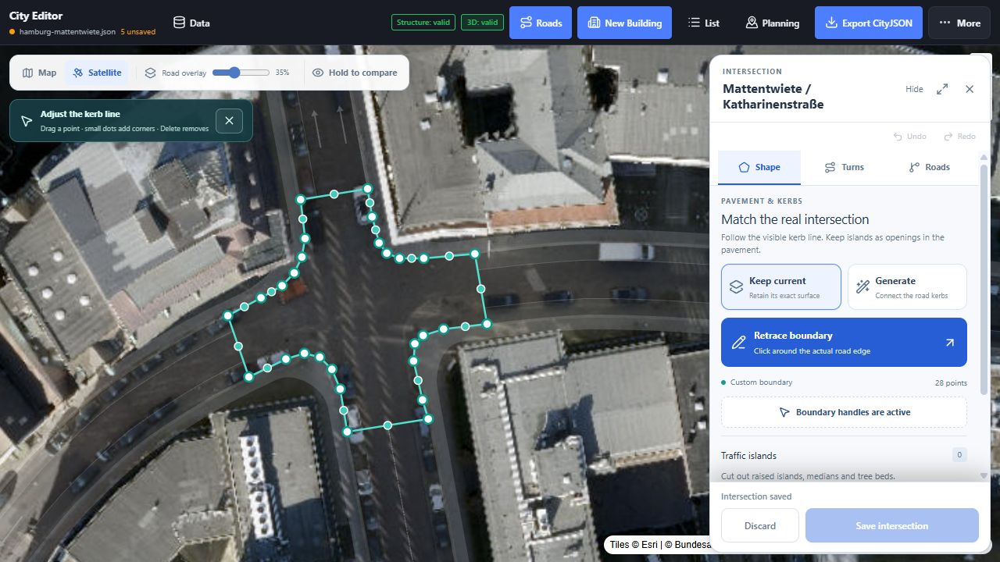
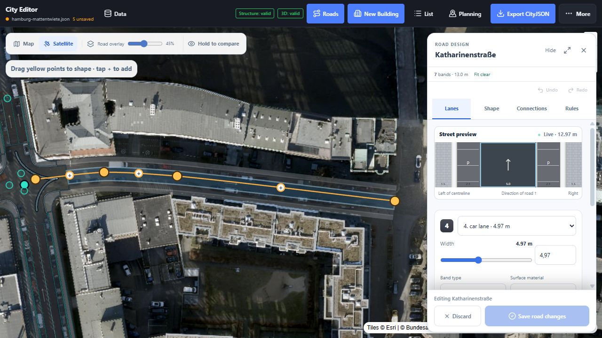
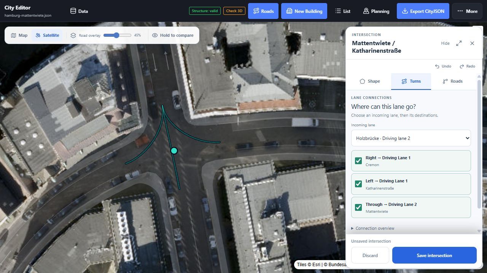
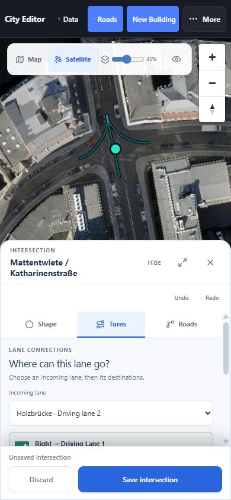
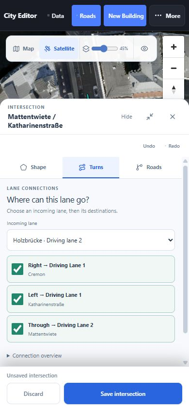

# City Editor

Design streets, edit intersections and buildings, and keep the result in **CityJSON**. City Editor combines Hamburg's city data, satellite imagery, direct map handles and a single responsive inspector.

**[Open the live demo](https://cakirmert.github.io/webcityeditor/)** · [Run locally](#run-locally) · [Research and technical notes](#research-and-technical-notes)



## Try the intersection in one minute

1. Open **Data → Try the Hamburg intersection**.
2. Choose **Roads**, then click the central junction. This is **Mattentwiete / Katharinenstraße**, with Holzbrücke and Cremon as the other approaches.
3. In **Shape**, choose **Adjust boundary on map**. Drag a boundary point; drag a smaller dot to add a corner. The pavement updates immediately.
4. Switch between **Map** and **Satellite** above the map. Adjust **Road overlay**, or hold the eye button to compare the road with the imagery.
5. Open **Turns**, choose an incoming lane and enable or disable its destinations.
6. Use **Undo** to review a change. Choose **Save intersection** to update the junction and its approach surfaces together.

The example includes a 28-point visual kerb trace and estimated approach widths. Parking allocations are illustrative; the source lane counts and directions are retained. The [original import](public/examples/hamburg-mattentwiete-source.json), [edited example](public/examples/hamburg-mattentwiete.json) and [comparison notes](docs/intersection-reference-study.md) make the changes inspectable.


*The GIF changes the real editor's road opacity. The imagery date is unknown; obscured kerbs, parking and lane details need field or survey verification.*

## Edit a road

Choose **Roads** and select a street. The same inspector holds its preview, properties and save controls. If another edit is already active, finish it or use the selected road's **Edit road** action.

| Tab | What you can do |
| --- | --- |
| **Lanes** | Select a band in the proportional street preview. Change width, type, surface, direction and order; add driving, cycling, sidewalk, parking or planting space. |
| **Shape** | Move centreline anchors, add bends with the white `+` handles, choose **Smooth** or **Straight**, adjust elevation or split a section. |
| **Connections** | Inspect joins at either end, disconnect an endpoint, open an existing intersection, or build one from a saved join. |
| **Rules** | Review minimum widths, set left/right extent limits, fit widths into available space, and import or export a city policy. |



Changes stay in a draft until **Save road changes** or **Save exact attributes**. Attribute-only edits can retain imported polygons. Moving a road, changing widths or reorganising its bands generates new geometry and previews connected junctions. **Discard** leaves the saved road as it was.

### Draw and connect a new road

1. Choose **Roads → Draw new road**.
2. Click along the centreline, including its bends. Press **Enter** or choose **Finish road**.
3. Set the cross-section in **Lanes** and review **Rules**. New bands start with the active policy's recommended widths.
4. Drag an endpoint onto a nearby teal connection target. Review the join in **Connections**, then save the road.
5. Choose **Build intersection** at the joined endpoint to construct a junction. Add nearby approaches in the intersection's **Roads** tab.

A failed fit explains the conflict and preserves the draft. Width fitting respects each band's minimum and the available space on each side. Existing trees on sidewalks, planted strips and traffic-island openings are allowed. Driving, cycling or parking pavement covering a mapped tree trunk blocks saving.

## Shape an intersection

The intersection inspector separates its physical outline from its permitted movements:

- **Shape → Keep current** retains the saved surface.
- **Shape → Generate** connects the approach kerbs with curved returns. It is a starting point for a local, flat junction.
- **Trace from satellite** lets you click around the visible carriageway boundary. Extend the outline slightly into each approach, then choose **Finish**. A crossing or detached boundary cannot be saved.
- **Adjust boundary on map** provides draggable corners and midpoint insertion. With a point focused, arrow keys nudge it; **Shift + arrow** moves farther and **Delete** removes it. A whole drag is one undo step.
- **Trace an island** creates an opening for a raised island, median or tree bed. Islands must remain inside the boundary and separate from each other.
- **Turns** selects one incoming driving lane, cycle lane or sidewalk and shows its destinations. Disabling a movement leaves the pavement intact. **Connection overview** opens a compact diagram.
- **Roads** names the junction and lists its connected approaches.



Automatic junctions follow connected road geometry changes. A manually traced outline remains fixed until you edit it; check its joins again after changing an approach. Islands are retained through save and reload, and the editor warns when a permitted connection crosses one.

Imagery makes a close visual reconstruction practical. It does not supply surveyed kerbs, current legal turn restrictions, vehicle turning envelopes or elevations. This editor handles flat local junction surfaces; complex grade-separated junctions, signals, stop lines and swept-path engineering need additional data and tools. See the [reference study](docs/intersection-reference-study.md).

## Work on a small screen

On a phone the inspector becomes a bottom sheet and the map frames the active edit above it. **Expand** gives the controls more height; **Hide** exposes the map while retaining the draft. **Show** brings the controls back. Starting a trace hides the sheet automatically; finishing or cancelling restores it. In landscape, the inspector moves to the right. Validation, export and other secondary actions are under **More** on narrow screens.

<p>
  
  
</p>

## Buildings, imagery and planning

The Hamburg overview streams city data as you move. Drag to pan; use the wheel, pinch or map `+`/`−` controls to zoom.

- Open **Map layers** outside road mode to change the basemap, opacity, building usage colours and available photo textures.
- Select a building to inspect its attributes and available **LoD2 / LoD3** detail. Use **Start editing position** to move it or **Make editable** for footprint, roof, opening and part edits.
- Choose **New Building** for a ready-made example or **Draw a custom building**, then place its footprint on the map.
- Choose **Planning** to inspect Hamburg's planning areas and their legend. Select a coloured area for its category.


## Save, check and export

| Action | Result |
| --- | --- |
| **Save road / Save intersection** | Applies the draft to the loaded CityJSON document. |
| **More → Undo / Redo** | Reverses or reapplies document changes. Drafts also have their own Undo / Redo controls. |
| **More → Save local** | Keeps a copy in this browser's local storage. |
| **Data** | Loads CityJSON, CityJSONSeq, bundled examples or a local save. |
| **Structure** | Checks document references and structure in the browser. |
| **Check 3D** | Runs primitive geometry validation through the configured local val3dity service. |
| **Export CityJSON** | Downloads the loaded buildings, roads, junctions, attributes and edits together. |

Road and intersection save operations are guarded against structural damage. Resolve blocking geometry/fit errors before export. A **Structure** pass and a **Check 3D** pass answer different questions; neither certifies traffic engineering or municipal design compliance.

## Run locally

Use Node.js 20.19+ or 22.12+ and a browser with WebGL2:

```powershell
npm ci
npm run dev:frontend
```

Open the address printed by Vite. The bundled intersection study works with this frontend command; live imagery and remote Hamburg layers require a network connection.

For a prepared local building catalog and validation service, use `npm run dev:hamburg-buildings`; for a prepared road catalog, use `npm run dev:hamburg-roads`. See [PROJECT.md](PROJECT.md) for data preparation and val3dity configuration. A validator executable is an optional local dependency and is not bundled in the website.

```powershell
npm test
npm run build
```

## Research and technical notes

| Document | Contents |
| --- | --- |
| [Intersection reference study](docs/intersection-reference-study.md) | Selected real junction, original/edited data, satellite comparison, width estimates and remaining uncertainty. |
| [UX and width-policy research](docs/road-ux-research.md) | PTV Vissim, SUMO NetEdit and Godot patterns; geometry alternatives; Hamburg ReStra sources and project assumptions. |
| [Transportation provenance](docs/transportation-provenance.md) | OSM → osm2streets → CityJSON, upstream rule audit and CityJSON Transportation semantics. |
| [Handoff and verification](docs/road-editor-handoff.md) | Delivered behavior, regression checks and implementation limits. |
| [PROJECT.md](PROJECT.md) | Architecture, datasets, converter commands and contributor notes. |

The map retains attribution for OpenStreetMap, Hamburg's building/tree/planning data, Esri World Imagery and BKG TopPlusOpen. Screenshots of the road workspace and the comparison GIF were captured from the running editor on 7 September 2026.
