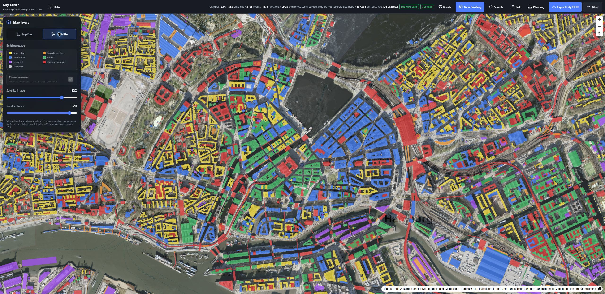
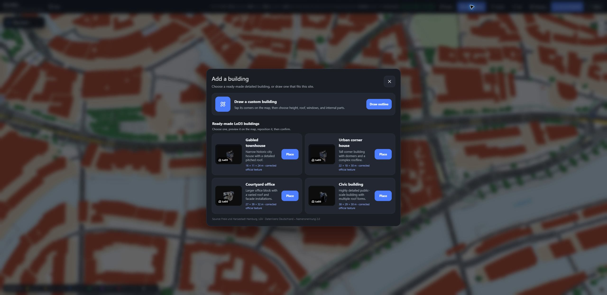
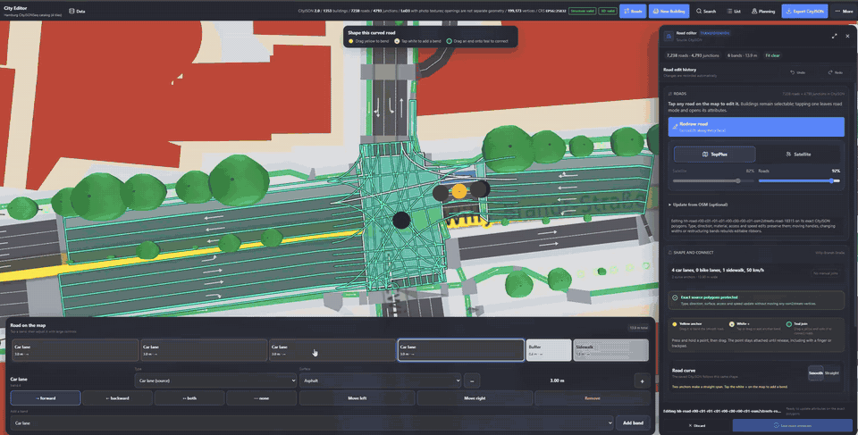
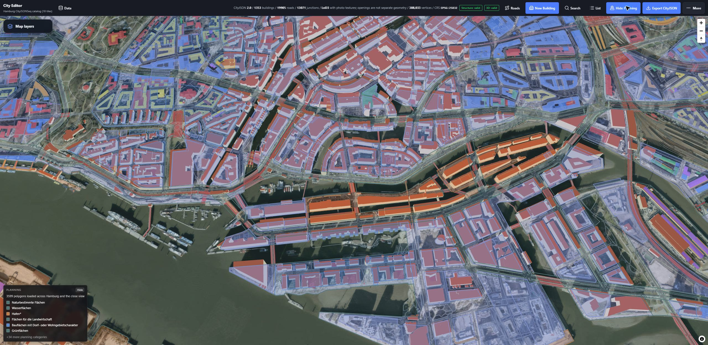
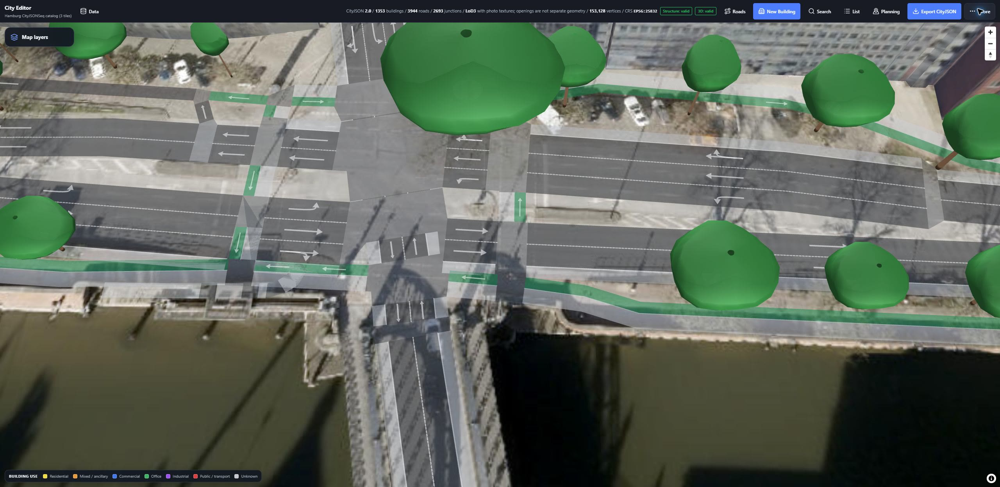

# City Editor

City Editor is a touch-friendly browser editor for Hamburg buildings, roads, and planning data. Explore the whole city, compare the map with satellite imagery, inspect detailed buildings, edit roads, and export the result as CityJSON.

**[Open City Editor](https://cakirmert.github.io/webcityeditor/)**


## First minute

1. Drag the map to move. Use the wheel, a pinch gesture, or the `+` and `−` buttons to zoom.
2. Open **Map layers** to switch between TopPlus and satellite imagery or to change the layer opacity.
3. Zoom in and tap a building, or choose **Roads** and tap a road.
4. Choose **Planning** to compare the city with Hamburg's planning areas.
5. Choose **Export CityJSON** when you want a portable copy of your work.

## Change the map view

Open **Map layers** in the upper-left corner.

- **TopPlus** is the default map.
- **Satellite** helps compare buildings and roads with aerial imagery.
- **Building usage** explains the footprint colours.
- **Photo textures** becomes available when detailed LoD3 buildings are visible.
- The two opacity controls let you balance the background image and road surfaces.



## Inspect and edit a building

1. Zoom in until the 3D buildings are visible, then tap a building.
2. Use **LoD2** and **LoD3** to compare the available detail levels. **Textures** appears when the selected building includes them.
3. Change the available building attributes.
4. Choose **Start editing position** to move the building.
5. Choose **Make editable** when you need to change its footprint, roof, openings, overhangs, or internal parts.
6. Use **Revert this building** to restore the selected building's loaded attributes.


Basic attributes and position can be edited directly. **Make editable** is only needed for larger shape changes.

## Add a new building

1. Choose **New Building** in the top bar.
2. Pick one of the four detailed building examples, or choose **Draw a custom building**.
3. For a ready-made building, tap the map to place it and adjust its position before confirming.
4. For a custom building, tap the footprint corners and then choose its height, roof, windows, entrance, and editable parts.



## Roads

### Edit an existing road



The cyan guides show lane connections through intersections. They can overlap at busy junctions, but the connections are present and can be inspected while editing the road.

1. Choose **Roads** in the top bar.
2. Tap a road surface, then choose **Edit road**.
3. Select a lane, cycle lane, sidewalk, buffer, parking strip, or green strip in **Road on the map**.
4. Change its type, surface, width, direction, or position. Lane dividers, arrows, and connection guides update with the road.
5. Drag a yellow anchor to move a bend. Use a white `+` to add a bend, or drag a road end onto a teal target to connect it.
6. Choose **Smooth** or **Straight** for the road shape.
7. Use **Undo** and **Redo** while editing.
8. Choose **Save exact attributes** or **Save road changes**. **Discard** leaves the saved road unchanged.


## Use the planning overlay

1. Choose **Planning** in the top bar.
2. Use the legend to understand the visible planning categories.
3. Zoom and pan to compare different parts of Hamburg.
4. Tap a coloured area to inspect its planning category.
5. Choose **Hide Planning** when you are finished.



## Load, validate, undo, and export

- **Data** loads a CityJSON or CityJSONSeq file.
- **Structure** checks the document structure.
- **Check 3D** validates edited geometry.
- **Undo** and **Redo** are available under **More**.
- **Save local** stores the current work in the browser.
- **Export CityJSON** downloads the buildings, roads, junctions, attributes, and edits as one file.



## Run locally

Install [Node.js](https://nodejs.org/) 20 or newer, then run:

```powershell
npm ci
npm run dev
```

Open the local address printed in the terminal.

## Data sources

The city overview uses Hamburg's [official ALKIS 2D building data](https://suche.transparenz.hamburg.de/dataset/inspire-hh-gebaeude-alkis12). Detailed buildings use Hamburg's [official LoD3.0 dataset](https://suche.transparenz.hamburg.de/dataset/3d-gebaeudemodell-lod3-0-hh-hamburg17). Trees, planning data, satellite imagery, and TopPlusOpen retain their source attribution in the editor.

Architecture, data preparation, contributor commands, and the project roadmap are documented in [PROJECT.md](PROJECT.md).
