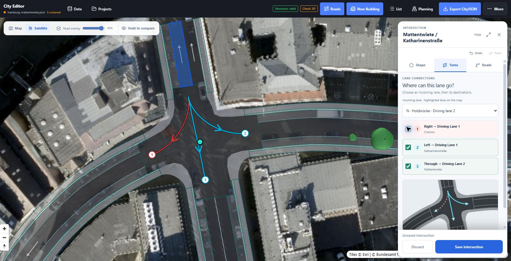
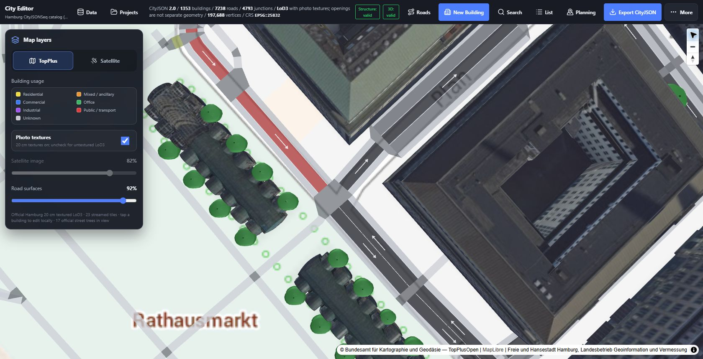
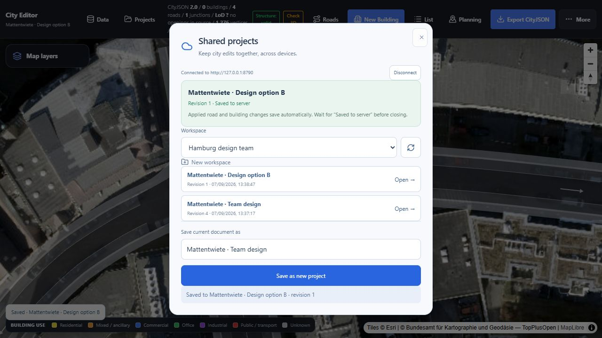

# City Editor

Design streets, edit intersections and buildings, and keep the result in **CityJSON**. City Editor combines Hamburg's city data, satellite imagery, direct map handles and a single responsive inspector.

**[Open the live demo](https://cakirmert.github.io/webcityeditor/)** · [Run locally](#run-locally) · [Research and technical notes](#research-and-technical-notes)


## Edit an intersection in one minute

1. Open the live editor and let the Hamburg data load. Pan and zoom to a junction.
2. Choose **Roads**, then click that junction. **Find a loaded road** also finds streets and intersection IDs in the current data.
3. **Turns** opens with **All approaches, together**. Colours and approach numbers match the map. Select a lane card or a map connection to inspect that lane; **← All approaches** returns to the overview.
4. Switch between **Map** and **Satellite** above the map. Adjust **Road overlay**, or hold the eye button to compare the road with the imagery.
5. Open **Shape → Generate** for a rounded road surface. Opening an intersection always keeps its saved shape; generation runs only when you click it. Eligible groups offer **Generate combined intersection**, with **Nearby pieces / Larger area** choices. The map fits all approaches when the group changes.
6. Use **Undo** to restore the original. Choose **Save intersection** to apply the junction, its approach surfaces and turn permissions together. **More → Save local** or **Export CityJSON** keeps it after the session ends.

These tools apply to loaded intersections throughout the network. The two study buttons and **Trace from satellite** have been removed. Satellite comparison and optional boundary handles remain. For a reproducible study, download the [original Mattentwiete import](public/examples/hamburg-mattentwiete-source.json) or [edited example](public/examples/hamburg-mattentwiete.json), then open it through **Data**. The [comparison notes](docs/intersection-reference-study.md) explain its estimated widths and visual kerb trace.

The [latest crossing and junction notes](docs/intersections-and-crossings-2026-09-10.md) cover road-over-rail rendering, cycle-lane preservation, larger merges and their limits. The [eight-location satellite review](docs/intersection-validation-2026-09.md) includes the earlier **608-junction audit**. Generated geometry is still a proposal: collisions or incompatible levels block saving.

### Try the complex crossing and lane split

Download the [Rödingsmarkt example](public/examples/hamburg-roedingsmarkt.json), load it through **Data**, then choose **Roads**. Search **intersection-210** to inspect the combined crossing, or **intersection-483** for the nearby Willy-Brandt-Straße lane split. To try the merge yourself, load the [unchanged source crop](public/examples/hamburg-roedingsmarkt-source.json), select intersection 210, and use **Shape → Generate combined intersection**.

- The example consolidates **nine junction records and eleven short internal roads** into one editable junction with thirteen external approaches. Separate-level railway geometry remains context above the road.
- **Levels** tilts the map and separates crossing levels schematically. Roads and railways share the same crossing order: an elevated road can sit above a railway. Open railway cuttings stay visible; true tunnels remain underground. Display heights are illustrative and never written into CityJSON. Switch Levels off to edit a flat boundary.
- Cycle lanes retain their width through the merge and at their ends. Existing bicycle pavement is reserved before generating the carriageway; compatible through connections can continue it across the junction.
- The lane transition joins **three incoming to six outgoing driving lanes**, retaining separate lane arrows and dividers. Both reviewed left-only lanes lead to separate left-turn destinations.
- **Generate → Save intersection** retains the generated surface and its arrows. Reopened generated surfaces are labelled **Saved generated surface**.
- Generated corners fit around unchanged neighbouring roads. Old approach tips are cut at the new road mouths so detached rectangular remnants do not remain beside rounded kerbs. Cycling keeps its full-width ends. If fitting would disconnect an approach, generation asks for a combined junction or an adjusted boundary; overlap checks remain active.


At **Altmannbrücke**, the opposite crossing order is required. The [source crop](public/examples/hamburg-altmannbruecke.json) retains the road bridge's layer +1 and is used by a regression test against the mapped railway cutting at layer −1.

The [original crop](public/examples/hamburg-roedingsmarkt-source.json) remains unchanged. The [edited example](public/examples/hamburg-roedingsmarkt.json) records the two left-arrow corrections explicitly: OSM way `43118557` has no `turn:lanes` tag. These are review edits, not newly discovered source tags.

## Edit a road

Choose **Roads** and select a street. The same inspector holds its preview, properties and save controls. If another edit is already active, finish it or use the selected road's **Edit road** action.

| Tab | What you can do |
| --- | --- |
| **Lanes** | Select a band in the proportional street preview. Change width, type, surface, direction and order; add driving, cycling, sidewalk, parking or planting space. |
| **Shape** | Move centreline anchors, add bends with the white `+` handles, choose **Smooth** or **Straight**, adjust elevation or split a section. |
| **Connections** | Inspect Start/End joins, open their existing intersections, or construct one together with an unsaved road draft. |
| **Rules** | Review minimum/maximum widths, set left/right extent limits, fit widths into available space, and import or export a city policy. OSM refresh is under **Advanced**. |


Changes stay in a draft until **Save road changes** or **Save exact attributes**. Attribute-only edits can retain imported polygons. Moving a road, changing widths or reorganising its bands generates new geometry and previews connected junctions. **Discard** leaves the saved road as it was.

### Draw and connect a new road

1. Choose **Roads → Draw new road**.
2. Click along the centreline, including its bends. Press **Enter** or choose **Finish road**.
3. Set the cross-section in **Lanes** and review **Rules**. New bands start with the active policy's recommended widths.
4. Drag an endpoint onto a nearby teal connection target. Review the confirmed join in **Connections**.
5. Choose **Build intersection** to preview the junction together with the unsaved road. **Save intersection** commits both; **Discard** returns to the road draft. Ordinary road saves also construct confirmed coincident endpoint joins atomically.
6. In the intersection's **Roads** tab, select a street card to highlight its road and Start/End point. **Add another approach** lists named road-end cards with compass direction and distance.

A failed fit explains the conflict and preserves the draft. Excessive band widths and new overlap with other roads block saving, even for connected roads. Shared edges and retained source overlaps are allowed. Width fitting respects the project's limits and the available space on each side; maximums are editable project guardrails, not statutory limits. Existing trees on sidewalks, planted strips and traffic-island openings are allowed. Expanding driving, cycling or parking pavement onto a mapped trunk blocks saving.

## Shape an intersection

The intersection inspector separates its physical outline from its permitted movements:

- **Shape → Keep current** retains the saved surface.
- **Shape → Generate** connects the approach kerbs with curved returns and retains lane arrows. Opening Shape keeps handles hidden until you choose to adjust them.
- **Generate combined intersection** appears for eligible groups joined by short internal roads. Choose **Nearby pieces** or **Larger area**; the counts show exactly what the preview will absorb. **Save intersection** removes those pieces in the same transaction. **Undo** returns to the separate draft and size options. Bridges, tunnels and roads connected outside the group are excluded.
- Unedited junctions with up to four approaches, including same-street lane transitions, can open with a proposed rounded surface when geometry and fit checks pass. Previewing changes nothing in the document; **Save** is still required. Complex, conflicting or differently elevated junctions keep their source surface and turn editor. The app does not silently rewrite the whole city.
- **Adjust boundary on map** provides draggable corners and midpoint insertion. With a point focused, arrow keys nudge it; **Shift + arrow** moves farther and **Delete** removes it. A whole drag is one undo step.
- **Trace an island** creates an opening for a raised island, median or tree bed. Islands must remain inside the boundary and separate from each other.
- **Turns** starts with all driving approaches. Select a lane to see its numbered destinations; click a curve or checkbox to change permission. The View selector also exposes cycle lanes and sidewalks. The compact diagram uses the same approach colours.
- **Roads** names the junction, highlights connected approaches and their endpoints, opens road editing and adds/removes connections.



Automatic junctions follow connected road geometry changes. An explicitly adjusted outline remains fixed until you edit it; check its joins again after changing an approach. Islands, bicycle surfaces and crossing levels are retained through save and reload, and the editor warns when a permitted connection crosses an island. Fit checks use the roads, buildings and trees loaded in the document; a roads-only example cannot check buildings that it does not contain.

Imagery makes a close visual reconstruction practical. It does not supply surveyed kerbs, current legal turn restrictions, vehicle turning envelopes or elevations. Physical junction rebuilding still requires approaches on a shared flat level. The railway context and schematic Levels view explain grade separation; they do not construct an engineered bridge or underpass. Signals, stop lines and swept-path engineering need additional data and tools. See the [reference study](docs/intersection-reference-study.md).

## Work on an iPad or desktop

The editing workspace targets **tablet and desktop screens, starting at 768 CSS pixels wide**. The inspector stays on the right on iPad-sized screens, including touch devices. Its width is reduced on smaller tablets so the map remains usable. **Hide** exposes the map while retaining the draft; **Expand** gives the controls more room. Save/Discard stay in the inspector footer, and map zoom controls move to the left while editing roads. Phones are not a supported editing target.

On smaller tablets, **More** also holds structure/3D checks, building lists, planning and export. The menu opens over the map, with every action reachable.


## Buildings, imagery and planning

The Hamburg overview streams city data as you move. Drag to pan; use the wheel, pinch or map `+`/`−` controls to zoom.

- Open **Map layers** outside road mode to change the basemap, opacity, building usage colours and available photo textures.
- Select a building to inspect its attributes and available **LoD2 / LoD3** detail. Use **Start editing position** to move it or **Make editable** for footprint, roof, opening and part edits.
- Building parts are grouped under **Browse parts**. The panel uses actual names or part IDs, and labels an item as a floor only when floor metadata exists.
- Choose **New Building** for a ready-made example or **Draw a custom building**, then place its footprint on the map.
- Choose **Planning** to inspect Hamburg's planning areas and their legend. Select a coloured area for its category.



Hamburg tile requests now use the serving `www.daten-hamburg.de` hostname directly, avoiding the redirect that caused browser **Failed to fetch** errors. The overview uses lightweight LoD1, then close-range LoD3; **Photo textures** switches between textured and untextured geometry. LoD2 remains available to the source-building conversion path.

## Save, check and export

| Action | Result |
| --- | --- |
| **Save road / Save intersection** | Applies the draft to the loaded CityJSON document. |
| **More → Undo / Redo** | Reverses or reapplies document changes. Drafts also have their own Undo / Redo controls. |
| **More → Save local** | Keeps a copy in this browser's local storage. |
| **Data** | Loads CityJSON, CityJSONSeq, bundled examples or a local save. |
| **Structure** | Checks document references and structure in the browser. |
| **Check 3D** | Runs primitive geometry validation through the configured local val3dity service. |
| **Export CityJSON** | Downloads the loaded buildings, roads, junctions, attributes and edits together. |

Road and intersection save operations are guarded against structural damage. Resolve blocking geometry/fit errors before export. A **Structure** pass and a **Check 3D** pass answer different questions; neither certifies traffic engineering or municipal design compliance.

## Shared projects and the optional backend

The editor is live on [GitHub Pages](https://cakirmert.github.io/webcityeditor/). Shared server storage is **prepared for later hosting**; the public site does not currently include a hosted database.

Open **Projects**. Once you have a storage server, enter its HTTPS address and access key, create a workspace and choose **Save as new project**. Applied road and building changes then save automatically. Wait for **Saved to server** before closing; reconnect and open the same project to continue on another device.



*Screenshots show a local test server. The public demo is ready to connect when you host the Docker service.*

Different workspaces organize your team's projects. Revision checks stop collaborators from overwriting one another silently. If someone saves first, open their latest version or keep your work as a new project. A newer version is announced every 20 seconds; changes are not automatically merged.

The optional service starts with two commands on a computer with Docker running:

```powershell
npm run backend:setup
npm run backend:up
```

It uses a persistent SQLite volume and retains the last 20 revisions. Local browser saves and CityJSON export continue to work without it. See the [backend setup and API guide](backend/README.md) for the access key, local connection, later HTTPS hosting, backups and replacing the storage implementation.

## Run locally

Use Node.js 20.19+ or 22.12+ and a browser with WebGL2:

```powershell
npm ci
npm run dev:frontend
```

Open the address printed by Vite. The bundled intersection study works with this frontend command; live imagery and remote Hamburg layers require a network connection.

For a prepared local building catalog and validation service, use `npm run dev:hamburg-buildings`; for a prepared road catalog, use `npm run dev:hamburg-roads`. See [PROJECT.md](PROJECT.md) for data preparation and val3dity configuration. A validator executable is an optional local dependency and is not bundled in the website.

```powershell
npm test
npm run build
```

## Research and technical notes

| Document | Contents |
| --- | --- |
| [Eight-intersection review and audit](docs/intersection-validation-2026-09.md) | Labeled satellite/source/candidate comparisons, reproducible tools, the 608-junction audit and explicit blocked cases. |
| [Consolidation, lane transitions and crossing levels](docs/intersection-consolidation-2026-09-10.md) | Rödingsmarkt follow-up, two left-turn lanes, source provenance, save/reload validation and the new railway context. |
| [Intersection reference study](docs/intersection-reference-study.md) | Selected real junction, original/edited data, satellite comparison, width estimates and remaining uncertainty. |
| [UX and width-policy research](docs/road-ux-research.md) | PTV Vissim, SUMO NetEdit and Godot patterns; geometry alternatives; Hamburg ReStra sources and project assumptions. |
| [Transportation provenance](docs/transportation-provenance.md) | OSM → osm2streets → CityJSON, upstream rule audit and CityJSON Transportation semantics. |
| [Handoff and verification](docs/road-editor-handoff.md) | Delivered behavior, regression checks and implementation limits. |
| [Backend setup and API](backend/README.md) | Docker, persistent workspaces, revision conflicts, backups and the replaceable storage contract. |
| [PROJECT.md](PROJECT.md) | Architecture, datasets, converter commands and contributor notes. |

The map retains attribution for OpenStreetMap, Hamburg's building/tree/planning data, Esri World Imagery and BKG TopPlusOpen. Current road, intersection and Hamburg LoD3 screenshots were captured from the running editor on 9 September 2026. Shared-project screenshots show the earlier local Docker test server.
