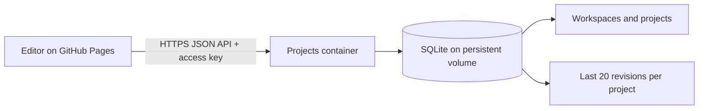

# Shared project storage

An optional Docker service for City Editor. It stores CityJSON projects in named workspaces, saves revisions and rejects stale writes. The GitHub Pages editor works without this service; choose **Projects** when a server is available.

This starter stores whole-document snapshots in SQLite. It does not provide the map's tile stream or an object-level spatial database. [Streaming and storage](../docs/streaming-and-storage.md) explains that separation and compares the future PostgreSQL/PostGIS, cjdb and 3DCityDB options. No database migration is implemented by that recommendation.

## Start with Docker

From the repository root, with Docker Desktop or Docker Engine running:

```powershell
npm run backend:setup
npm run backend:up
```

The setup command creates `backend/.env` with a random access key. Running it again preserves the existing settings. The environment file is ignored by Git and excluded from the Docker build context.

For local development, run `npm run dev:frontend`. In its **Projects** dialog enter:

- **Server address:** `http://127.0.0.1:8789`
- **Access key:** the `PROJECTS_TOKEN` value from `backend/.env`

Create a workspace, then choose **Save as new project**. Later road/building changes save automatically after you apply them to the document. Wait for **Saved to server** before closing. Reconnect and open the same workspace/project to continue. The editor remembers the server address; the key remains in memory for the current page session and must be entered again after reopening.

Stop the service with `npm run backend:down`. Its named volume remains intact. Start it again with `npm run backend:up`. There is no need to install a separate database or run the city converters.

## What runs where



GitHub Pages serves static files and cannot run this container. The Docker configuration binds port 8789 to the host's loopback address. It is ready for local use and later hosting; it does not expose your computer publicly or make localhost reachable from an iPhone.

When you have a server:

1. Copy the repository's backend files/configuration there and run the same Docker commands.
2. Put an HTTPS reverse proxy in front of port 8789. A public URL such as `https://projects.example.com` must forward requests unchanged to this API.
3. Keep `https://cakirmert.github.io` in `PROJECTS_ALLOWED_ORIGINS`. Origins have no `/webcityeditor/` path. Add your own editor's exact origin if you host another frontend.
4. Enter that HTTPS URL and the key in the editor. No GitHub Pages rebuild is needed.

The client rejects non-HTTPS remote addresses, sends no cookies and does not forward the access key through redirects. This starter uses **one shared team key for all workspaces on the service**. Workspace folders organize projects; they are not separate permission boundaries. Run separate instances/volumes/keys for separate teams until a future backend provides individual accounts and workspace permissions.

## Persistence and collaboration

- Each project is a complete CityJSON document. Remote map tiles and unapplied map drafts are not saved. Saving a viewport-streamed document freezes the current loaded/editable features as a stable working area, not the entire Hamburg dataset. Further map navigation does not replace that project's roads with another viewport.
- Each save is a SQLite transaction. The document, revision and update time change together. The default retains the most recent **20** revisions; the current revision always remains available.
- Saves include the revision the editor opened. If another editor saved first, the server returns **409**. The UI keeps your work and offers **Open latest version** or **Save as new project**. It never overwrites the newer version automatically.
- The editor checks for a newer revision every 20 seconds while connected. It announces the update and lets you decide when to open it. This is shared persistence with conflict detection, not simultaneous cursor editing or automatic feature merging.
- Retried network writes use a stable mutation UUID, so a lost response does not create another revision or another project. Reusing that UUID with different content is rejected.
- Pending applied edits also receive an ordered, best-effort IndexedDB recovery copy in the browser, listed under **Data → Advanced loading options → Local saves** as `Shared recovery …`. If the server is unavailable, the UI stays **Not synced**; **Retry** or **Export CityJSON** preserves the explicit recovery path. Mobile browser shutdown cannot guarantee completion of an in-flight save.
- Browser and server both check document structure. The service stores data; it does not run val3dity, regenerate tiles, infer roads or certify geometry/traffic engineering.

## Configuration

| Variable | Default / purpose |
| --- | --- |
| `PROJECTS_TOKEN` | Required key, at least 32 characters. Setup generates 64 hexadecimal characters. |
| `PROJECTS_ALLOWED_ORIGINS` | Comma-separated exact editor origins. Compose includes GitHub Pages and local Vite. |
| `PROJECTS_MAX_BYTES` | `67108864` (64 MiB), maximum complete JSON request body. |
| `PROJECTS_HISTORY_LIMIT` | `20`, retained snapshots per project. |
| `PROJECTS_DATA_DIR` | `/data` inside Docker, `.projects-data` when run directly. |
| `HOST` / `PORT` | Container `0.0.0.0:8789`; direct Node defaults to `127.0.0.1:8789`. |

The image uses Node 24 and its built-in SQLite driver. It runs as the non-root `node` user with a read-only container filesystem, a writable data volume and a health check. The image has no application npm dependencies. Node 24's SQLite API may emit an experimental-feature notice; the project uses its basic prepared-statement and transaction APIs.

For backend development without Docker, use Node 24+:

```powershell
npm run backend:setup
npm run backend:start
npm run test:backend
```

## API contract (version 1)

All paths below except `/health` require `Authorization: Bearer <access-key>`. JSON writes require `Content-Type: application/json`. Document and metadata responses use `Cache-Control: no-store`.

| Method and path | Result |
| --- | --- |
| `GET /health` | `{ ok: true, service: "city-editor-projects", apiVersion: 1 }` |
| `GET /api/v1/workspaces` | `{ workspaces: [{ id, name, createdAt }] }` |
| `POST /api/v1/workspaces` | Body `{ name }`; returns the created workspace. |
| `GET /api/v1/workspaces/:workspaceId/projects` | `{ projects: [{ id, workspaceId, name, revision, updatedAt }] }` |
| `POST /api/v1/workspaces/:workspaceId/projects` | Body `{ name, document, mutationId }`; creates revision 1. The UUID `mutationId` also becomes its project ID, making creation retries idempotent. |
| `GET /api/v1/workspaces/:workspaceId/projects/:projectId` | Project metadata plus `document`; `ETag: "<revision>"`. |
| `GET /api/v1/workspaces/:workspaceId/projects/:projectId/head` | Metadata/ETag only, for checking updates without downloading geometry. |
| `PUT /api/v1/workspaces/:workspaceId/projects/:projectId` | Body `{ document, mutationId }`, header `If-Match: "<opened-revision>"`; returns updated metadata/ETag. |
| `GET /api/v1/workspaces/:workspaceId/projects/:projectId/revisions` | Retained `{ revisions: [{ revision, updatedAt }] }`, newest first. |
| `GET /api/v1/workspaces/:workspaceId/projects/:projectId/revisions/:revision` | Read an older retained document. To restore it, save a new project or write it against the current revision. |

IDs and mutation IDs are UUIDs. Names contain 1–120 characters. Server errors use `{ error: { code, message } }`. Typical statuses: 401 wrong key, 403 disallowed origin, 404 unknown resource, 409 revision/idempotency conflict, 413 size limit, 422 invalid document, 428 missing base revision.

`src/lib/project-storage.ts` is the frontend adapter. `backend/server.mjs` keeps persistence behind `createProjectStore`; a future service can implement this HTTP contract with PostgreSQL, separate databases or another store without changing the road/building editors. SQLite's workspaces are logical namespaces in one `projects.sqlite` database. Deploy one writer service per volume; this starter is intended for modest project snapshots rather than concurrent citywide bulk processing.

## Backup and verification

The named volume is `backend_projects-data` with the default Compose project name. Keep a backup outside Docker before migrating hosts. A simple consistent backup for this single-instance service is:

```powershell
docker compose --env-file backend/.env -f backend/compose.yml stop projects
docker compose --env-file backend/.env -f backend/compose.yml cp projects:/data ./backend-backup
docker compose --env-file backend/.env -f backend/compose.yml start projects
```

Copy the entire data directory, including any SQLite WAL files. The database contains project data; the access key is in `backend/.env` and must be backed up separately. Ordinary `down` preserves the volume; `down -v` removes it.

```powershell
npm run test:backend
npm test
npm run build:pages
docker compose --env-file backend/.env -f backend/compose.yml ps
```

Automated checks cover authentication, CORS, workspace isolation, server restart persistence, simultaneous writers, revision retention, invalid/oversized data, missing revision headers and idempotent retries. Frontend checks cover deferred autosave, in-flight edits, offline retry, conflicts, document detach and reopen behavior.

Primary references: [GitHub Pages static hosting](https://docs.github.com/en/pages/getting-started-with-github-pages/what-is-github-pages), [Docker volume persistence](https://docs.docker.com/engine/storage/volumes/), [Node SQLite API](https://nodejs.org/download/release/v24.14.0/docs/api/sqlite.html).
