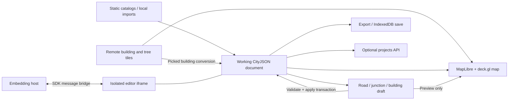

# Technical handover

This guide explains the running editor's architecture, data ownership and extension points. The [README](../README.md) is the user guide; [Building roads from OSM](osm-to-cityjson.md), [Transportation provenance](transportation-provenance.md) and [Streaming and storage](streaming-and-storage.md) provide the detailed data references. Dated intersection studies describe the implementation and observations at their stated dates.

The companion [UI/UX handover](handover-ui-ux.md) covers interaction, [road warnings](road-warnings.md) defines acceptance and failure behavior, and [upstream attribution](upstream-dependencies.md) separates Delft/A/B Street code from application logic. [Godot integration](godot-integration.md) is an optional architecture proposal.

## System boundaries

The application is a browser editor with an optional persistence service. Its editable model is a CityJSON document. Reference tiles supply context and, where supported, objects that can be brought into that document. A generated map mesh, a selected feature, an unfinished draft and an applied CityJSON edit are different states.



The shipped Hamburg application and an embedded editor use the same editing implementation. The package adapter isolates the full editor in an iframe; it does not make each existing React component an independent public widget. See the [package guide](package-guide.md) for its API, runtime assets and hosting setup.

## Application composition and state

[App.tsx](../src/App.tsx) connects the map, inspectors and hooks. It also coordinates document replacement, source loading, planning overlays and building handoff. Most domain geometry belongs in `src/lib`; interaction and lifecycle coordination belong in hooks and components.

| Owner | Responsibility |
| --- | --- |
| [useCoreState](../src/hooks/useCoreState.ts) | Working document, filename, selection, dirty object IDs, drawing mode, filters, save/validation status and `reloadToken`. |
| [useUndoRedo](../src/hooks/useUndoRedo.ts) | Document-level undo/redo and restoration of dirty IDs and selection. |
| [useCatalog](../src/hooks/useCatalog.ts) | Active catalog connection, loaded tiles, viewport requests, clean-tile eviction and optional write-back. |
| [useImportExport](../src/hooks/useImportExport.ts) | Loading/replacing documents, merge, local save, CityJSON/GLB export and external validation status. |
| [useRoadEditor](../src/hooks/useRoadEditor.ts) | Road and intersection drafts, selection changes, preview construction, warnings, draft history and save transactions. |
| [useBuildingEditor](../src/hooks/useBuildingEditor.ts) | Pending creation, transforms, footprint edits, subdivision, IFC placement and building asset placement. |
| [useSharedProjects](../src/hooks/useSharedProjects.ts) | Project binding, serialized autosave, local recovery copies, revisions and conflict state. |
| [useProjectRoadReset](../src/hooks/useProjectRoadReset.ts) | Preparation, review, backup and application of a whole-project OSM road replacement. |

### Mutable document, explicit invalidation

The document is **mutable**. Operations such as road insertion, merge, compaction and building transformation update `CityObjects`, `vertices` and related metadata in place. React state holds the document reference; changing an existing object does not itself create a new reference. `reloadToken` is the explicit signal used to rebuild derived geometry and notify other consumers after such a mutation.

`cityjsonRef` and `dirtyIdsRef` expose the current state to asynchronous callbacks. Drafts and UI state use React setters. Geometry arrays derived with `useMemo` generally depend on both the document reference and `reloadToken`. Adding a new memoized document reader without the invalidation dependency can produce an inspector or mesh that stays stale after Save.

The document-level [UndoStore](../src/lib/undo.ts) deep-clones the document **before** an edit. Its default capacity is 30 snapshots, a count limit rather than a fixed memory budget. Road drafts have a separate history; junction drafts keep their own undo/redo lists. Applied document history, unfinished draft history and server revision history are independent.

### Mutation lifecycle

An editing operation follows this sequence:

1. Build a preview from the current draft without modifying the saved model.
2. Recheck constraints against the current document at Save. Debounced preview checks are not sufficient for a commit.
3. Capture document undo before mutation.
4. Apply related geometry and metadata changes through [runStructurallyGuardedMutation](../src/lib/editor-actions.ts).
5. Mark every affected object dirty, increment `reloadToken` and invalidate the primitive-validation result if geometry changed.

The guard snapshots the document, compares integrity before and after, and restores the snapshot if an exception or a newly introduced structural error occurs. Existing input defects remain reportable; this guard does not certify that the source was valid. It also does not replace road-fit checks or a full external geometry validator.

Asynchronous source loads must verify that their original document/connection is still active before applying results. Catalog requests compare source identities; project saves use a generation counter; reset preparation records the original serialized document. A late response must not append old tiles or replace a newly opened project.

## CityJSON, coordinates and imports

[types-cityjson.ts](../src/types-cityjson.ts), re-exported through [types.ts](../src/types.ts), defines the subset of CityJSON used by the application, not the complete standard. Shared road types live in [road-types.ts](../src/lib/road-types.ts). These data types have no renderer dependency. Most geometry is read through specialized helpers. Preserve unrelated object attributes, parent/child relationships, appearance references and semantic indices when changing an object.

| Representation | Coordinate and index rules |
| --- | --- |
| Working CityJSON | One document-wide vertex array. With `transform`, decode a coordinate as `vertex × scale + translate`. |
| CityJSONSeq input | Header plus `CityJSONFeature` records. Each feature has local vertex indices; these must be remapped when assembled into the working document. |
| Map input and handles | Longitude/latitude in WGS84. Widths and geometric offsets are calculated in a suitable metric CRS. |
| Hamburg road conversion | EPSG:25832, quantized to a 0.001 m grid; initial road surfaces are flat. Quantization is not survey accuracy. |
| Native building tiles | Tile/node transforms and ECEF coordinates must be applied before converting a picked feature into projected CityJSON. |

[projection.ts](../src/lib/projection.ts) registers supported CRSs and handles coordinate conversions. The declared `metadata.referenceSystem` is preferred. Inference from coordinate magnitude is a limited fallback; contributors should fix the input declaration rather than depend on it. Geocentric coordinates require all three axes. The registered horizontal/compound definitions do not provide a general surveyed vertical-datum transformation service.

[mergeCityJson](../src/lib/merge.ts) mutates the base document, remaps geometry and appearance indices, and resolves colliding object IDs with reported suffixes. It rejects declared CRS mismatches. Compatible quantization transforms are re-encoded into the base grid; coordinates that cannot be represented without the checked precision loss are rejected. Merging is not an automatic reprojection operation.

The import paths have different roles:

- **CityJSON / CityJSONSeq:** parse into editable city objects. Strict catalog parsing additionally enforces the prepared sequence structure.
- **IFC:** [ifc-import.ts](../src/lib/ifc-import.ts) uses web-ifc to extract placed meshes and metadata; [ifc-to-cityjson.ts](../src/lib/ifc-to-cityjson.ts) maps them into the editable representation. Placement and georeferencing require review.
- **OSM XML/PBF preparation:** the native Rust exporter builds lane and junction geometry, then the shared JavaScript adapter produces CityJSON. The browser's optional project reset runs the WASM version and reuses the adapter. The [conversion guide](osm-to-cityjson.md) lists commands, options and intermediate files.
- **CityGML / OpenDRIVE tooling:** conversion scripts are separate tooling. Their presence does not make the browser a native editor for every construct in either format.

## Streaming and building handoff

Roads use a static tile catalog and gzip CityJSONSeq. The browser reads a complete selected tile, decompresses it, parses feature records and merges them into the working document. It does not progressively render individual network lines as they arrive. Required neighboring tiles preserve known seam connections.

`useCatalog` debounces viewport loading by 450 ms. Oversized views do not request additional detailed tiles. The loader limits requests, retains the latest pending view and evicts clean off-screen source tiles. Tiles that own dirty objects remain loaded. Eviction can clear document undo because its source working set has changed. Opening or creating a shared project detaches road catalog streaming to stabilize its editable area.

Building delivery is separate. Prepared raster/vector footprints provide the overview; native LoD1 and LoD3 3D Tiles provide detail. [lod-transition.ts](../src/lib/lod-transition.ts) owns the view thresholds. LoD1 begins at zoom 13.25 and LoD3 at zoom 18; there is no ordinary LoD2 map tier. The previous tier stays visible while the next one loads. Road editing caps remote building context at LoD1.

A clicked native building passes through [hamburg-3d-tiles-edit.ts](../src/lib/hamburg-3d-tiles-edit.ts). It converts the picked feature rather than the whole tile hierarchy. The initial local object is a **passive selection proxy**: the remote mesh remains visible. A saved local change promotes it to an override and hides its remote counterpart. Matching detailed data can upgrade a passive proxy; it must not overwrite an applied local edit.

A saved project includes loaded/editable CityJSON objects. It does not contain every remotely rendered building, tree, texture or background tile. See [Streaming and storage](streaming-and-storage.md) for the catalog limits, delivery formats and database comparison.

## Rendering and runtime assets

| Component/module | Role |
| --- | --- |
| [MapView](../src/components/MapView.tsx) | MapLibre camera/basemap, deck.gl overlays, native 3D Tiles, selection, draw interactions and map previews. |
| [cityjson-map-mesh](../src/lib/cityjson-map-mesh.ts) | Triangulates local CityJSON surfaces and resolves appearance data for map rendering. |
| [BuildingDetailPreview](../src/components/BuildingDetailPreview.tsx) and [Viewer](../src/components/Viewer.tsx) | Isolated Three.js building view, highest-LoD selection, semantic materials and edit overlays. |
| [road-visuals](../src/lib/road-visuals.ts) | Saved road markings and surface presentation derived from transportation data. |
| [junction-presentation](../src/lib/junction-presentation.ts) | Approach colors, lane identities and connection-display grouping. |
| [crossing-levels](../src/lib/crossing-levels.ts) | Relative road/rail ordering and display-only schematic heights. |

The building detail viewer currently constructs the synchronous `CityJSONParser` from `cityjson-threejs-loader`. The dependency also contains a worker parser, but that does not mean this viewer runs parsing in a worker. Similarly, osm2streets initializes WASM asynchronously and then runs its network generation synchronously. Large conversions can still occupy the browser thread.

The OSM and IFC bridges import `.wasm` files as asset URLs. [vite.config.ts](../vite.config.ts) splits large rendering dependencies into separate chunks, deduplicates Three.js and excludes the CityJSON loader from dependency prebundling to preserve its source/worker URL resolution. These choices matter when testing production builds or changing bundlers. A working TypeScript import does not prove that the deployed WASM or worker URL can load.

Reference datasets under `public/data` are application data, not core editor logic. [public-assets.ts](../src/lib/public-assets.ts) centralizes app asset URLs. The package guide describes which editor runtime files are copied to a host and which Hamburg data files are excluded. Test a deployment beneath a URL prefix; GitHub Pages uses `/webcityeditor/` rather than the domain root.

Road and railway heights shown in Levels are schematic: the current display uses six metres per relative OSM layer. Rail has no unconditional priority over roads. These heights help explain grade separation; they are not exported as surveyed bridge or tunnel geometry.

## Road and intersection implementation

[transportation.ts](../src/lib/transportation.ts) reads and writes Road objects and editable layouts. Imported lane polygons use **exact** geometry until an intentional geometric change occurs. Attribute-only changes can update direction, access, material or speed while preserving boundaries and vertices. A width, centreline or band-order change builds generated ribbons from the editable layout.

The `_roadLayout` attribute carries sections, bands, curves, elevation and endpoint connections. Source metadata such as `_sourceCenterlineWgs84` and `_osmWayIds` remains distinct from the draft. [road-rules.ts](../src/lib/road-rules.ts) validates the active width profile; [road-fit.ts](../src/lib/road-fit.ts) checks geometry against loaded surroundings. A profile minimum, an overlap and an invalid vertex reference are different classes of issue and must retain different explanations and save behavior.

Intersections separate **movement topology** from **pavement construction**. [road-junctions.ts](../src/lib/road-junctions.ts) reads movement metadata, builds a generation plan and saves its result. Disabling a turn changes permissions; it does not remove the pavement beneath that turn. The movement display is not a vehicle swept-path simulation.

Generation is explicit. The default selected-intersection scope preserves connected road IDs and trims their approach ends. A larger-area selection permits absorption of internal road pieces. [junction-clusters.ts](../src/lib/junction-clusters.ts) determines consolidation scope; [junction-ownership.ts](../src/lib/junction-ownership.ts) and the footprint/boolean helpers control which surfaces belong to the junction. Expanding a shape must not silently expand its selected ownership scope.

A generation plan contains the resulting junction, changed approaches, any explicitly absorbed road IDs and warnings. Save recomputes that plan from current data and commits all associated objects together. Original approach surfaces are retained in junction metadata for subsequent rebuilds. Generated automatic junctions can follow connected road geometry changes; a custom footprint remains an explicit boundary.

The important contributor invariants are:

- Preview and saved road geometry use the same sampling/construction path.
- Junction surfaces, approach trimming, reciprocal connections and accepted-review metadata are one transaction.
- Unrelated roads are not removed merely because their polygons touch a generated outline.
- Cycle bands retain their width at retained approach ends; unsupported internal fragments must not leave square cutouts in the pavement.
- Mixed-level or otherwise unsupported reconstruction must return a visible error while allowing existing geometry and movements to be inspected.
- A parked draft cannot overwrite source objects changed by another saved edit. [road-draft-source.ts](../src/lib/road-draft-source.ts) compares source geometry independently of vertex-index compaction.

The [road/intersection design reference](road-ux-research.md) explains generation methods and width sources. The [intersection implementation reference](intersections-and-crossings-2026-09-10.md) covers selected-scope generation, warning saves and related regression cases.

## Persistence, reset and export

[storage.ts](../src/lib/storage.ts) implements browser-local saves in IndexedDB. Explicit local saves preserve the applied document, while shared-project editing also queues recovery copies. Unfinished parked drafts are session state and do not become durable project revisions until applied.

The optional projects client in [project-storage.ts](../src/lib/project-storage.ts) provides the replaceable HTTP boundary. `useSharedProjects` observes applied document changes, waits 1.2 seconds, and sends serialized saves one at a time. Stable mutation IDs make retries identifiable; `If-Match` carries the opened revision. A 409 response stops autosave for review instead of overwriting another client's revision. A 20-second poll detects newer remote revisions; it does not merge them automatically.

The Docker starter stores complete CityJSON snapshots in Node 24's SQLite database. It is separate from map delivery, from the optional local catalog/validation service and from the embedding SDK bridge. GitHub Pages runs none of these server processes. [backend/README.md](../backend/README.md) describes setup, authentication, limits, backup and the HTTP API. The [storage comparison](streaming-and-storage.md#database-options) describes the proposed PostgreSQL/PostGIS direction; no migration is implied by the package API.

Project-wide OSM reset prepares replacement roads before changing the document, checks that the project has not changed, and writes a local recovery copy before applying. It replaces Road objects and their road-specific edits across the loaded project's extent. It is not a routine refresh of the selected road. [project-road-reset.ts](../src/lib/project-road-reset.ts) owns replacement rules; [project-osm-reset.ts](../src/lib/project-osm-reset.ts) owns fetching and conversion.

[export-validation.ts](../src/lib/export-validation.ts) serializes, reopens and structurally checks the exact CityJSON text prepared for export. The optional local service runs val3dity; cjval can be enabled separately there. Browser structural checks are not a full CityJSON-schema or ISO 19107 certificate. A failed external primitive check stops export; an unavailable service is reported as unchecked and requires the explicit export choice implemented in the UI. The local validation configuration currently uses `val3dity --ignore204`.

## Development, tests and deployment

Use Node.js 24 for the frontend and the included backend. A normal frontend installation uses the committed browser WASM package; building the native exporter additionally requires the pinned Rust submodule and toolchain.

```sh
npm ci
npm run dev
```

`npm run dev` starts Vite on port 5173. Optional `dev:hamburg-buildings` and `dev:hamburg-roads` commands start the local catalog tooling as well. The [OSM conversion guide](osm-to-cityjson.md) describes native preprocessing; the [package guide](package-guide.md) describes SDK build and packed-consumer verification.

The test layout follows the implementation boundary:

| Change area | Useful tests |
| --- | --- |
| CityJSON parsing, projection and indices | `tests/lib/cityjson*.test.ts`, `projection.test.ts`, `merge.test.ts`, `roundtrip.test.ts`, `integrity.test.ts`. |
| Road generation and fit | `transportation.test.ts`, `road-junctions.test.ts`, `junction-ownership.test.ts`, `junction-fragments.test.ts`, `road-fit.test.ts`, `road-rules.test.ts`. |
| Save and selection lifecycle | `tests/hooks/useRoadEditor.test.tsx`, `tests/components/RoadEditorPanel.test.tsx`, `RoadJunctionPanel.test.tsx`. |
| Streaming and source replacement | `tests/hooks/useCatalog.test.tsx`, CityJSONSeq catalog/write-back tests, project reset tests. |
| Buildings and native tile handoff | `hamburg-3d-tiles-edit.test.ts`, `cityjson-map-mesh.test.ts`, generator/transform tests and building component tests. |
| Shared persistence | `tests/hooks/useSharedProjects.test.tsx`, `tests/lib/project-storage.test.ts`, `backend/server.test.mjs`. |

For example, a junction ownership change can first be checked with:

```sh
npm test -- tests/lib/junction-ownership.test.ts tests/lib/junction-fragments.test.ts tests/lib/road-junctions.test.ts tests/hooks/useRoadEditor.test.tsx
```

Before publishing application changes, the repository's deployment workflow runs:

```sh
npm test
npm run test:backend
npm run build:package
npm run test:package
npm run build:pages
```

Vitest runs TypeScript/component tests in jsdom. These checks do not demonstrate that a GPU-rendered crossing matches its intended appearance. For geometry or UI changes, also inspect a representative intersection in the built app, save it, reopen/export it, and compare the same objects and connections. External validators and native fixtures may need extra local tools; check reported skips rather than quoting an old test total as current evidence.

[deploy-pages.yml](../.github/workflows/deploy-pages.yml) runs on `main` pushes, builds with the Pages base path, and publishes `dist` onto `gh-pages`. GitHub Pages then serves that branch. A successful build is one stage; the public page should be checked after publication. The npm package has a separate artifact/release lifecycle, documented in the package guide.

## Extension boundaries and current limitations

Add geometric behavior as testable functions in `src/lib`, then connect it through the relevant hook. Keep map layer construction and pointer behavior in the rendering/interaction layer. Host applications should use the documented SDK or public core exports rather than reach into React hooks or mutate the iframe's internal state.

The main limits to retain in technical explanations are:

- The editable working set is bounded by loaded data; road warnings cannot evaluate unseen obstacles or substitute for design approval.
- Intersection reconstruction assumes compatible flat approaches. Layer display does not solve surveyed bridge/underpass construction.
- Citywide reference display and project persistence use different formats and services. Saving a project is not a snapshot of the complete remote scene.
- Document snapshots and undo can become large. Current shared persistence has whole-document revision conflicts, not per-object concurrent editing.
- Geometry generation and some parsing still run on the main browser thread. WASM alone does not provide background scheduling.
- The UI targets desktop and tablet editing. Embedding isolates the existing editor but does not automatically make its interaction design appropriate for phone-sized containers.

When changing a boundary, preserve a small representative fixture through import, edit, save and reopen. For roads, include source attributes, lane directions, an accepted warning and a connected junction. For buildings, include child objects and appearance references. Those round trips test the data contract that rendering alone can hide.
