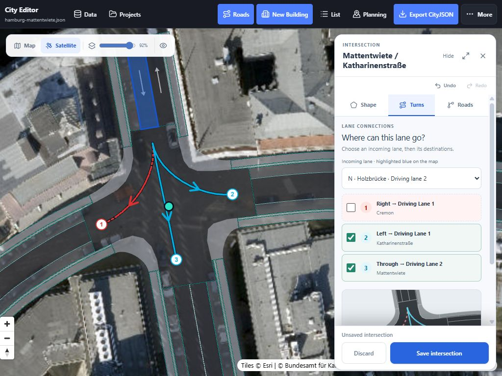
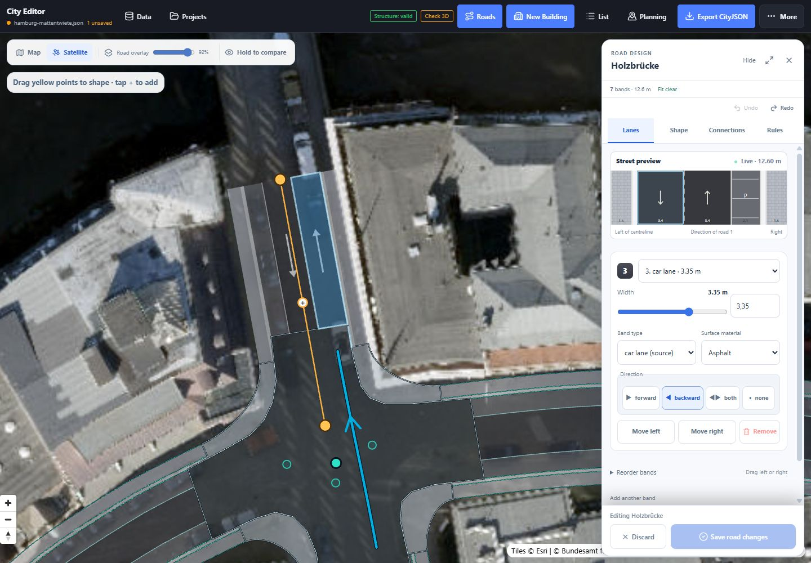

# UI and UX handover

Current behavior and interaction reference · updated 11 September 2026

WebCityEditor is a map-based CityJSON editor for roads, intersections and buildings. The central workflow is **select → edit a draft → inspect the map and warnings → apply → persist or export**. The interface targets desktop and tablet viewports from 768 CSS pixels wide. Phone editing is not a supported target.

This document explains the interface and its state transitions for designers, frontend maintainers and people demonstrating the application. The [README](../README.md) is the shorter user guide. The [technical handover](handover-technical.md) follows the implementation and data flow. The [intersection design reference](road-ux-research.md) explains geometry and width policy; [road warnings](road-warnings.md) defines the validation and recovery behavior.

## Workspace and navigation

The map occupies the main work area. A single right-hand inspector holds road or building editing controls. Opening **Roads** clears unrelated building/planning selection instead of stacking several inspectors over the map. Road **Hide/Show** minimizes controls without discarding the draft; **Expand** increases inspector width. Its save/discard footer remains available while the controls scroll.

The toolbar gives access to **Data**, **Projects**, **Roads**, **New Building**, search/filter tools and planning. **More** contains secondary actions such as Undo/Redo, local save, merge/import, export, viewport loading and checks. Some otherwise visible actions move into More at smaller widths. Whether an action is present depends on loaded data and available services.

| Area | Purpose | State to keep visible |
| --- | --- | --- |
| **Data** | Open CityJSON/CityJSONSeq, configured catalogs, examples or a local save. | Parsing/loading status and which document is active. |
| **Roads** | Select roads/junctions, draw a road and edit geometry, bands or connectivity. | Selected object, draft status, warning list and save action. |
| Building inspector | Inspect source detail and edit attributes, position, footprint, parts and openings where supported. | Source LoD, editable state, preview and apply/cancel controls. |
| **Map layers** | Basemap, display opacity, building colouring and texture choices. | Active reference layer and loading/fallback state. |
| **Planning** | Inspect loaded Hamburg planning areas and their categories. | Legend, selected area and overlay loading state. |
| **Projects** | Connect shared storage, manage named projects and perform the optional project-wide OSM road reset. | Server save state, revision and explicit reset scope. |
| **Structure / Check 3D** | Inspect distinct document-structure and primitive-geometry checks. | Valid, invalid, unchecked and unavailable must remain distinguishable. |

Implementation: [App.tsx](../src/App.tsx) composes the workspaces; [Toolbar.tsx](../src/components/Toolbar.tsx), [RoadEditorPanel.tsx](../src/components/RoadEditorPanel.tsx) and [index.css](../src/index.css) own their presentation.

## Selection, drafts and saving

There are several different forms of state. UI wording and future features should preserve their distinction.

| State | How it is created | Lifetime and destination |
| --- | --- | --- |
| Selected object | Click a road/building, select a search result or inspect an approach. | Chooses what is highlighted and shown in the inspector. Selection alone does not generate a new surface. |
| Active road/junction draft | Change a field, band, centreline, boundary or turn. | Memory in the current page. The saved CityJSON remains unchanged until the draft is applied. |
| Kept draft | Select another road/intersection while the current draft is dirty. | Session memory, with its undo history. **Resume** or selecting that object restores it. It is not an IndexedDB or server save. |
| Applied document change | **Save road changes**, **Save intersection**, building apply actions or another document operation. | The current in-memory CityJSON and document undo history. Dirty object tracking informs persistence/writeback. |
| Local save | **More → Save local**. | A named copy in this browser's IndexedDB. Reopen it through Data. It is tied to the browser/origin. |
| Shared save | Applied changes in an attached shared project. | Sent to the configured server; **Saved to server** is the acknowledgement. Unsaved road/junction drafts are not part of the saved document. |
| Export | **Export CityJSON** or another available format. | A downloaded file containing the loaded document. It is not the entire remote catalog. |

Directly selecting another road or junction parks unsaved edits without requiring Discard. This enables comparison of connected roads without losing work. **Discard** is still the explicit way to abandon a draft. Loading another document or closing the page does not persist kept drafts; save them to the document first.

Draft undo is separate from document undo. Ctrl/Cmd+Z targets the active road/intersection history when that history is in use; otherwise it uses document history. Ctrl/Cmd+Shift+Z and Ctrl+Y redo. Continuous handle drags form one draft undo step. A source signature prevents a kept draft from overwriting geometry changed by a later connected edit; the resulting message asks to discard and reopen the affected draft.

Implementation: [useRoadEditor.ts](../src/hooks/useRoadEditor.ts), [road-draft-history.ts](../src/lib/road-draft-history.ts), [useUndoRedo.ts](../src/hooks/useUndoRedo.ts), [storage.ts](../src/lib/storage.ts), [useSharedProjects.ts](../src/hooks/useSharedProjects.ts).

## Road editing

Choose **Roads** and click a road on the map. The initial workspace also has **Find a loaded road** for street names and road IDs. Search operates on loaded data; pan to the relevant location or load a crop when a result is absent.

The road inspector has four tabs:

| Tab | Workflow | Map feedback |
| --- | --- | --- |
| **Lanes** | Select a band in the proportional cross-section; edit width, kind, direction, surface and order. Choose a band type and use the blue **+ Add band** button to append and select it. | The selected band and the road's current cross-section are highlighted; regenerated pavement follows the draft. |
| **Shape** | Move centreline anchors, add bends at midpoint handles, choose Smooth/Straight, split a section and set available vertical properties. | Yellow road ends, intermediate anchors, centreline and live pavement preview. |
| **Connections** | Inspect Start/End cards; open existing intersections; disconnect a join or preview a new intersection. | Teal snap targets, connected endpoints and selected-lane continuation guides. |
| **Rules** | Set asymmetric left/right limits and offset, fit widths, inspect sources, import/export the rule profile. | Dashed amber extent lines and fit conflict highlights. |

New bands start from the active profile's recommended width. Importing a rule profile changes its thresholds and source notes; it does not automatically replace existing widths. **Fit widths to available space** is an explicit action with an all-or-nothing result.

Attribute-only edits can preserve imported road polygons, shown by **Save exact attributes**. Changes that affect the cross-section or centreline rebuild geometry and preview already-generated connected junctions. The save action reflects this distinction; the user should know when source geometry is being reconstructed.

### Drawing and connecting a road

1. Choose **Draw new road** in the Roads workspace.
2. Place centreline points on the map. **Enter** or **Finish road** ends the line; **Escape** or **Cancel** abandons the drawing.
3. Set its bands and widths, then review Rules.
4. Drag a yellow endpoint onto a teal target. Confirm the resulting join in **Connections**.
5. Use **Build intersection** to inspect the junction with the unsaved road. **Save intersection** commits both together; **Discard** returns to the road draft. A normal road save also constructs confirmed coincident endpoint joins when supported.

Moving an already confirmed reciprocal join can affect its neighbour. At save, the current implementation asks whether to move the connected endpoint as well. If that is declined and the join remains stale, a second confirmation is required to save while disconnecting it. These confirmations describe changes to the connected network, rather than silently leaving misleading connection metadata.

Implementation: [RoadSectionPreview.tsx](../src/components/RoadSectionPreview.tsx), [RoadConnectionsPanel.tsx](../src/components/RoadConnectionsPanel.tsx), [RoadRulesPanel.tsx](../src/components/RoadRulesPanel.tsx), [road-draft-edit.ts](../src/lib/road-draft-edit.ts).

## Intersection editing

Selecting an intersection opens its existing surface and connected roads. **Generation is manual.** Opening **Shape** does not generate geometry or activate boundary handles. A turn-only edit can be saved while keeping the imported surface.

### Shape

**Keep current** retains the existing surface. **Generate** creates a rounded junction between its road mouths. The default **Selected intersection** scope keeps neighbouring intersections and road objects separate, fitting only the relevant approach ends. **Larger area** explicitly exposes **Generate combined intersection**, along with counts of the junction pieces and internal roads that saving will absorb. The default resets when a different intersection is opened.

The draft preview changes before the document. Save commits the surface, approach trims, connectivity metadata and any explicitly absorbed pieces together. Undo restores the earlier draft; document undo is available after applying. A reopened generated junction is labelled **Saved generated surface**.

**Corner shape** adjusts automatic kerb-return curvature. **Adjust boundary on map** activates explicit point handles. Drag a point to move it; use a midpoint to add a corner. A focused point supports arrow-key nudging, Shift+arrow for a larger nudge, and Delete/Backspace or **Remove point** to remove it. Nudges are screen-pixel based, so their ground distance changes with map zoom. Boundary editing should use the flat view with Levels off.

**Trace an island** creates an opening inside the boundary. Finish the trace with the map guide; the outline must be complete before saving. Islands must not touch the outer kerb or overlap each other. Existing median/island semantics and openings are retained when supported by the generated shape.

Automatic junctions are recomputed when a connected road's geometry changes. Explicitly adjusted boundaries remain fixed and require join review after approach edits. Cycle pavement is reserved separately, with full-width approach ends; the generator removes disconnected internal fragments rather than tapering a valid cycle lane to a point.

### Turns

The initial **All driving approaches** view displays incoming roads together, with consistent colours and approach numbers on the map and the compact plan. Select a lane or a connection to inspect its destinations. **All approaches** returns to the overview.

For one incoming lane, the map highlights that lane and numbers the outgoing destinations. The checkbox list and clickable curves change the same permission state. The compact plan also supports Enter/Space on a focused connection. The View selector exposes other source lanes, including cycling and pedestrian connections when available.

Turn permissions and physical pavement are independent: disabling a movement changes its guide without erasing the surface. Arrows can come from source lane tags, generated lane relationships or explicit edits. They are not automatically verified against current restrictions or imagery. Missing source information should remain distinguishable from an authored correction in documentation and data.

### Roads

Road cards identify each approach by name and Start/End orientation. Selecting a card highlights its road mouth; **Edit road** switches to its road draft. **Disconnect** changes membership, with at least two approaches retained through this control. **Add another approach** lists nearby road-end cards with direction and distance; selecting one and choosing **Connect selected road end** updates the draft.

Some junctions cannot be rebuilt as one flat surface: mixed elevations, missing approaches, invalid outlines and entirely consumed short roads are construction blockers. **Keep current** and turn editing remain useful even when automatic reconstruction cannot succeed. [Road warnings](road-warnings.md#intersection-construction-messages) describes the exact failure groups.

Implementation: [RoadJunctionPanel.tsx](../src/components/RoadJunctionPanel.tsx), [JunctionCanvasEditor.tsx](../src/components/JunctionCanvasEditor.tsx), [road-junctions.ts](../src/lib/road-junctions.ts), [road-lane-continuations.ts](../src/lib/road-lane-continuations.ts).

## Map comparison and crossing levels

The road workspace has a compact comparison bar: **Map / Satellite**, **Road overlay** opacity, **Hold to compare**, and **Levels**. Hold to compare temporarily hides the road overlay and restores its previous opacity on release, cancel or loss of focus. Keyboard Space/Enter also supports the hold action.

Levels tilts the map and displays roads and railways in their known order. Rail is not always above roads. OSM layer is topological information; schematic separation uses six display metres per layer and is never exported as surveyed elevation. Open railway cuttings can remain visible below roads; true underground geometry remains underground.

The reference basemap and aerial imagery help compare alignment, markings and context. They do not supply measured kerbs, swept paths or engineering clearances. The comparison controls alter presentation, not the CityJSON source or saved geometry.

Implementation: [RoadMapCompare.tsx](../src/components/RoadMapCompare.tsx), [MapView.tsx](../src/components/MapView.tsx), [crossing-levels.ts](../src/lib/crossing-levels.ts).

## Buildings, planning and loading feedback

Hamburg's overview uses lightweight building data, with official 3D Tiles for detail. A streamed building is display geometry until its editable representation is imported. Selecting a building exposes available detail in the right inspector; **Start editing position** starts a transform draft, and **Make editable** enables supported local geometry editing. Photo textures describe appearance, not separate editable window/door objects.

Building parts are grouped under **Browse parts** and use actual names or IDs. A part should be presented as a floor only when the data supplies floor meaning. Available footprint, roof, division and opening controls depend on the representation. Imported textured geometry and parametrically regenerated geometry are different editing states.

**New Building** offers a prepared example or **Draw a custom building**. The creation form and map preview collect the footprint and building parameters before applying them. Planning mode shows the relevant polygon legend and directs map picking to planning areas while active.

Layer status must remain visible during loading and failures. LoD1/ALKIS fallback can keep the map usable after detail requests fail. A road warning check only sees available document footprints and supplied tree/planning data; a displayed textured building does not prove that it was checked. The [streaming reference](streaming-and-storage.md) explains how sources enter the map and editable document.

Implementation: [BuildingStartPanel.tsx](../src/components/BuildingStartPanel.tsx), [BuildingCreator.tsx](../src/components/BuildingCreator.tsx), [AttributePanel.tsx](../src/components/AttributePanel.tsx), [BuildingDetailPreview.tsx](../src/components/BuildingDetailPreview.tsx), [useBuildingEditor.ts](../src/hooks/useBuildingEditor.ts).

## Projects, reset and export

**Projects** connects the frontend to optional storage using a server address and access key. Named workspaces contain projects. Applied edits on an attached project save automatically after a short delay; unsaved map drafts remain local to the current session. Wait for **Saved to server** before closing.

The client checks for a newer revision every 20 seconds. A revision conflict stops automatic overwriting and offers **Open latest version** or **Save as new project**. The current implementation does not merge simultaneous feature edits or show other users' cursors. Local save and export remain independent options when no server exists.

The OSM reset belongs to **Projects**, not the road inspector. **Prepare project-wide reset** builds a replacement without changing the document. It uses the entire loaded project extent, not the camera. Review counts and conversion notices, optionally download the replacement, then **Reset all project roads** replaces roads, intersections, lane edits and turn restrictions. Buildings and other objects remain. A local recovery copy and document Undo provide recovery; old road streaming stops so source tiles cannot overwrite the replacement. Active and kept drafts must be saved/discarded first.

**Export CityJSON** contains the loaded document and applied edits. It checks structure and calls the configured optional primitive validator. A failed primitive result prevents the download; an unavailable validator prompts for an export with 3D validity unchecked. A saved design-warning record is retained in the CityJSON. See [road warnings](road-warnings.md#conversion-loading-and-export-diagnostics) for the distinctions between check types.

Implementation: [SharedProjectsDialog.tsx](../src/components/SharedProjectsDialog.tsx), [useSharedProjects.ts](../src/hooks/useSharedProjects.ts), [useProjectRoadReset.ts](../src/hooks/useProjectRoadReset.ts), [useImportExport.ts](../src/hooks/useImportExport.ts).

## Interaction requirements to preserve

The following behaviors are part of the current workflow and should remain explicit when extending or embedding the editor:

- Keep geometry, turn permissions and presentation settings separate. Selection or a display toggle must not generate or apply a design.
- Keep **Selected intersection** as the default. A merge must state its wider scope and affected pieces before saving.
- Keep the map usable beside the inspector at tablet widths. Hide/Expand should preserve drafts, and the footer should remain reachable.
- Use text and numbers as well as colour for connections and warnings. Keep native selects readable, keyboard focus visible, and error text on a contrasting surface.
- Keep width addition visible, source information accessible and unknown values explicit. Do not fabricate floors, regulatory approvals or source turn tags.
- Preserve direct switching and kept drafts. Distinguish draft undo from document undo, and applied changes from durable server/local saves.
- Offer warning acceptance for valid design geometry while preserving construction and structural blockers. Never label an unavailable data/validation service as a pass.

These are documented interaction constraints, not a claim of a completed accessibility audit. Current tabs use tab roles and keyboard navigation; map handles and connection curves have focused keyboard operations. Map-centric tasks still require testing with touch, keyboard and realistic screen sizes.

## Maintainer walkthrough

Use the committed examples so a review does not depend on fresh OSM conversion. Start with the [Rödingsmarkt source crop](../public/examples/hamburg-roedingsmarkt-source.json) and the [edited example](../public/examples/hamburg-roedingsmarkt.json).

1. Open Roads and select intersection `210`. Verify that selection retains its saved surface; inspect Turns before generating.
2. Generate with **Selected intersection** and check the approach ends and neighbours. Undo, choose Larger area, review its counts, and generate the combined preview. Save and reload the export to confirm surface, turns and metadata persist.
3. Inspect lane transition `483` in the edited example. Confirm distinct lane arrows/destinations and compare cycle-lane ends against the map reference.
4. Edit a road width enough to overlap a neighbour. Inspect the visible warning and highlight, save with warnings, and reopen the saved review. Try an invalid width separately and confirm that it cannot be accepted.
5. Change one road, select another, and return through Kept drafts. Check that both edits and draft undo histories are retained until saved/discarded.
6. At tablet landscape and portrait sizes, reach every tab and footer action, hide/show the inspector, and use the map beside it. Check keyboard focus and native select contrast.
7. Inspect a building and its actual parts, then test a loading failure/fallback separately from road-fit results. Verify local save/export and, with a test server, the visible shared revision/conflict flow.

Do not use the large-area merge example as proof that all intersections can be reconstructed or that an entire city has been revalidated. [The dated intersection audit](intersection-validation-2026-09.md) describes its own dataset, results and limits.

Existing regression suites cover [road controls](../tests/components/RoadEditorPanel.test.tsx), [junction tools](../tests/components/RoadJunctionPanel.test.tsx), [map comparison](../tests/components/RoadMapCompare.test.tsx), [draft and save state](../tests/hooks/useRoadEditor.test.tsx), [project reset](../tests/hooks/useProjectRoadReset.test.tsx), [shared projects](../tests/hooks/useSharedProjects.test.tsx) and [toolbar reachability](../tests/components/Toolbar.test.tsx). The screenshots above are repository captures of the current workflows; the handover update itself does not represent a new visual audit.
