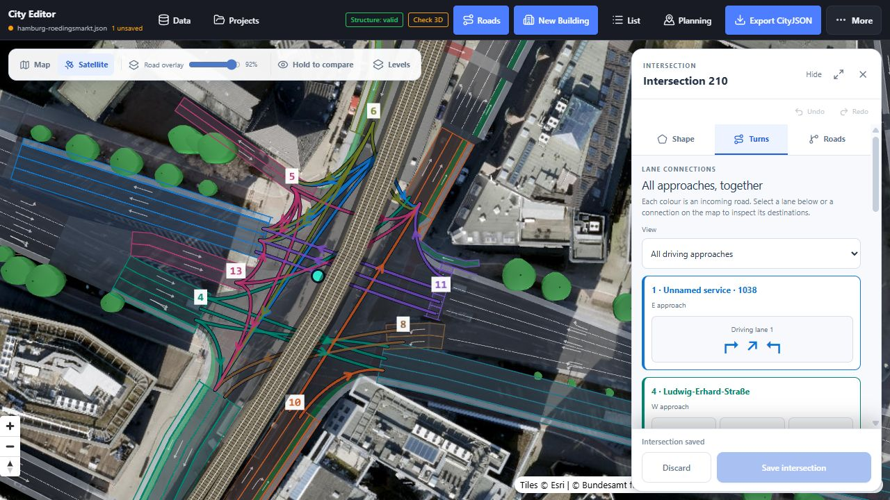
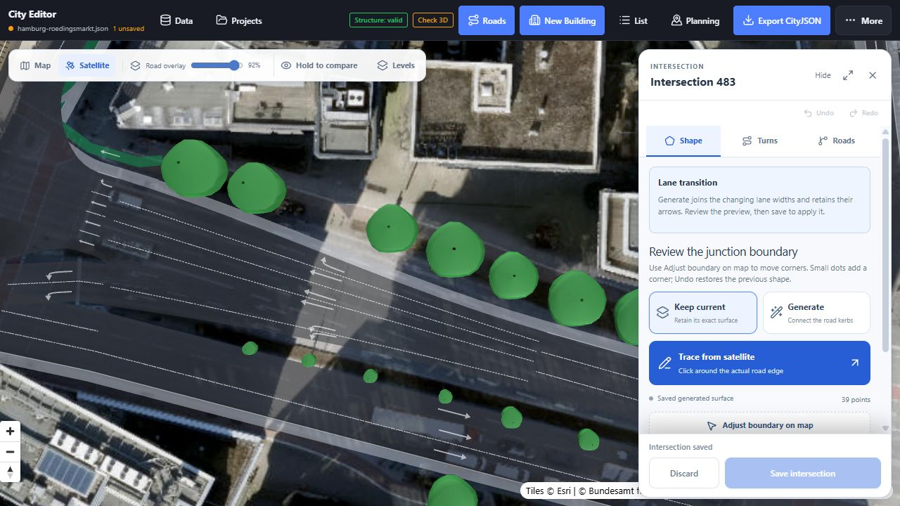
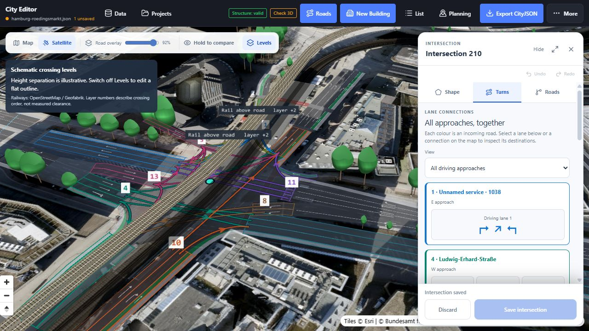

# Rödingsmarkt, lane transitions and crossing levels

10 September 2026

The latest work keeps the existing Shape tools and improves the few junctions where short imported road pieces overlapped or made the network difficult to understand. Two real sites supplement the [earlier eight-location comparison](intersection-validation-2026-09.md).

## What changed

**Rödingsmarkt / Ludwig-Erhard-Straße / Willy-Brandt-Straße:** the source describes the complex crossing as nine nearby junction records linked by eleven short roads. A combined preview assigns the junction one CityJSON Road object, with thirteen external approaches and multiple semantic surfaces. Saving removes the other eight junctions and eleven internal roads, trims approaches, and writes the lane permissions together. The edited example has 47 mode-specific lane connections; the unchanged-source consolidation has 49. Explicit lane-arrow corrections account for the difference.

Consolidation follows actual source connections, not spatial proximity alone. Internal connectors must be short and local; different levels and outside connections prevent absorption. Original reachable road pairs constrain the result. Where an approach carries explicit arrows, lane pairs are recalculated against the final exits: a locally left turn through a chain of tiny junctions must not become a right-hand destination in the combined junction. Both reviewed left-only lanes now reach separate southbound Rödingsmarkt lanes.

**Willy-Brandt-Straße near Görttwiete, intersection 483:** three incoming lanes widen into six outgoing driving lanes. Sorting compatible lanes laterally and matching them monotonically keeps every target lane reachable. Generated lane ribbons are clipped to the physical pavement to place arrows and dividers. Polygon trimming no longer relies on opposite vertices of an even-sided ribbon, which previously removed arrows from irregular trimmed lanes.





## Railway context and source limits

The road converter's committed OSM crop contains highway ways, but no railway ways. The new static context is extracted from the [Geofabrik Hamburg OSM snapshot](https://download.geofabrik.de/europe/germany/hamburg.html), downloaded on 10 September 2026. It contains 6,626 railway ways, including the two elevated tracks through Rödingsmarkt. It is fetched from the static website, so a backend or live Overpass request is unnecessary.

**Levels is a schematic view.** OSM `layer` expresses relative ordering where features cross; it is not an elevation or a clearance measurement. The viewer uses six display metres per layer solely to make that ordering legible, with mapped railway alignment, deck shading and rails. These display heights and reference rails are not inserted into the road edit or CityJSON export. See the [OSM layer documentation](https://wiki.openstreetmap.org/wiki/Key:layer).



The two left arrows in the representative example are explicit review corrections. The original OSM way `43118557` has two lanes but no `turn:lanes`; way `43145235` supplies `through|through|through|right`. The source crop is unchanged, and the edited object's `_laneArrowReview` attribute records the correction. Lane arrows and actual permitted lane connections are distinct data, and both remain editable. See [OSM turn:lanes](https://wiki.openstreetmap.org/wiki/Key:turn:lanes).

The existing Esri imagery in the UI was used for comparison. Its acquisition date is unknown. The consolidated boundary follows imported approach geometry and is an editable approximation; hidden kerbs, exact paint positions and bridge clearance are not verified survey data. Explicit source islands and holes are retained; obsolete sidewalk end fragments are not treated as islands. Trace any real islands that the source lacks. Curves are connection guides, not vehicle swept-path checks.

## Editing and saving

1. Open **Data → Explore Rödingsmarkt**, then **Roads**.
2. Search **intersection-210** for the combined junction, or **intersection-483** for the widening.
3. **Turns** starts with all driving approaches, coloured and numbered consistently with the map. Select a lane card or map connection; use **← All approaches** to return.
4. Use **Shape → Generate**, **Adjust boundary on map**, or the existing trace tools. Eligible source clusters offer **Preview one combined intersection**. Simple same-street transitions can be proposed automatically, but still require explicit Save.
5. **Save intersection** applies the geometry, trims and turn permissions together. Save errors remain visible. A reopened generated shape is labelled **Saved generated surface**, rather than looking like a reversion to the import.
6. **Save local**, CityJSON export, or a configured shared project retains work beyond the current session. The optional Docker storage service remains prepared for later hosting; GitHub Pages has no hosted database.

## Verification and reproduction

The final automated suite passes **732 tests**, with five pre-existing skips. Focused regressions cover unchanged preview documents, consolidation across save/reload, structural integrity, zero new road overlap, outside/grade boundaries, retained islands, all six transition exits, distinct left arrows and their matching left destinations. The actual browser was also used to generate/save/reopen the transition and to disable, save and reopen a lane permission.

The production Pages build passes. The browser captures in this note use the actual running editor at 1280 × 720; they are not mockups. Tablet layout guidance and the earlier iPad capture remain in the README.

```powershell
npm test
npm run build:pages
node scripts/build-roedingsmarkt-example.mjs
npm run review:intersections
```

The review tool now includes these two cases before the earlier eight. With Vite running, open `/test-output/intersection-review/index.html` to compare satellite, source and candidate in synchronized maps. The historical 608-junction audit numbers in the earlier report are not a new audit of this change.

To rebuild railway context, install `osmium` in a Python environment, obtain the regional PBF, then run:

```powershell
python scripts/extract-hamburg-railways.py --input path/to/hamburg-latest.osm.pbf
```

Railway data © OpenStreetMap contributors, distributed under ODbL 1.0. The source URL, extraction time and licence are retained in `hamburg-railway-context.json`; attribution is also visible on the map.
