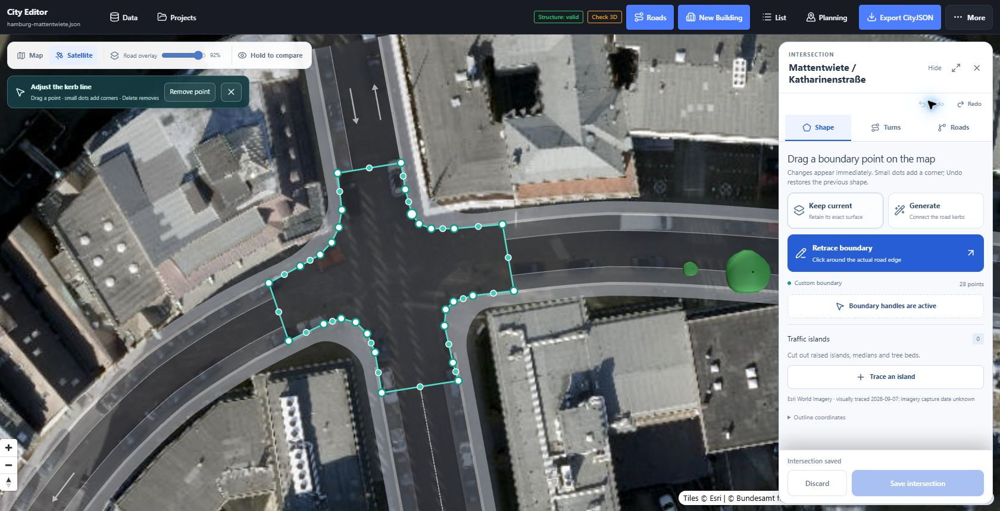
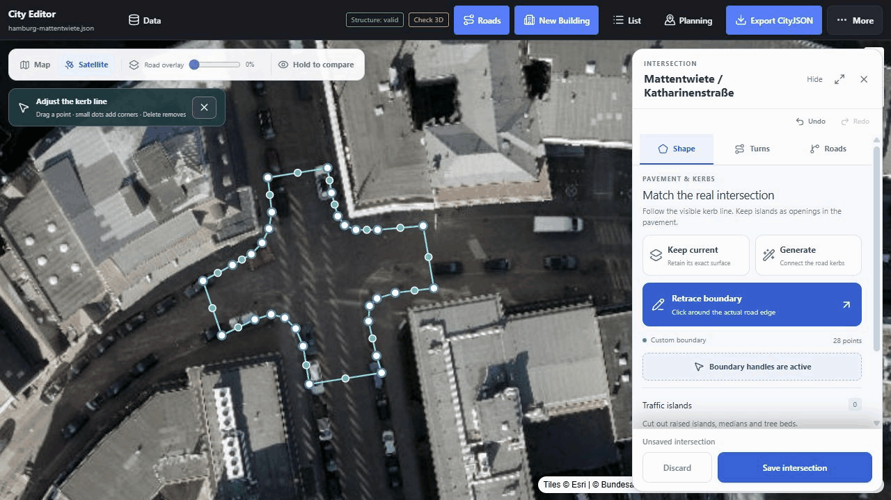

# Mattentwiete intersection: visual reconstruction study

7 September 2026 · Hamburg · representative local, flat four-arm junction

**Updated review:** the [9 September correction](intersection-validation-2026-09.md) adds eight separate satellite comparisons, the 608-junction audit, robust overlap checks and the current editing workflow. This document retains the provenance and estimates of the original single-junction trace.

## Result

The editor can reconstruct a useful visual intersection footprint from the imagery already available in its **Satellite** mode. The selected example is **Mattentwiete / Katharinenstraße**, with **Holzbrücke** to the north and **Cremon** to the west. It combines skewed approaches, one-way source streets, a curved western approach and visible parking. It is more informative than a symmetric invented crossroads while remaining small enough to inspect as one design.

Open **Data → Try the Hamburg intersection → Roads** and select the central junction.

## Reproducible inputs

| Input | Provenance |
| --- | --- |
| [Original five-object crop](../public/examples/hamburg-mattentwiete-source.json) | Extracted from the committed `public/data/hamburg/hamburg-city-center-roads.city.json`; OSM-derived osm2streets Road surfaces. Its vertices are compacted and the study junction is named for readability. |
| Junction | `hh-road-r00-c00-osm2streets-intersection-177`, source OSM node `25075678`. |
| Approach IDs | Road 175: Holzbrücke; 202: Katharinenstraße; 588: Mattentwiete; 155: Cremon, all with the same `hh-road-r00-c00-osm2streets-road-` prefix. |
| Imagery | The editor's existing Esri World Imagery layer. Visually reviewed on 7 September 2026; acquisition date and local absolute accuracy are unknown. No new imagery service was required. |
| [Edited study](../public/examples/hamburg-mattentwiete.json) | Five Road objects in EPSG:25832 on the source millimetre coordinate grid. Includes the traced outline, retained source directions/lane counts, estimated approach widths, explanatory metadata and untrimmed approach bases. |

The original crop remains available separately. This study does not replace the citywide road catalog. No satellite tiles are bundled as a new basemap; the README images are captures of the attributed running editor.

## Method and observed differences

1. Loaded the actual source junction and its four approaches. Imported connectivity identified the roads but did not provide explicit start/end labels. The editor now resolves missing labels from the nearest external road endpoints.
2. Tried automatic construction. The earlier movement-ribbon union failed on the pedestrian geometry of this real junction. Physical kerb outlines now have their own construction: sample the approach centreline at a setback, order the mouths, connect their edges with tangent-constrained curves, and make the mode surfaces disjoint with polygon subtraction. Turn permission is a separate graph operation.
3. Set road opacity to zero and traced 28 points along the visible carriageway edge. The trace spans the junction and short lengths of each approach. It follows the broad eastern mouth and the irregular western and southern returns that uniform inferred road widths missed.
4. Used the traced mouth edges to estimate full carriageway widths and lateral alignment. The source lane count and direction were retained. Parking bands are an illustrative interpretation of visible parked vehicles, not verified traffic regulation. The remaining motor space is assigned to the existing driving bands; a wide band must not be read as proof of a marked lane.
5. Rebuilt the approaches, saved the traced junction and reopened the example in the UI. Used the opacity control to compare the same view, checked boundary insertion/undo and movement toggles, then validated the CityJSON geometry.

| Approach | Estimated kerb-to-kerb motor pavement | Study driving band(s) | Illustrative parking | Lateral offset from source centreline |
| --- | --- | --- | --- | --- |
| Holzbrücke | 8.80 m | 2 × 3.35 m | 1 × 2.10 m | +0.18 m |
| Katharinenstraße | 9.17 m | 1 × 4.97 m | 2 × 2.10 m | −0.65 m |
| Mattentwiete | 10.64 m | 2 × 3.22 m | 2 × 2.10 m | +1.63 m |
| Cremon | 8.30 m | 1 × 4.10 m | 2 × 2.10 m | +0.56 m |

Offsets are relative to each source road's directed centreline. These values are design-study estimates derived from the on-screen trace, rounded to centimetres for storage; that precision does **not** imply centimetre accuracy. Widths away from the traced mouths remain approximations. Existing sidewalk and curb-band widths were retained and have not been surveyed.

The resulting pavement follows the visible central opening and the wider approach mouths much more closely than the original constant-width import. This is a qualitative visual comparison. No independent surveyed outline was available, so there is no justified numerical accuracy score or claim of exact equivalence.

## Editing and verification

- **Shape** supports preserving the imported surface, automatic generation, tracing, point dragging, midpoint insertion, keyboard nudging/deletion and interior island rings. One pointer drag is one undo action.
- **Turns** shows an incoming lane and its destinations; pavement stays intact when a turn is disabled. The optional diagram supplements the map.
- Custom outlines persist under `_junctionFootprint` and remain fixed during later approach edits. Generated outlines adapt to approach geometry. Both are saved as ordinary Road `MultiSurface` geometry with semantic surfaces.
- Geometry checks reject malformed/crossing outlines, islands outside/touching the kerb, overlapping islands, detached approaches, incompatible levels and complete consumption of a short road. Islands are also removed from any underlying approach pavement.
- The committed source and edited example are exercised by automated regressions. The edited five-object study passed **val3dity 2.7.0** using the application's `--ignore204` profile: **5/5 features and 5/5 MultiSurfaces valid**. This checks geometry, not traffic design.
- Current browser checks focus on desktop and iPad-sized right inspectors. See the [handoff](road-editor-handoff.md) for current validation; phones are not a supported editing target.

## What is still uncertain

Cars, shadows and roof displacement obscure some kerbs. Imagery age, registration and projection limit accuracy. Parking use and marked-lane allocation require closer observation or field verification. The study has no surveyed elevations and does not add traffic islands where none were clearly established.

The builder targets local flat junctions. Turn curves are connectivity guides; they are not vehicle swept paths and do not automatically route around islands. Island conflicts are reported for review. Crosswalks, stop lines, signals, priority, complex channelisation and grade-separated intersections require further authored data and specialised checks. The practical workflow is automatic construction followed by visual correction and engineering review where required.

For data-model and policy context, see [transportation provenance](transportation-provenance.md) and [UX/geometry research](road-ux-research.md).
