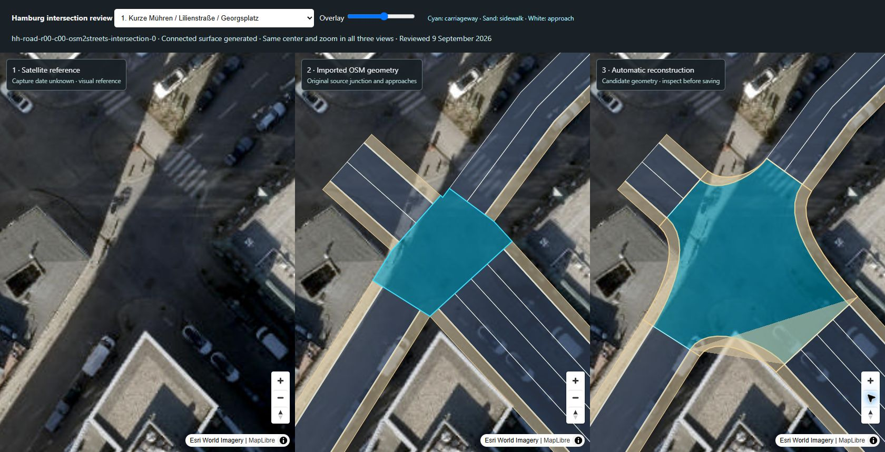

# Hamburg intersections: September correction and validation

9 September 2026

The editor now opens an intersection with usable map handles, separates its physical pavement from turn permissions, and validates the complete changed road network before saving. This review expands the earlier single Mattentwiete study to eight real locations and an automated audit of 608 source junctions.

**Automatic construction is a starting geometry, not an exact reconstruction of the satellite image.** It now produces continuous curved kerbs in many cases where the import contains a small rectangle or fragments. The comparisons also expose incorrect inferred approach widths, hidden kerbs, short internal roads and complex divided junctions that still need explicit editing. The citywide source catalog has not been silently replaced by these candidates.

## Eight visual comparisons

Each linked image shows three synchronized views: **satellite alone**, **original imported geometry**, and **automatic candidate**. Cyan denotes the junction carriageway; sand denotes sidewalks. The images come from the running review tool using the same Esri World Imagery service already present in the editor. Acquisition date and absolute accuracy are unknown. Shadows, vehicles and roof displacement prevent a survey-grade comparison.

| Junction / source suffix | What the comparison shows | Network check |
| --- | --- | --- |
| [Kurze Mühren / Lilienstraße / Georgsplatz · 0](../assets/readme/intersection-review-georgsplatz.jpg) | Rounded returns replace an angular central patch. The broad paved and parking space still needs locally measured widths and a visual boundary trace. | Candidate passes road-overlap check. |
| [Mönckebergstraße / Bergstraße · 2](../assets/readme/intersection-review-moenckeberg.jpg) | Four approach mouths now connect continuously. The visible markings and large pedestrian corners are more detailed than the inferred source cross-sections; much of the kerb is in shadow. | Candidate passes. This case also reproduces the former floating-point clipping failure. |
| [Große Bleichen / Poststraße · 12](../assets/readme/intersection-review-poststrasse.jpg) | A tiny source rectangle becomes a continuous four-way surface with curved corners. The real paved pedestrian space is broader and irregular, with trees/furniture that cannot be inferred from lane widths. | Candidate passes. |
| [Kurze Straße / Poolstraße / Kohlhöfen · 17](../assets/readme/intersection-review-kurze-strasse.jpg) | The skewed T-junction gets two curved returns. The eastern source alignment approaches a displaced building roof in the imagery; automatic rounding alone cannot resolve that offset. | Candidate passes. |
| [Mattentwiete / Katharinenstraße · 177](../assets/readme/intersection-review-mattentwiete.jpg) | Automatic construction connects the original narrow mouths. The separately bundled **28-point trace and adjusted approach widths** remain the closer visual reconstruction; see the [reference study](intersection-reference-study.md). | Candidate passes. The edited study is exercised separately. |
| [Kajen / Hohe Brücke · 182](../assets/readme/intersection-review-kajen.jpg) | The original junction is a thin, folded fragment between short approaches. The candidate creates pavement but retains an awkward spur and encroaches on a neighbouring junction. This requires correcting the short-road topology/boundary. | **Save blocked:** approximately 0.8 m² of new overlap in total. |
| [Meßberg / Dovenfleet / Willy-Brandt-Straße · 302](../assets/readme/intersection-review-messberg.jpg) | The real site contains divided carriageways, slip roads and large islands. One OSM junction object does not describe the whole physical intersection. Its local candidate reaches the adjacent junction. | **Save blocked:** approximately 1.2 m² of new overlap. Keep the source or author the boundary and connections. |
| [Rathausmarkt / Große Johannisstraße / Rathausstraße · 144](../assets/readme/intersection-review-rathausmarkt.jpg) | Curves replace the angular T-shaped patch, but the result intrudes into another loaded road. Heavy shadow prevents an independent exact kerb trace from this image. | **Save blocked:** approximately 6.5 m² of new overlap. |



The three blocked examples are deliberately included. A generated surface must not be treated as valid merely because it can be drawn. Their existing imported surfaces remain available in **Keep current**, and turn permissions can still be edited independently.

## Construction and validation changes

- Sample actual imported lane-polygon edges at each approach mouth, including asymmetric or tapered kerbs. Generated layout edits continue to use their current band widths.
- Order mouths by position around the junction and limit corner controls at tangent intersections. Unite local generated fans when overlapping mouths would otherwise leave a crossing outline. User traces are validated, never silently repaired.
- Preserve existing island holes and explicit median/planting surfaces during automatic regeneration. Trace additional islands when the source does not contain them.
- Trim junction and approach pavement in one transaction, retain original approach bases, and support creating junctions from unsaved road joins. Two new joins on the same road retain both trims through repeat saves.
- Check new overlap against untouched roads **and other roads changed in the same transaction**. A topology connection does not exempt an overlap. Shared edges and retained source overlap are allowed; new encroachment is blocked.
- Validate newly occupied pavement for buildings and trees. Tree checks use the traffic footprint separately, so changing a sidewalk to a driving/cycling/parking surface over a trunk still blocks saving. Unchanged approach pavement does not produce distant new tree errors when a junction corner moves.
- Keep the existing fast polygon operations, with an identical-coordinate retry through [polyclip-ts](https://github.com/luizbarboza/polyclip-ts) when near-coincident projected edges make the floating-point sweep line fail. This avoids suppressing a collision or altering the boundary to bypass a numerical error.
- Add project maximum widths, including compatibility with older saved profiles. These are editable project guardrails, not statutory road-width maxima.

## Reproduce the checks

```powershell
npm ci
npm test
npm run audit:intersections
npm run review:intersections
npm run dev:frontend
```

Open `/test-output/intersection-review/index.html` on the Vite server for the synchronized comparison tool. Choose a location, adjust opacity and pan/zoom any panel. It reports the candidate's save-blocking road conflicts. `audit:intersections` writes a fresh JSON report under `test-output`; pass a filename to retain it elsewhere.

The [recorded full audit](reports/hamburg-intersections-2026-09-09.json) uses the committed Hamburg center CityJSON and its EPSG:25832 projection. Of **608** loaded junctions with at least three approaches:

| Result | Count |
| --- | ---: |
| Constructed candidate with no newly introduced road overlap | 539 |
| Candidate blocked by new road overlap | 46 |
| Construction blocked by unsupported geometry/elevation or an exhausted short approach | 23 |
| Polygon calculation failures left unresolved by the precise retry | 0 |

This audit checks geometry and road overlap. It does not certify imagery accuracy, pedestrian clear width, buildings, tree coverage, legal movements or vehicle turning envelopes. The editor additionally checks loaded environmental constraints during actual saves.

The regression suite covers ten real junctions, three/four-arm synthetic networks, repeated reconstruction, island retention, missing incoming movements, two simultaneous new endpoint joins, disabled-turn persistence, source-overlap retention and actual encroachment. See [the handoff](road-editor-handoff.md) for current browser and build results.
