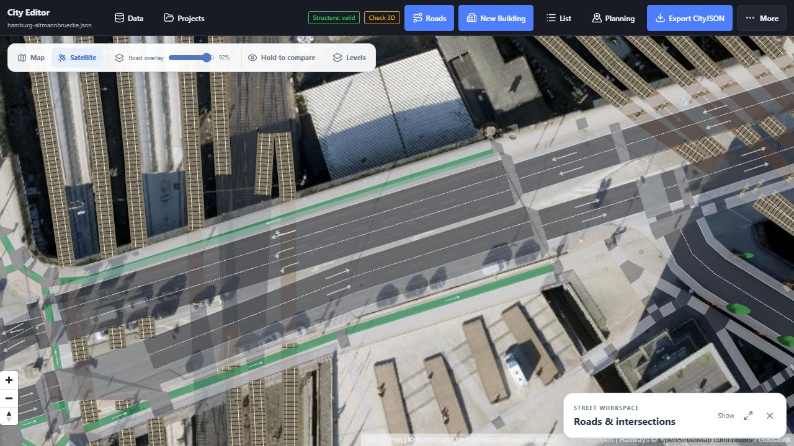
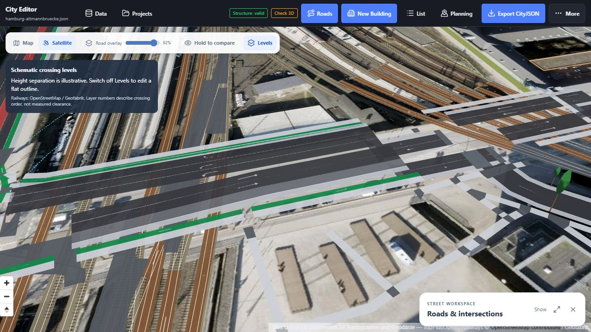
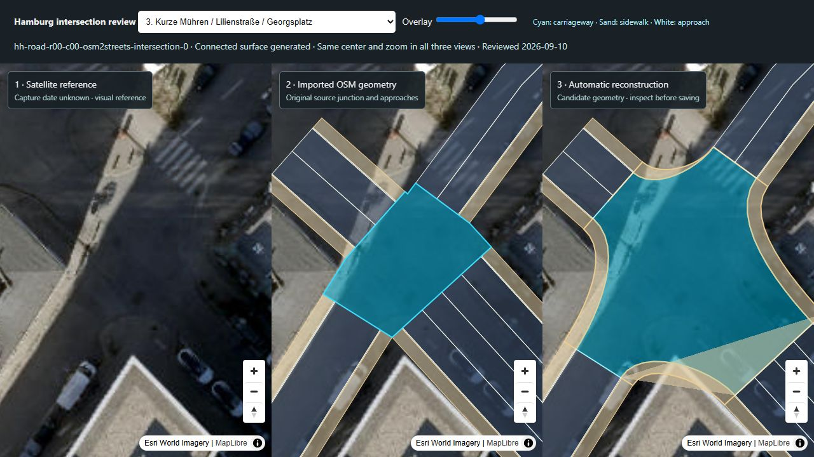

# Intersection generation, cycle lanes and crossing order

10 September 2026 — follow-up to the [Rödingsmarkt implementation](intersection-consolidation-2026-09-10.md).

The editor uses the same Generate and connection tools for loaded junctions throughout the network. **Opening a junction always preserves its saved geometry.** Both ordinary generation and larger consolidations require an explicit click, followed by Save to apply the preview. The two Data study cards and the satellite boundary-tracing button are removed. Satellite comparison, Shape, Generate, islands and optional boundary handles remain.

## Road-over-rail crossings

Altmannbrücke exposed a rendering error: railway layers were appended after all roads. In the published road catalog, OSM ways `32959523` and `32959524` already have road layer +1. The nearby main-line tracks have layer −1, while the U-Bahn tunnels have tunnel tags and layer −2. A negative layer alone does not make the open station cutting a tunnel.

The renderer now groups road surfaces, markings and selection highlights with railway geometry by relative layer. In flat view, higher road surfaces mask the lower railway display paths, so the sleepers do not bleed through a translucent bridge overlay. Narrow seams between carriageways of the same named bridge are closed for display; explicit holes remain. In Levels, road paint and geometry share their display height and depth ordering. Repeated per-track labels were removed.





The [Altmannbrücke crop](../public/examples/hamburg-altmannbruecke.json) contains 183 unchanged CityObjects from published road tiles `hh-road-e566-n5933` and `hh-road-e566-n5934`. Its metadata records the source tiles and crop. The existing static railway context comes from the Geofabrik Hamburg OSM snapshot described in the earlier report. No new service is required. Display heights still use six illustrative metres per relative layer; they never become exported elevations or clearance measurements.

## Bicycle pavement and junction size

The old cycling surface was the difference between an outer bicycle outline and an inner carriageway outline. When the next road had no bicycle lane, these outlines converged and the green strip faded to zero width. A larger carriageway could also consume it.

Generation now reserves the original approach cycleways before constructing motor and walking surfaces. Absorbed internal bicycle pavement is retained in the combined junction. Compatible through or slight-turn bicycle continuations use ribbons with positive widths at both ends. Other turning permissions remain visible as connection guides. An unconnected cycle lane keeps its original full-width end. Shared cycle-lane ends are assigned to the junction once, avoiding overlapping approach polygons. Cycle geometry and metadata survive save, reopen and regeneration.

**Selected intersection** is now the default generation extent. It rebuilds the selected junction and fits its approach ends without deleting connected road objects or changing neighbouring junctions. The former **Nearby pieces** default was removed because even that search could absorb a chain of junctions. Only explicitly choosing **Larger area** enables **Generate combined intersection**. Switching to another junction starts with the selected-only scope again.

The larger search follows actual endpoint ownership within 90 m, using internal roads up to 35 m and at most 18 junction records. Its initial smaller search (65 m, 20 m and 12 records) remains an internal algorithm step, not a default UI action. Roads connected outside the group are excluded. A larger search never weakens the crossing-level check. Consolidation stays at ground level; an individual flat underground junction can be rebuilt without losing its underground profile, while mixed levels are refused.

On the unchanged Rödingsmarkt crop, Nearby combines nine junction records and eleven internal roads, leaving thirteen outside approaches. Larger combines thirteen records and seventeen internal roads, leaving twelve outside approaches. Both pass the overlap and save/reopen checks. The camera reframes when the approach set changes. Saved generated boundaries are labelled accordingly.

## Manual generation, road ownership and limits

The automatic-on-selection proposal was removed after user review. Selecting any junction opens all its incoming roads and turn connections without creating a geometry edit or an Undo entry. **Shape → Generate** prepares the rounded draft; **Keep current** or Undo restores the original. Previewing does not mutate CityJSON.

Generated corners fit to unchanged neighbouring roads at the same crossing level. The neighbouring objects are not edited. A generated component is discarded only if the remaining component reaches every original driving approach. When clipping would split the carriageway, the original connected candidate is retained and its overlaps are reported. Grade-separated crossings are not clipped into holes. The user can explicitly save design conflicts with warnings; invalid geometry remains blocked.

Ordinary generation trims each old road tip at the same cross-section used to construct the new kerb. Detached rectangular remnants no longer survive outside that rounded corner. Combined footprints also drop detached tip components; real outward approaches and full-width bicycle ends remain. Short **separate source roads** outside an ordinary junction are intentionally still separate: use **Generate combined intersection** to absorb eligible connected pieces together.

The ten-location regression includes Kajen / Hohe Brücke, Meßberg / Dovenfleet / Willy-Brandt-Straße, and Rathausmarkt / Große Johannisstraße / Rathausstraße. The larger Rödingsmarkt merge was also reviewed against 5,605 CityObjects across two streamed tiles. It now retains a connected carriageway and reports four overlap conflicts with nearby footways, steps and junctions; the browser successfully saved it with warnings. This is not a claim that every preview fits its surroundings without conflicts.

## Follow-up: square fragments, warnings and switching drafts

The reported green squares were retained cycling segments from internal source roads, plus fragments severed during neighbour fitting. Cycling is now fitted and tested for connection to external approaches **before** its space is reserved in the motor and walking pavement. Isolated internal parts are omitted without leaving rectangular holes. Full-width external cycle ends remain. Both Nearby and Larger merges of source junction `3376` are covered by save/reopen tests on the actual streamed tiles.

Warning cards use solid, contrasting colours and can expand their complete lists. **Save with N warnings** records accepted design issues in `_roadFitReview`; reopening shows them as results from the last save. Fresh checks still run synchronously before a commit. Structural validity and incomplete geometry are not bypassed.

Road and intersection selections switch directly on the map, including preview surfaces. Unsaved drafts and their undo histories are kept in the inspector. They are session drafts, not persisted project edits. Source signatures prevent a kept draft from silently overwriting geometry changed by another saved operation.

The old viewport OSM refresh was removed. **Projects → Reset project roads from OSM** prepares a complete replacement over the loaded project's extent using the same network-to-CityJSON converter as the Rust pipeline's CLI. Counts, notices and a downloadable preview precede the explicit reset. Application requires a recovery copy, creates an Undo entry, preserves non-Road objects, and stops old road tile streaming. A live browser test prepared 207 roads and 127 intersections from the 75-object source crop, applied the reset, then restored its original 48 roads and 27 junctions with Undo. Public Overpass availability and a 25 km² browser limit constrain this optional workflow.



Checks cover **loaded** buildings, roads and trees. A roads-only crop contains no building footprints to test against. Existing geometry and its retained overlaps are not treated as newly created collisions. The imagery's capture date is unknown, and generated kerbs remain approximations. Neither connectivity curves nor schematic heights certify vehicle turning clearance or bridge engineering.

## Verification and reproduction

The frontend suite passes **773 tests**, with five pre-existing skips; the production GitHub Pages build also passes. Generation-scope regressions exercise the default, explicit expansion, switching back and selecting another junction. On the full streamed Rödingsmarkt source, selected-only generation and repeated save/reopen preserve every road and junction ID and leave objects outside the selected junction and its four approaches unchanged.

Regression coverage includes unchanged selection, imported tip cleanup, fitting and saving the three formerly blocked locations with unchanged neighbours, refusal to split a carriageway across another road, both crossing directions, full-width bicycle ends, islands, merge sizes and existing building/tree validation. The previous crossing review and larger Rödingsmarkt save/reopen checks remain covered. The browser was also used to verify unchanged selection, manually generate and save Meßberg, and compare the cleaned Kajen candidate with the original roads and built-in imagery.

```powershell
npm test
npm run build:pages
node scripts/build-roedingsmarkt-example.mjs
node scripts/build-altmannbruecke-example.mjs
npm run review:intersections
```

The optional Docker storage service is unchanged and still prepared for later hosting. GitHub Pages serves the editor and static data; it does not host a shared database.
