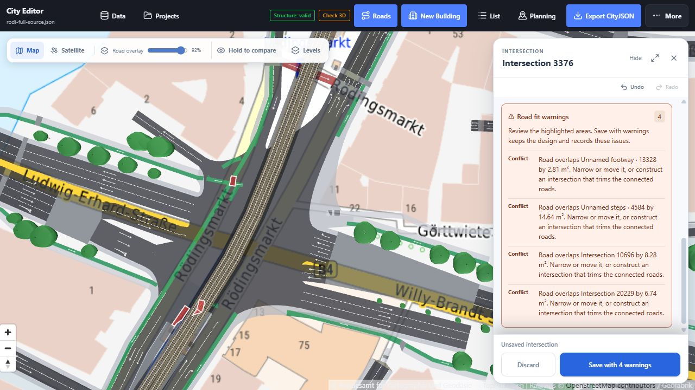

# Road warnings, validation and recovery

Behavior reference · updated 11 September 2026

The road editor checks a proposed change against the loaded document and its active width profile. A **Conflict** is a design issue that needs review; **Save with N warnings** can record and apply that design. Invalid inputs, failed surface construction and newly introduced CityJSON structural errors still prevent saving. These outcomes are separate from OSM conversion diagnostics and the optional 3D validator.

The [width policy reference](road-ux-research.md#governing-references) explains which thresholds have a published source and which are editor defaults. Accepting a warning records a modelling decision; it does not grant a regulatory exemption.

## Reading the inspector

The **Road fit warnings** card shows each message with a text label: **Conflict** for an internal `error` severity, or **Check** for `warning`. It initially shows four entries; **Show all N warnings** expands the rest. Spatial conflicts also have highlighted polygons on the map. Width recommendations and generation notes need no map polygon.

**Checking fit…** means the geometry has changed and the delayed checks are pending. Road geometry previews are limited to roughly one update per 50 ms during a drag; fit checks settle 140 ms after the latest preview change. Saving recomputes geometry and fit synchronously, so an old clear result cannot approve a later change.

The compact **Fit clear** status describes the fit/error summary, not every recommendation in the active rule profile. Read the warning card and **Rules** tab for the complete list. Intersections show fit conflicts beneath their tools and construction notes separately.



## Width and extent checks

Widths belong to bands in a road section. Left and right are relative to its directed centreline. The active profile supplies minimum, target and maximum widths; two-way bands can use a separate set of values.

| Check | Trigger | Meaning and response |
| --- | --- | --- |
| Below minimum | A finite, positive band is narrower than the profile minimum. | A new or changed width is a Conflict; an unchanged source width is a Check with **Existing width retained**. Increase the width, revise the section, or explicitly save with warnings. |
| Above maximum | A band exceeds the profile's upper limit. | New/changed widths are Conflicts; unchanged widths are Checks. These maxima are editable software limits, not statutory maxima. Use separate bands where multiple lanes are intended. |
| Below target | Width meets the minimum but is below the recommended value. | A Check asks for review of the constrained width. |
| Left/right extent exceeded | `total width / 2 ± offset` exceeds an entered side limit. | A Conflict reports the excess in metres. Narrow bands, shift the section, increase a justified limit, or accept the warning. A blank limit means unknown, not zero. |
| Invalid width or configuration | Non-finite/non-positive width, non-finite offset, negative/non-finite extent, or invalid rule JSON. | Saving is blocked. Correct the input; explicit warning acceptance cannot bypass it. |

**Fit widths to available space** preserves each band's minimum, reduces surplus width proportionally, and adjusts the offset to respect the side limits. If the minimum widths together cannot fit, it reports the required space and leaves the draft unchanged. It does not silently remove a band or compress it below its minimum.

The exposed extent workflow uses the numeric limits in **Rules**. The lower-level fit validator also supports `outside_corridor` conflicts against supplied corridor polygons, but the current editor hook does not supply those polygons. A drawn parcel or the visible map edge is therefore not automatically a hard road boundary.

Implementation: [road-rules.ts](../src/lib/road-rules.ts), [RoadRulesPanel.tsx](../src/components/RoadRulesPanel.tsx).

## Spatial fit checks

| Internal kind | What is checked | Default result |
| --- | --- | --- |
| `road_overlap` | New shared area between separate road objects at the same level. A confirmed connection does not exempt the roads from this check. | Conflict, with the neighbouring road and overlap area. Shared edges and numerical slivers of at most 0.04 m² are ignored. |
| `building_overlap` | New pavement overlaps a loaded building footprint without known vertical separation. Explicit elevation can also be tested against the building's vertical range. | Conflict. Move/narrow the road, correct the source geometry, or review an explicit exception. |
| `building_clearance` | A standalone road geometry edit approaches a loaded building. | Less than 0.5 m is a Conflict; 0.5 m to less than 1 m is a Check. These are editor proximity thresholds, not verified legal setbacks. |
| `tree_overlap` | A traffic surface covers a loaded street-tree trunk. | Conflict at the surface; Check for elevated traffic, where the simple trunk test does not establish vertical collision. Underground roads are excluded. |
| `vertical_uncertainty` | A bridge/tunnel indication is present, but available level/elevation information cannot decide a plan overlap. | Check. Supply known elevation information or retain the uncertainty for review. |
| `affected_land` | New road coverage intersects a loaded planning/land polygon passed to the validator. | Check naming the area. This is an intersection test, not an assessment of permitted land use. |
| `outside_corridor` | Coverage leaves an explicitly supplied allowed corridor. | Warning by default; the caller can request error severity. This is library capability rather than the current UI extent input. |

Direct intersection rebuilding checks overlaps with roads, buildings and trees. It does **not** currently apply the standalone road editor's 0.5/1 m building proximity thresholds or its planning-area checks. A lack of a junction proximity warning therefore does not establish building clearance.

Road-to-road level classification uses explicit elevation where both roads have it; more than 0.5 m difference is treated as separated by this geometric check. Otherwise, distinct OSM layers can distinguish known bridge/underground placements. This tolerance is not a vehicle-clearance requirement. The **Levels** display adds schematic depth and cannot supply missing measured heights.

Tree checks use the recorded trunk radius, or a 0.25 m fallback when unavailable, with no additional clearance in the current UI. Driving, cycling, parking and other traffic surfaces are checked. Sidewalks, planting and separators can contain trees; a complete tree opening is also allowed. Canopies, roots and required growing volumes are not evaluated.

Implementation: [road-fit.ts](../src/lib/road-fit.ts), [useRoadEditor.ts](../src/hooks/useRoadEditor.ts), [crossing-levels.ts](../src/lib/crossing-levels.ts).

## Existing source defects and the scope of a check

Geometry-changing checks compare the preview with the saved network. They subtract unchanged paved coverage before checking newly occupied building/land space. For trees, a separate traffic-only mask ensures that replacing a sidewalk with a driving lane is still a new conflict, even if the outer paved boundary is unchanged.

Road overlap checking subtracts the old overlap between the same pair of roads. An existing source overlap can remain; an overlap that grows or moves into new space is reported. The comparison includes other roads changed in the same transaction and excludes road pieces explicitly removed by a combined junction operation.

An exact-attribute edit retains its imported polygons. It avoids rerunning building/road geometry checks for pavement that has not moved, while tree checks can still reflect the traffic use of the surface. Consequently, the editor is an **edit-impact check**, not an exhaustive audit of every existing road defect.

Checks use loaded data. Visible 3D Tiles are not, by themselves, editable CityJSON building footprints in the fit validator; detailed buildings enter the document through the editing/import path. A roads-only example cannot check missing buildings or trees. Zooming out does not prove a whole-city design free of conflicts.

## Intersection construction messages

**Generate** first builds a valid junction candidate, then evaluates its fit. A construction failure produces no valid candidate to save; **Save with warnings** cannot replace the missing geometry.

| Message family | Reason | Available action |
| --- | --- | --- |
| Load every connected approach | One or more referenced roads are absent. | Load the required roads/crop before generating. **Keep current** remains the route for editing an existing surface's movements. |
| Different levels / flat approaches required | Approaches have incompatible layers, placements or elevations, a non-flat elevation range, or an elevated approach lacks a known elevation. | Preserve the surface to edit turns. Separate bridges/underpasses from the junction; correct heights only with supporting data. |
| Approach cannot be reconstructed | Imported polygons cannot produce the road layout needed by the generator. | Keep the current intersection or edit that road's layout first. |
| Boundary does not reach an approach | A custom boundary fails to join a connected driving/parking surface. | Extend the boundary into the actual road mouth. |
| Boundary/island crosses itself, touches another ring, or has no usable area | Outline geometry is invalid. | Move/remove points; keep islands strictly inside the boundary and apart from each other. |
| Approach kerbs do not form a simple outline / no valid surface | The input roads cannot be joined by the current construction method. | Adjust approach ends or retain the source surface. Existing boundary handles are available through **Adjust boundary on map**. |
| Junction would consume an entire short approach | The selected-scope trim would erase a connected road. | Extend/correct the approach, or deliberately choose **Larger area** when those short pieces belong to one junction. Selected-scope generation does not silently absorb them. |
| Consolidation group no longer matches / connected outside the group | A proposed merge would remove a road still needed by another junction, or the source group changed. | Reopen the current source junction and build a fresh preview. |
| Approaches too far apart / boundary too large | The local generator/outline limits have been exceeded. | Edit long sections as roads or separate the junctions. These are construction limits, not road-design standards. |

Generation can also succeed with notes:

- **Generated edges fit around N neighbouring roads** describes a completed clipping operation.
- **A neighbouring road cuts through this junction** means clipping would disconnect the carriageway. The generator retains its connected candidate and reports the overlap instead of creating detached scraps. Review a larger-area merge or save the candidate with warnings.
- **Permitted lane connections cross an island** asks for movement review in **Turns**. Curves are connection guides, not vehicle swept paths. Disabling a turn leaves the pavement intact.

**Selected intersection** is the default scope. **Larger area** exposes a combined preview and counts of absorbed junctions/internal roads. A combined save removes those pieces and replaces the external approach ends together. Invalid construction rolls the operation back.

Implementation: [road-junctions.ts](../src/lib/road-junctions.ts), [junction-footprint.ts](../src/lib/junction-footprint.ts), [junction-ownership.ts](../src/lib/junction-ownership.ts), [junction-clusters.ts](../src/lib/junction-clusters.ts).

## Save with warnings and the saved review

The normal UI offers **Save with N warnings** when a road has fit or accepted design-rule issues. For intersections, the save action accepts listed fit conflicts once construction is valid. The save check uses current geometry; a newly detected structural failure still rolls back the transaction.

Geometry saves record their review on the Road object:

```json
{
  "_roadFitReview": {
    "checkedAt": "2026-09-11T12:00:00.000Z",
    "warnings": [
      {
        "id": "example-overlap",
        "label": "Road overlaps a neighbouring road by 1.20 m².",
        "severity": "error"
      }
    ]
  }
}
```

This example shows the storage shape. The record contains IDs, labels, severity and a timestamp. Generation notes and rule messages can also appear in the array; rule messages are recorded as warning notes. It contains no conflict polygons, reviewer identity, sign-off or immutable history. Rule-profile values are stored separately with `_roadLayout`.

Reopening a clean saved draft displays **Warnings accepted at last save**. That is the last recorded geometry review, not a live certification. A later checked geometry save replaces the record, or removes it when there are no issues. Exact-attribute road saves and **Keep current** junction saves retain the earlier review because they do not perform a new surface rebuild.

One current workflow distinction is important: **Build intersection** from an unsaved connected road rejects rule errors before opening its preview. That preflight has no warning-acceptance action. Resolve its width/configuration errors first, or save the road through the ordinary road workflow and inspect the connection afterward.

Implementation: [road-fit-review.ts](../src/lib/road-fit-review.ts), [RoadEditorPanel.tsx](../src/components/RoadEditorPanel.tsx), [useRoadEditor.ts](../src/hooks/useRoadEditor.ts).

## Failures that cannot be accepted as design warnings

Road generation requires supported coordinates, a valid transform, at least two distinct centreline points, at least one band per section, and finite positive widths. Collapsed or self-intersecting generated bands fail construction. Invalid junction outlines, incomplete traces and stale draft sources also block saving.

The structural mutation guard snapshots the document before editing and compares browser-detectable errors before and after. It restores the snapshot if an operation throws or introduces an error such as an invalid vertex reference or dangling object relationship. Existing structural input defects can remain visible during editing; they are not silently repaired by warning acceptance.

Selecting another road parks the dirty draft and its undo history for the current session. If a saved operation changes the source geometry used by a parked draft, saving that draft reports **Saved geometry changed while this draft was kept**. Discard and reopen it against the current document. This prevents an older draft from overwriting a newer connected edit.

## Conversion, loading and export diagnostics

| Origin | Where it appears | Interpretation |
| --- | --- | --- |
| Native osm2streets exporter | `diagnostics.json`, exporter logs and conversion summary in the tile work directory. | Rust `warn`/`error` log messages can accompany successful output. Inspect geometry and the command's result; a logged error is not automatically a rejected conversion. |
| Browser osm2streets conversion | **Projects → Reset project roads from OSM → OSM conversion notices** after preparation. | Review the replacement and its notices before applying the project-wide reset. These are conversion messages, not `_roadFitReview` results. |
| Invalid/incomplete OSM response, failed download or oversized reset | Reset status in **Projects**. | Preparation fails without replacing the current document. The browser reset limit is 25 km²; larger datasets use the offline converter. |
| Road/catalog/imagery/building request failure | Loader, catalog or layer status. | Missing data or a lower-detail fallback. An unavailable LoD3 tile does not mean the road has passed a building collision check. |
| **Structure** | Toolbar, or **More** on narrower layouts. | Browser document checks for references, transforms, semantic indices and related structure. Orphaned vertices can be advisory. This is separate from road fit. |
| **Check 3D** | 3D validation status. | Optional local val3dity service, currently using `--ignore204`; see the conversion guide for that validation scope. Unavailable is distinct from valid. |
| Shared storage failure/revision conflict | **Projects** and the shared-project status badge. | The applied design may still be only in the browser. Retry or keep a separate project/export; a save-to-document success is not a server acknowledgement. |

**Export CityJSON** serializes and reparses the exact download, rejects browser structural errors, and requests external primitive validation. A val3dity rejection stops export. If the service is unavailable, the UI asks whether to export with 3D validity unchecked. Accepted road design warnings do not, by themselves, prevent export; structural/primitive validation still applies.

See [OSM-to-CityJSON conversion](osm-to-cityjson.md) for logs and validation commands, and [streaming and storage](streaming-and-storage.md) for loading and persistence. The primary validation paths are [editor-actions.ts](../src/lib/editor-actions.ts), [export-validation.ts](../src/lib/export-validation.ts) and [useImportExport.ts](../src/hooks/useImportExport.ts).

## Regression coverage

The warning behavior is exercised by [road-fit.test.ts](../tests/lib/road-fit.test.ts), [road-overlap.test.ts](../tests/lib/road-overlap.test.ts), [road-rules.test.ts](../tests/lib/road-rules.test.ts), [road-junctions.test.ts](../tests/lib/road-junctions.test.ts), [junction-ownership.test.ts](../tests/lib/junction-ownership.test.ts), [useRoadEditor.test.tsx](../tests/hooks/useRoadEditor.test.tsx) and [RoadEditorPanel.test.tsx](../tests/components/RoadEditorPanel.test.tsx). The hook tests include immediate-save validation before the preview debounce, explicit overlap acceptance, stored warnings, draft switching and invalid-width rejection.
