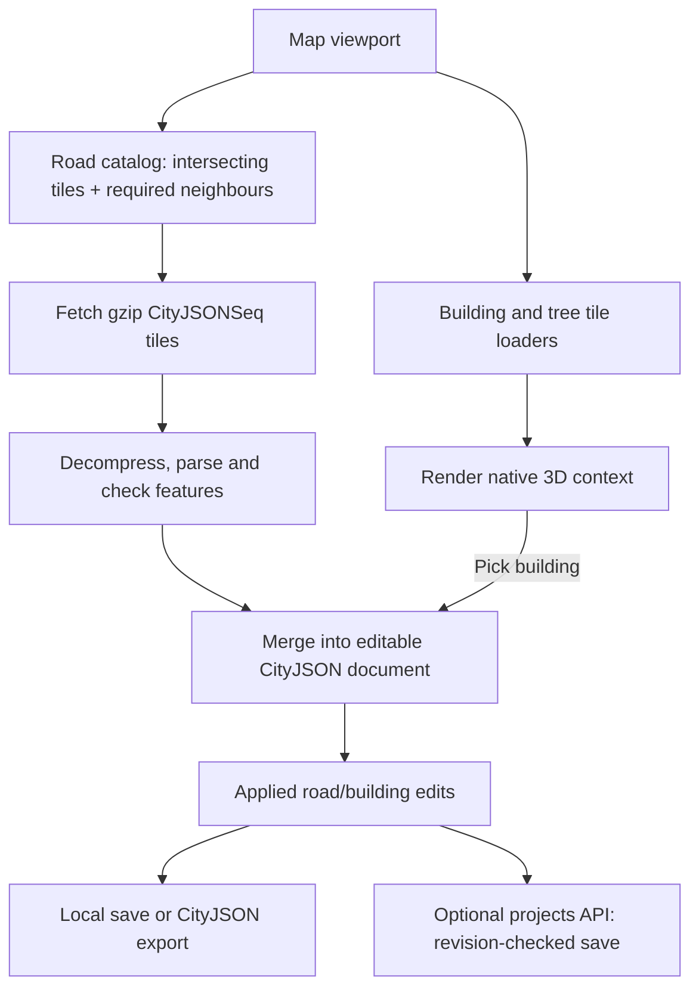

# Streaming and storage

Architecture reference · implementation checked 11 September 2026

The application separates **map delivery**, **editable city data** and **project persistence**. GitHub Pages serves prepared files. The browser loads the visible area and keeps an editable CityJSON document in memory. An optional projects API saves that document and its revisions. The projects database does not currently serve the Hamburg map.

## Delivery formats

| Layer | Delivery format | Use in the application |
| --- | --- | --- |
| Roads and intersections | Static catalog plus gzip CityJSONSeq tiles | Become editable Road objects in the working CityJSON document. |
| Building overview | Prepared PNG tiles at low zoom; MVT footprints closer in | Cheap citywide context with usage colours. |
| Detailed buildings | Official Hamburg 3D Tiles, with b3dm/glTF payloads | Render native LoD1/LoD3 meshes; convert a picked feature when needed for editing. |
| Trees | Official 3D Tiles instance data | Load nearby positions and render procedural tree meshes. |
| Satellite/basemap | Raster map tiles | Visual reference, separate from semantic city objects. |
| Saved project | Complete CityJSON document | Browser-local save, downloadable export or optional shared revision. |

“The city streams as CityJSONSeq” is only accurate for the road catalog and the optional converted CityJSONSeq catalogs. The default detailed building display uses 3D Tiles directly.

## CityJSONSeq records

CityJSONSeq represents a dataset as a header followed by feature records. This repository uses JSON Lines: one complete JSON object per line in a `.city.jsonl` file. Features have their own vertex arrays; a feature can include a parent object and its children. See [CityJSON §7.2, text sequences and streaming](https://www.cityjson.org/specs/2.0.2/#text-sequences-and-streaming-with-cityjsonfeature).

The road converter writes this organization:

| Record | Contents |
| --- | --- |
| First line | `type: "CityJSON"`, `version: "2.0"`, empty `CityObjects` and `vertices`, shared `transform` and `metadata.referenceSystem`. |
| Each subsequent line | `type: "CityJSONFeature"`, root `id`, `CityObjects` and a local `vertices` array. One generated road or intersection per record. |

For example, vertex index `0` in road A's record means A's first vertex. Index `0` in road B's record means B's first vertex. When combining records into one editable document, the loader remaps those indices into the combined array. The same adjustment is needed for appearance references where present. Concatenating feature vertex arrays without remapping geometry indices corrupts the model.

Quantized coordinates are reconstructed with `coordinate = integer × scale + translate`. In the road dataset, a scale component of `0.001` expresses a millimetre grid in the projected CRS. It does not specify observational accuracy.

The file format supports record-by-record processing. **The current browser road loader reads and decompresses a complete tile before parsing its lines**, and applies a viewport load after its requested tiles have been assembled. It does not progressively display each incoming network line. Its memory saving comes primarily from spatial tiling, bounded requests, removal of duplicate source copies and unloading clean off-screen data. The build packager and sequence scanner do process source files line by line.

## Road catalog preparation

[build-hamburg-road-pages-catalog.mjs](../scripts/build-hamburg-road-pages-catalog.mjs) consumes a complete generated road catalog and assigns each feature to a **1 km cell by the centroid of its extent**. Features remain whole; they are not clipped at every cell edge. Each output tile therefore records its actual feature extent.

The catalog contains a CRS, per-tile URL, extent, object counts, content revision and optional `dependencies`. Known connections across source crop seams are recorded so a visible junction can load its required neighbour. These dependencies are correctness information, distinct from optional nearby-tile prefetch.

The committed [Hamburg catalog](../public/data/hamburg/roads/catalog.json), inspected on 11 September 2026, reports:

| Metric | Value |
| --- | ---: |
| Static tiles | 930 |
| Roads | 344,265 |
| Intersections | 206,426 |
| Total features | 550,691 |
| Uncompressed tile content | 1,724,524,636 bytes (about 1.72 GB) |
| Compressed tile files | 129,287,582 bytes (about 129 MB / 123 MiB) |

These are complete-dataset totals, excluding the catalog itself. A normal viewport downloads a subset, not all 129 MB. Counts and sizes should be read from the catalog when the dataset is rebuilt. [Building roads from OSM](osm-to-cityjson.md) provides a small reproducible example through conversion and packaging.

## Viewport loading and unloading

The implementation is split between [useCatalog.ts](../src/hooks/useCatalog.ts), [cityjsonseq-catalog.ts](../src/lib/cityjsonseq-catalog.ts) and [cityjsonseq-writeback.ts](../src/lib/cityjsonseq-writeback.ts).

1. A map movement updates its WGS84 bounding box. A **450 ms debounce** delays requests during continuous movement.
2. The box is projected into the catalog's CRS. Views spanning more than **4,500 m** on either axis do not request additional detailed road tiles; the status asks for a closer view.
3. The loader selects intersecting extents, required seam dependencies and, where capacity allows, up to two optional neighbouring tiles. It skips already loaded tiles and permits at most **25 unloaded tiles per request**. Required neighbours are not silently dropped to meet the cap.
4. Tiles are fetched in batches of **two**. Gzip bytes are decoded with `DecompressionStream`; an already decoded CDN response is recognized to avoid double decompression.
5. Header and feature records are parsed, structure is checked and local indices are remapped. Static read-only tiles discard their duplicate full feature templates after merging.
6. Clean off-screen tiles are removed before the new geometry is merged. Tiles owning applied but unsaved edits are retained. Vertex references are maintained as the working set changes.
7. If the map moves during a request, the latest pending viewport is replayed afterwards. A response belonging to a document that has since been replaced or detached is ignored.

Tile eviction can clear document-level undo history because the working document has changed. Draft undo and shared revision history are separate. For a stable editing area, opening or creating a shared project detaches viewport road streaming and freezes the loaded editable features; subsequent navigation does not swap that project's roads.

A tile or parse failure appears in catalog status. It is not evidence that OSM is missing the road. Inspect the tile request, compression, CRS and parser error before rebuilding source data. Fit checks operate on loaded context, so they cannot report a building or road that is absent from that context.

## Building display and the edit handoff

The city overview uses prepared footprint tiles. At zoom 13.25, the viewer begins loading official LoD1 building blocks; at zoom 18, it requests LoD3, keeping LoD1 visible until detailed data is ready. There is no ordinary LoD2 display tier. Opening road editing caps the remote building context at LoD1 for readability and load control.

A building click resolves a single feature from its native tile, applies tile/node transforms and converts that feature into the editor's projected CityJSON representation. Initially it is a passive edit proxy: the remote feature continues rendering. Saving a local mutation makes the CityJSON object the visible override. The application does not convert the entire city to CityJSON before displaying it.

The official 3D Tiles URLs and detailed handoff are documented in [PROJECT.md](../PROJECT.md). A project snapshot contains its loaded/editable objects, not every remote building or tree currently visible in the scene.

## Persistence currently implemented

| Storage path | What it preserves | Scope |
| --- | --- | --- |
| In-memory document and parked drafts | Current working data and unfinished edits | Current browser session; not a durable shared save. |
| Save local / CityJSON export | Applied editable document | Browser storage or a downloaded file. |
| Optional projects API | Complete applied CityJSON snapshots and retained revisions | Named workspaces; requires a separately running server. |
| Optional local catalog write-back | Changed CityJSONSeq tiles | Separate local catalog service, unavailable on static Pages. |

The Docker starter uses **Node 24 and SQLite**. Its tables hold workspaces, project metadata and revisions. A revision stores the entire CityJSON document as JSON text; a transaction changes the document revision and metadata together. It does not decompose roads into spatial database rows or compute server-side intersections.

The client supplies the revision it opened through `If-Match`. If another user saved first, the server rejects the stale write with **409**, preserving the local work for review or saving as a new project. Retries use stable mutation IDs. The default retains the last **20 revisions** and checks for newer shared versions every **20 seconds**. This supports shared persistence and conflict detection; it does not merge simultaneous edits to different lanes or provide live cursors.

Workspace names behave like logical folders in one database. They are not separate physical databases or separate permission domains: the starter uses one team access key. The service is prepared for Docker, but the GitHub Pages deployment does not host it. See the [backend setup and API](../backend/README.md).

## Database options

CityJSON is an interchange format and data model encoding. A CityJSON-oriented database usually adds a schema, import/export tools and spatial indexing to an existing database engine. It can be a better fit for querying and editing individual city objects, while whole-document revision storage has different requirements.

| Option | Fit for this application | Additional work |
| --- | --- | --- |
| Current SQLite snapshot store | Simple persistence for modest working areas and queued saves through one service. | No current object-level spatial queries; each revision repeats the document. |
| PostgreSQL + PostGIS with CityJSON attributes/geometry | Recommended direction for shared citywide object storage, viewport queries and multi-user edits. | Define object revisions, atomic junction transactions, permissions and CityJSON import/export. |
| **cjdb**, on PostgreSQL/PostGIS | A CityJSON-oriented starting point for import/export and object queries. | Verify round-trip preservation of editor attributes, then add the projects/revision API. |
| **3DCityDB v5**, on PostgreSQL/PostGIS | Candidate when CityGML integration and a broader semantic city-model repository are central requirements. | Integrate its schema and tools, test editor metadata mappings and add collaborative editing behavior. |

SQLite permits concurrent readers and one writer at a time; a browser application can still use it through a single server whose database is local. Higher simultaneous write demand is a reason to choose a client/server engine. [SQLite's deployment guidance](https://www.sqlite.org/whentouse.html).

**cjdb** imports/exports CityJSON feature sequences through PostgreSQL/PostGIS. Its model stores individual objects with separate JSONB attributes and geometry, a PostGIS ground footprint and parent/child relationships. Its documented input restrictions mean this application's sequences require a compatibility test before adoption. [cjdb repository](https://github.com/cityjson/cjdb), [data model](https://github.com/cityjson/cjdb/blob/main/cjdb/model/README.md).

**3DCityDB v5** supports CityGML and CityJSON import, and its CityJSON exporter supports CityJSONSeq. Its v5 Docker database is PostgreSQL/PostGIS. These format capabilities do not establish that all editor-specific attributes survive an import/export cycle. [Import tools](https://docs.3dcitydb.org/1.3/citydb-tool/import/), [CityJSON export](https://docs.3dcitydb.org/1.3/citydb-tool/export-cityjson/), [Docker database](https://docs.3dcitydb.org/1.3/3dcitydb/docker/).

## Recommended migration boundary

**Architecture recommendation, not an implemented migration:** retain static reference delivery and local editing, and use PostgreSQL/PostGIS for the future shared city-object service. Evaluate cjdb first for its CityJSON-oriented model; evaluate 3DCityDB when interoperability with a managed CityGML repository is required. SQLite remains the runnable starter until that replacement is verified.

The first migration can preserve the existing snapshot HTTP contract in [project-storage.ts](../src/lib/project-storage.ts) while replacing `createProjectStore` in the backend. Database replacement alone does not remove whole-document conflicts. Supporting concurrent edits to different objects requires an additional object-level API and transaction model.

A subsequent object-level service needs:

- Stable object IDs scoped by workspace/project, with source provenance, tombstones and revisions.
- CityJSON geometry and semantic attributes preserved alongside a spatial index, with explicit CRS handling.
- One transaction for a changed junction, its approach trims, connections and review metadata. Accepting only part of that edit would break the network.
- Version checks on all objects read or changed by that transaction, including relevant neighbours.
- Retained history, access control, backup/restore and a way to export a coherent project as CityJSON or CityJSONSeq.

Before choosing an importer, round-trip a generated junction, two connected roads, a custom island, a two-way bicycle band, an underground crossing, accepted warnings and a building with children. Compare IDs, geometry, semantics, `_roadLayout.ruleProfile`, connection attributes and untrimmed approach backups after export. Then verify stale-write rejection and atomic saves. This determines compatibility with the editor more reliably than database format support alone.
